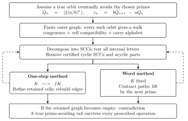
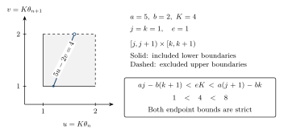
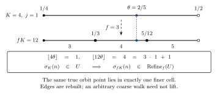
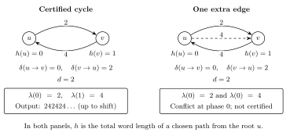
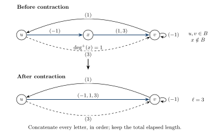
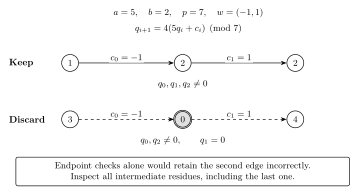
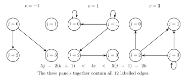
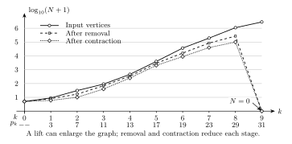
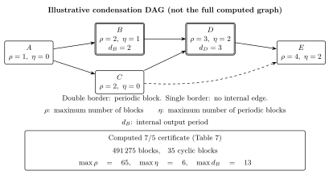

# Finite graph certificates for composite terms in rational floor sequences

<!-- BEGIN PUBLIC ADDITION doi -->
DOI: [10.5281/zenodo.22887589](https://doi.org/10.5281/zenodo.22887589)
<!-- END PUBLIC ADDITION doi -->

## Abstract

For every real number \(\xi>0\), we give computer-assisted proofs that
\(\lfloor\xi(7/5)^n\rfloor\) is divisible by at least one of
\(2,3,5,11,13\) for infinitely many positive integers \(n\), and that
\(\lfloor\xi(5/2)^n\rfloor\) is divisible by at least one of
\(2,3,7,11,13,17,19,23,29,31\) for infinitely many positive integers
\(n\). Consequently both sequences contain infinitely many composite
terms. The proofs represent an orbit avoiding the given primes by a walk in
a finite labelled graph whose vertices record residues and fractional
cells and whose edges carry signed carries. Components whose output
depends only on a cyclic phase are excluded by an elementary
nonperiodicity lemma. In the word-labelled construction the edges carry
finite carry words; deterministic paths are contracted exactly, and each
new prime is imposed at every intermediate time of a word. For the ratio
\(7/5\) we also prove an explicit waiting-time bound: if
\(P=\lfloor\xi\rfloor>13\) then some term with index at most
\(428+12L(P)\), \(L(P)=\min\{h\ge0:5^h\ge P+2\}\), is divisible by one
of the five primes. We then determine the reach of this certificate
method: contraction, prime powers, and the primes dividing \(2ab\) do not
enlarge the class of finitely certifiable bases; the method cannot
terminate when \(a\ge2\operatorname{rad}M\); and the product \(R\) of the
auxiliary primes not dividing \(2ab\) must satisfy
\(a\le2R\,J(N_0)\) for the Jacobsthal function \(J\), whence
\(R\ge a^{1-o(1)}\) by an elementary bound. Every adopted finite
computation was performed by two implementations with disjoint scientific
cores, which agree element by element on all compared finite data.
Lean proofs cover both divisibility theorems and their compositeness
corollaries: the one-step proof for \(7/5\) is kernel-checked, and the
word-labelled proofs combine kernel-checked soundness theorems with
`native_decide` finite evaluations, which add trust in the compiler
and native evaluation.

## 1. Introduction

The arithmetic of the integer parts of rational powers presents difficulties
even for simple nonintegral bases. A useful way to prove that a sequence
contains infinitely many composite terms is to exhibit a fixed finite set of
primes such that infinitely many terms have a divisor in that set. Once the
terms exceed all those primes, divisibility implies compositeness.

In 1967, Forman and Shapiro [FS](#ref-fs) proved that the integer
parts of the powers of \(3/2\) and \(4/3\) contain infinitely many
composite numbers; see the historical account in
[DN, pp.635–636](#ref-dn). As noted there, their proofs also apply
after multiplication by any fixed positive coefficient \(\xi\).
Dubickas and Novikas treated the additional base \(5/4\) and stated
explicit divisibility results for all three bases: for every \(\xi>0\),
infinitely many terms of each of
\[
\lfloor\xi(3/2)^n\rfloor,\qquad
\lfloor\xi(4/3)^n\rfloor,\qquad
\lfloor\xi(5/4)^n\rfloor
\]
have a divisor in the respective prime sets
\[
\{2,5,7,11\},\qquad \{2,3,5\},\qquad \{2,3,7,11,13\};
\]
see [DN, Theorem 1, p.636](#ref-dn) and
[N, Theorem 1.1, p.24](#ref-n).

Dubickas and Novikas also proved the
corresponding assertion with primes \(\{2,3,5,11\}\) for the *nearest
integers*
\(\lfloor\xi(7/5)^n+1/2\rfloor\): this is the third assertion of
[DN, Theorem 4, p.637](#ref-dn), also stated as
[N, Theorem 1.5(iii), p.26](#ref-n). For the ratio \(5/2\) they proved
that, for every \(\xi>0\), the *shifted* sequence
\(\lfloor\xi(5/2)^n\rfloor-1\) has infinitely many terms divisible by
\(2\), \(3\) or \(5\); see [DN, Theorem 3, p.637](#ref-dn) and
[N, Theorem 1.4, p.25](#ref-n); inside the proof, the same argument is
noted to apply to \(\lfloor\xi(5/2)^n\rfloor-1+30k\) for every fixed
integer \(k\) ([DN, p.646](#ref-dn), [N, p.26](#ref-n)).
The rounding and shift conventions matter here. The present results
concern the unshifted integer parts. For \(5/2\) the shift changes the
alphabet of admissible carries, and our certificate uses a different
prime set.

**Theorem 1 (Main Theorem).** For every \(\xi\in\mathbb R\) with
\(\xi>0\) and every \(N\in\mathbb N\):

(i) there is an integer \(n\ge\max(N,1)\) such that
\[
\gcd\!\left(\left\lfloor\xi(7/5)^n\right\rfloor,4290\right)>1,
\qquad 4290=2\cdot3\cdot5\cdot11\cdot13;
\tag{1}
\]

(ii) there is an integer \(n\ge\max(N,1)\) such that
\[
\begin{aligned}
\gcd\!&\left(\left\lfloor\xi(5/2)^n\right\rfloor,40112098026\right)>1,\\
40112098026&=2\cdot3\cdot7\cdot11\cdot13\cdot17\cdot19\cdot23\cdot29\cdot31.
\end{aligned}
\tag{2}
\]

The indices in (i) and (ii) are quantified separately; no common index
is asserted. The modulus in (2) does not contain the prime \(5\).

Here and below \(\mathbb N=\{0,1,2,\ldots\}\), and for an integer \(q\)
we use \(\gcd(q,M)=\gcd(|q|,M)\). The formulation with arbitrary \(N\)
states precisely that the qualifying positive indices form an infinite set.
A positive integer is *composite* if it equals \(uv\) with integers
\(u,v>1\).

**Corollary 2.** For every \(\xi>0\), each of the sequences
\[
\bigl(\lfloor\xi(7/5)^n\rfloor\bigr)_{n\ge1}\qquad \text{and}\qquad \bigl(\lfloor\xi(5/2)^n\rfloor\bigr)_{n\ge1}
\]
contains infinitely
many composite terms.

For the ratio \(7/5\) the certificate also yields an explicit waiting
time. Write
\[
L(P)=\min\{h\ge0:5^h\ge P+2\}.
\]

**Theorem 3 (Quantitative Theorem).** Let \(\xi>0\) with
\(P=\lfloor\xi\rfloor>13\). Then there is an integer \(n\) with
\[
\begin{aligned}
0&\le n\le428+12L(P)\\
\text{and}\qquad
\gcd\!&\left(\left\lfloor\xi(7/5)^n\right\rfloor,4290\right)>1,
\end{aligned}
\tag{3}
\]
and this term is composite. Consequently, for every \(N\in\mathbb N\)
with \(Q_N=\lfloor\xi(7/5)^N\rfloor>13\), some
\(\lfloor\xi(7/5)^n\rfloor\) with
\[
N\le n\le N+428+12L(Q_N)
\]
is
composite.

The related study of fractional parts includes Mahler's question
[M68, p.313](#ref-m68) whether some \(\xi>0\) satisfies
\[
0\le\{\xi(3/2)^n\}<1/2\qquad\text{for all }n\ge0.
\]
Flatto, Lagarias, and Pollington
[FLP, Theorem 1.4, p.129](#ref-flp) proved that, for coprime integers
\(p>q\ge2\) and every \(\xi>0\),
\[
\limsup_{n\to\infty}\{\xi(p/q)^n\}
-\liminf_{n\to\infty}\{\xi(p/q)^n\}\ge1/p.
\]
Dubickas [Dub08](#ref-dub08) obtained further results on whether all
these fractional parts can lie in prescribed intervals or unions of
intervals. These confinement questions provide a background for the use
of fractional cells here. The range bound alone does not yield the
infinitely many even terms that would suffice for compositeness, as
explained in [DN, p.636](#ref-dn).

For other real bases, Alkauskas and Dubickas [AD04](#ref-ad04)
constructed Pisot numbers whose positive powers all have composite
integer parts, as well as a transcendental number whose integer-part
sequence meets every integer arithmetic progression infinitely often.
Those results construct particular bases; here the base is a specified
rational number and the coefficient \(\xi\) ranges over all positive reals.

**Method.** The proofs combine an existing nonperiodicity obstruction with
explicit finite certificates. Nonperiodicity of the carry sequence
\(c_n=bQ_{n+1}-aQ_n\) is already contained in
[DN, Lemma 2, p.638](#ref-dn) and [N, Lemma 1.7, pp.28–29](#ref-n), and
the use of restrictions on operation words to force periodicity also has
precedents in [DN, pp.638–639 and 647](#ref-dn). We include an integral
proof of the obstruction and make the graph construction, the all-edge
phase test, and the tail-preservation arguments explicit. The one-step construction (Section 3) records one carry per edge and refines
the fractional cells; it proves (1). The word-labelled construction (Section 4)
labels edges by finite carry words, contracts deterministic paths without
changing their output, and lifts the graph by one new prime at a time
while checking the residues at every intermediate time of each word; it
proves (2) and gives a second proof of (1). A finite rank certificate on
the complete one-step graph, combined with a finite version of the
nonperiodicity lemma, gives Theorem 3 (Section 6).

Akiyama, Frougny, and Sakarovitch [AFS08](#ref-afs08) developed
rational-base representations with finite transducers for arithmetic.
Their nonperiodicity results use divisibility by growing powers of the
denominator ([AFS08, Lemma 8, p.65 and Proposition 26, p.75](#ref-afs08)).
Their language of integer representations is nonregular
([AFS08, Corollary 7, p.65](#ref-afs08)). Our finite graphs instead
record necessary residue and fractional-cell constraints on a
prime-avoiding orbit: every such orbit gives a walk, while a walk need
not represent an orbit. This distinction allows finite certificates
without requiring a finite automaton for the full representation language.

A related computational approach appears in Stephan's preprint
[S26, §4](#ref-s26), which reports finite graph certificates, eventual
periodicity, and a Lean verification for the integer base \(7\). Its
computation is a methodological comparison, not a dependency of the proofs
given here. The nonintegral base here permits eventual periodicity itself
to be excluded.
For comparison, [DJ22, Theorem 1.2, p.167](#ref-dj22) implies that for the
integer base \(7\), every finite set of primes can be avoided by all terms
for a suitable positive coefficient. That result does not apply to \(7/5\)
or \(5/2\). The specific contributions here are
the finite certificates for the unshifted \(7/5\) and \(5/2\) sequences
with their exact verification, the word-labelled contraction with prime
conditions imposed at every intermediate time, the waiting-time bound,
and the structural results described next.

**Scope of the method.** Sections 7 and 8 study what this certificate
method can and cannot do. With the operations fixed precisely (initial
complete graph, phase removal, exact contraction, cell refinement,
modulus enlargement, carry restriction), we prove a normal-form theorem:
a finite certificate exists for some choice of parameters if and only if,
for some cell count \(K\) and some finite set \(S\) of primes not dividing
\(2ab\), every cyclic strongly connected component of one explicit graph
passes the phase test. Contraction does not enlarge the certifiable
class, prime powers in the modulus can be dropped, and the primes dividing
\(2ab\) reduce to a restriction of the carry alphabet; the normal form
changes the prime set of the conclusion, which then contains all primes
dividing \(2ab\). Two obstruction theorems then show that the method
does not terminate when \(a\ge2\operatorname{rad}M\), and that it does
not terminate when a certain two-letter carry word admits unit residues
modulo \(M\). The second obstruction gives the necessary condition
\(a\le2R\,J(N_0)\), where \(R\) is the product of the primes of \(M\)
not dividing \(2ab\), \(N_0\) is the product of the odd primes dividing
\(ab\), and \(J\) is the Jacobsthal function; an elementary bound
\(J(N)\le3^{\omega(N)}\) gives \(R\ge a^{1-o(1)}\). These obstruction
theorems are statements about the non-termination of a fixed procedure.
They are not counterexamples to any arithmetic statement, and they do not
assert that any base fails to have infinitely many composite terms.

**Verification.** Every adopted finite computation was carried out by two
implementations whose scientific cores (edge enumeration, component
decomposition, certification, contraction, lifting) were written
separately from the mathematical specification; their complete graph
data were compared element by element. Section 9 describes their
provenance and the comparison. Lean proofs establish both parts of
Theorem 1 and Corollary 2. The one-step proof for \(7/5\) uses a
kernel-checked finite certificate; the word-labelled proofs use
kernel-checked soundness theorems and `native_decide` finite
evaluations. Section 9.4 gives the precise formalization coverage and
the additional compiler and native-evaluation trust of the latter
proofs.

Section 2 proves the nonperiodicity lemma. Section 3 presents the one-step
outer graphs and finite certification, and Section 4 the word-labelled
certificates. Section 5 gives the finite calculations for (1) and (2).
Section 6 proves Theorem 3. Sections 7 and 8 contain the structural and
obstruction results. Section 9 describes the verification and the exact
scope of the formalization. Section 10 states further results whose proofs are given in the
appendices, and Section 11 lists open problems.

<!-- BEGIN PUBLIC ADDITION figure:certificate-flow -->
The two finite certification procedures share the same tail-preservation argument, summarized below.



**Figure 1.** Logical flow of the one-step and word methods. Arrows from an orbit to a graph express inclusion in an outer approximation. The two branches use different operations: cell refinement in the one-step method, and contraction followed by prime lifting at fixed cell count in the word method. Dashed arrows indicate iteration.
<!-- END PUBLIC ADDITION figure:certificate-flow -->

## 2. Carries and nonperiodicity

Throughout the general argument, let
\[
a,b\in\mathbb N,\qquad a>b\ge2,\qquad \gcd(a,b)=1,\qquad \xi>0,
\]
and put \(r=a/b\), with division in \(\mathbb R\). For \(n\ge0\), define
\[
x_n=\xi r^n,\qquad Q_n=\lfloor x_n\rfloor\in\mathbb Z,
\qquad \theta_n=x_n-Q_n\in[0,1),
\tag{4}
\]
and the signed integer carry
\[
c_n=bQ_{n+1}-aQ_n=a\theta_n-b\theta_{n+1}.
\tag{5}
\]
Thus
\[
1-b\le c_n\le a-1,\qquad bQ_{n+1}=aQ_n+c_n.
\tag{6}
\]
The strict real bounds \(-b<c_n<a\) imply the integer bounds in (6).
An alternative indexing writes \(e_{n+1}=c_n\); no value of \(e_0\) is
needed. Since \(x_{n+1}=rx_n>x_n\), the sequence \((Q_n)\) is
nondecreasing, and \(Q_n\ge Q_0\) for all \(n\).

We shall also use \(Q_n\to+\infty\) in the explicit sense
\[
\forall T\in\mathbb Z\ \exists N\in\mathbb N\ \forall n\ge N,
\qquad Q_n>T.
\tag{7}
\]
Indeed, writing \(r=1+\delta\) with \(\delta>0\), Bernoulli's inequality
gives \(r^n\ge1+n\delta\), and
\(Q_n>\xi(1+n\delta)-1\).

**Lemma 4 (nonperiodicity).** The carry sequence \((c_n)\) is not
eventually periodic: there do not exist \(N\ge0\) and \(L\ge1\) such that
\[
c_{n+L}=c_n
\]
for all \(n\ge N\).

**Proof.** First suppose an integer sequence \((D_k)_{k\ge0}\) satisfies
\(bD_{k+1}=aD_k\).
Induction gives
\[
b^kD_k=a^kD_0.
\]
Since \(a^k\) and \(b^k\) are coprime, \(b^k\mid D_0\) for every
\(k\). As \(b\ge2\), this forces \(D_0=0\), without any assumption on
its sign.

Now assume that \(c\) has period \(L\) from \(N\) onward. For a fixed
\(m\ge N\), set
\[
D_k=Q_{m+k+L}-Q_{m+k}.
\]
Subtracting the two recurrences in (6) and using periodicity gives
\(bD_{k+1}=aD_k\).
The preceding observation yields
\(Q_{m+L}=Q_m\).
This holds for every \(m\ge N\), so in particular
\(Q_{N+kL}=Q_N\)
for every \(k\), contrary to (7). ∎

This proof uses only an integral recurrence and growth. The hypotheses
\(b\ge2\) and \(\gcd(a,b)=1\) are essential: integer ratios admit
identically zero carries for suitable coefficients. The earlier
nonperiodicity lemmas cited above also exclude eventual periodicity, since
a tail can be absorbed into the new positive coefficient \(\xi r^N\).

We also record the iterated form of (6): with \(C_0=0\) and
\[
C_{i+1}=aC_i+b^ic_{u+i},
\]
\[
b^iQ_{u+i}=a^iQ_u+C_i\qquad(i\ge0),
\tag{8}
\]
by induction, since
\[
b^{i+1}Q_{u+i+1}=b^i(aQ_{u+i}+c_{u+i})=a(a^iQ_u+C_i)+b^ic_{u+i}.
\]

## 3. One-step outer graphs and finite certification

### 3.1 The graphs

Fix integers \(M\ge1\) and \(K\ge1\). The states recording a residue
coprime to \(M\) and a fractional cell are
\[
V(M,K)=\{(q,j)\in\mathbb Z^2:0\le q<M,\ \gcd(q,M)=1,\ 0\le j<K\}.
\tag{9}
\]
For \(M=1\) the residue coordinate is \(q=0\). For
\(W\subseteq V(M,K)\), define a directed labelled graph \(G_K(W)\)
on \(W\). There is an edge \((q,j)\xrightarrow{e}(z,k)\) exactly when
the endpoints lie in \(W\) and the following signed integer conditions hold:
\[
\begin{aligned}
1-b&\le e\le a-1, &&\text{(E1)}\\
bz&\equiv aq+e\pmod M, &&\text{(E2)}\\
aj-b(k+1)&<eK<a(j+1)-bk. &&\text{(E3)}
\end{aligned}
\tag{10}
\]
Edges with the same endpoints and different labels are distinct. We
write \(G(M,K)=G_K(V(M,K))\) for the *complete* one-step graph.

Define the state of an actual orbit by
\[
\sigma_K(n)=\bigl(Q_n\bmod M,\ \lfloor K\theta_n\rfloor\bigr),
\tag{11}
\]
where the residue is the representative in \(\{0,\ldots,M-1\}\).

**Proposition 5 (orbit inclusion).** If
\(\sigma_K(n),\sigma_K(n+1)\in W\), then
\[
\sigma_K(n)\xrightarrow{c_n}\sigma_K(n+1)
\]
is an edge of \(G_K(W)\).

**Proof.** Condition (E1) is (6), and reduction of (5) modulo \(M\)
gives (E2). Write \(j=\lfloor K\theta_n\rfloor\) and
\(k=\lfloor K\theta_{n+1}\rfloor\). Then
\[
j\le K\theta_n<j+1,\qquad k\le K\theta_{n+1}<k+1,
\]
so
\[
aj-b(k+1)<aK\theta_n-bK\theta_{n+1}=Kc_n<a(j+1)-bk.
\]
This is (E3). Both inequalities are strict, even though a fractional part
may equal zero. ∎

The proof uses only the real identity (5) and the half-open cells; it
does not use the integrality of \(Q_n\). This observation is used in
Section 7. The graph is an outer approximation. Each orbit that
eventually avoids all prime divisors of \(M\) gives a walk in the graph,
but no converse realizability assertion about graph walks is used. For
real numbers \(u,v\) with \(j\le u<j+1\), \(k\le v<k+1\), and
\(au-bv=eK\), condition (E3) is necessary and sufficient for the
existence of such a pair; it expresses the compatibility of two adjacent
cells only.

The conditions allow complete integer enumeration. For a fixed \(j,e\),
(E3) and \(0\le k<K\) are equivalent to
\[
\max\!\left(0,\left\lfloor\frac{aj-eK}{b}\right\rfloor\right)
\le k\le
\min\!\left(K-1,\left\lfloor\frac{a(j+1)-eK-1}{b}\right\rfloor\right).
\tag{12}
\]
For example, if \(A=aj-eK\), then \(A<b(k+1)\) is equivalent to
\(\lfloor A/b\rfloor\le k\). The other bound follows by replacing the
strict integer inequality \(bk<B\) with \(bk\le B-1\).
All floors in (12) are mathematical floors, including for negative
numerators. Truncation toward zero would give an incorrect enumeration.
An empty integer interval contributes no edges.

No invertibility of \(b\) modulo \(M\) is assumed. To see explicitly how
all solutions of (E2) can be found, put \(g=\gcd(b,M)\) and \(t=aq+e\).
There are no solutions unless \(g\mid t\). If this divisibility holds,
solve the reduced congruence
\[
(b/g)z_0\equiv t/g\pmod{M/g},\qquad 0\le z_0<M/g.
\]
For \(M/g=1\), use \(z_0=0\). Otherwise the coefficient \(b/g\) is
invertible modulo \(M/g\). The full set of representatives is
\[
z=z_0+\ell(M/g),\qquad 0\le\ell<g.
\tag{13}
\]
One then retains exactly those satisfying \(\gcd(z,M)=1\) and
\((z,k)\in W\). Equivalently, one can enumerate all unit residues \(z\)
and group them by \(bz\bmod M\), as the one-step implementations do.
In the case \(M=4290\), \(\gcd(5,4290)=5\), so division by \(5\) modulo
\(4290\) is unavailable.

<!-- BEGIN PUBLIC ADDITION figure:cell-intersection -->
A single compatible cell pair illustrates why both inequalities in (E3) are strict.



**Figure 2.** Cell compatibility for \(a=5,b=2,K=4,j=k=1,e=1\). The line meets the half-open square along \(u=(4+2v)/5\), \(1\le v<2\). The lower endpoint is included and the upper endpoint is excluded. The cell-pair test is local; it does not assert the existence of a full orbit.
<!-- END PUBLIC ADDITION figure:cell-intersection -->

### 3.2 Components with periodic output

A strongly connected component (SCC) is an equivalence class for mutual
directed reachability, allowing paths of length zero. We call an SCC
*cyclic* if it contains an internal edge. Thus a singleton is cyclic
exactly when it has a self-loop.

**Lemma 6.** Every infinite walk in a finite directed graph eventually
remains in one cyclic SCC.

**Proof.** After leaving one SCC for a different one, a walk cannot return:
a return would make the two components mutually reachable. There can
therefore be only finitely many changes of component. The final component
contains the infinite tail and hence an internal edge. ∎

Let \(C\) be a cyclic SCC of \(G_K(W)\). Choose a root \(\rho\in C\),
and let \(h(v)\) be the shortest length of a path from \(\rho\) to \(v\)
inside \(C\). Define
\[
d=\gcd\{\,|h(u)+1-h(v)|:
u\xrightarrow{e}v\text{ is an internal edge of }C\,\}.
\tag{14}
\]
There is a nonempty closed walk in \(C\). Summing the differences
\(h(u)+1-h(v)\) along a closed walk of length \(\ell>0\) gives
\(\ell\). Consequently, the differences cannot all vanish, so \(d>0\).
Every internal edge satisfies
\[
h(v)\equiv h(u)+1\pmod d.
\tag{15}
\]
The same summation shows that the length of every closed walk is divisible
by \(d\). Along any nonempty closed walk, the first \(d\) departure
phases therefore realize all residues modulo \(d\). In particular, each
phase has at least one outgoing internal edge.

For each phase \(s\in\{0,\ldots,d-1\}\), collect the labels on *all*
internal edges whose source \(u\) satisfies \(h(u)\equiv s\pmod d\).
We certify \(C\) if each such collection is a singleton, written
\(\{\lambda_s\}\).

**Lemma 7 (phase criterion).** Every infinite walk confined to a certified
component has a periodic label sequence, with period \(d\).

**Proof.** For a walk
\(v_0\xrightarrow{\ell_0}v_1\xrightarrow{\ell_1}\cdots\), (15) gives
\[
h(v_i)\equiv h(v_0)+i\pmod d.
\]
Therefore
\[
\ell_i=\lambda_{(h(v_0)+i)\bmod d},
\qquad \ell_{i+d}=\ell_i.
\]
∎

The test includes parallel edges and every internal edge, not just tree
edges or a selected cycle. Edges leaving \(C\) are irrelevant once a
walk stays in \(C\). Lemma 12 below proves soundness for any
integer-valued \(h\). For a complete test, \(h\) is chosen as the
length of a path from a common root, as above; shortest paths are
unnecessary. Theorem 21 and Corollary 22 show that the outcome is
independent of the root and of these paths.

The integer \(d\) in (14) is kept separate from the primitive period
\(p\) of the phase-label word. For reporting, we replace
\((\lambda_0,\ldots,\lambda_{d-1})\) by its shortest repeating word and
then by its lexicographically least cyclic rotation. This word has length
\(p\mid d\), possibly \(p<d\). Such normalization is for comparison
and display; Lemma 7 requires neither minimality of the period nor a
particular starting phase.

### 3.3 Tail preservation and finite certification

Let \(R_K(W)\) be the union of all cyclic SCCs of \(G_K(W)\) that fail
the phase criterion. The other vertices are removed.

**Lemma 8 (retained tail).** If \(\sigma_K(n)\in W\) for all sufficiently
large \(n\), then \(\sigma_K(n)\in R_K(W)\) for all sufficiently large
\(n\).

**Proof.** Proposition 5 turns the given tail into an infinite walk with
labels \(c_n\). By Lemma 6 it eventually stays in one cyclic SCC. If
that component were certified, Lemma 7 would make \(c_n\) eventually
periodic, contrary to Lemma 4. It must therefore be retained. ∎

For an integer \(f\ge2\), define the refinement
\[
\operatorname{Refine}_f(U)
=\{(q,fj+i):(q,j)\in U,\ 0\le i<f\}.
\tag{16}
\]

**Lemma 9 (refinement).** If \(\sigma_K(n)\in U\), then
\[
\sigma_{fK}(n)\in\operatorname{Refine}_f(U).
\]

**Proof.** From \(j=\lfloor K\theta_n\rfloor\) one obtains
\[
fj\le fK\theta_n<f(j+1).
\]
Thus
\[
\lfloor fK\theta_n\rfloor=fj+i
\]
for a unique integer
\(0\le i<f\). The residue coordinate is unchanged. ∎

Starting with \(K_0\ge1\) and \(W_0=V(M,K_0)\), compute
\[
K_t=K_0f^t,\qquad U_t=R_{K_t}(W_t),\qquad
W_{t+1}=\operatorname{Refine}_f(U_t).
\tag{17}
\]
At each new stage the edges are recomputed from (10).

**Theorem 10 (finite certification).** If \(U_s=\varnothing\) for some
finite \(s\), then for every \(\xi>0\) and every \(N\in\mathbb N\)
there is an \(n\ge\max(N,1)\) such that
\[
\gcd\!\left(\left\lfloor\xi(a/b)^n\right\rfloor,M\right)>1.
\tag{18}
\]

**Proof.** Suppose instead that for some \(\xi>0\), the integers \(Q_n\)
are coprime to \(M\) for all sufficiently large \(n\). By (9) and (11),
the corresponding states lie in \(W_0\). Lemma 8 places a further tail
in \(U_0\), and Lemma 9 places the same tail at the finer scale in
\(W_1\). Iterating these two implications over the finitely many stages
puts a tail in \(U_s\), which is empty. This contradiction proves (18).
∎

The beginning of the tail may increase at each stage and may depend on
\(\xi\). Neither a uniform starting time nor preservation of every finite
prefix is needed. In particular, refinement is proved for true orbit
states; it does not presume that every coarse graph walk has a finer lift.
The graphs themselves have no \(\xi\) input. The passage to all positive
real coefficients is supplied by these lemmas, rather than by sampling
initial values or computing long numerical trajectories.

Theorem 10 assumes a finite successful calculation. It does not assert
termination for arbitrary choices of \(a,b,M,K_0,f\).

The modulus may also grow from stage to stage. For \(U\subseteq V(M,K)\)
and integers \(h,f\ge1\), put \(M'=hM\), \(K'=fK\), and
\[
U'=\{(q+\ell M,\ fj+i):(q,j)\in U,\ 0\le\ell<h,\ 0\le i<f,\
\gcd(q+\ell M,hM)=1\}\subseteq V(M',K').
\]

**Lemma 11 (joint enlargement).** If \(\sigma_K(n)\in U\) as a state
modulo \(M\) and \(\gcd(Q_n,hM)=1\), then
\[
\sigma_{K'}(n)\in U'
\]
as a
state modulo \(M'\).

**Proof.** Let \(q=Q_n\bmod M\) and \(q'=Q_n\bmod hM\). Then
\(q'\equiv q\pmod M\) and \(0\le q'<hM\), so \(q'=q+\ell M\) with
\(0\le\ell<h\), and
\[
\gcd(q',hM)=\gcd(Q_n,hM)=1.
\]
The cell coordinate
is handled by Lemma 9. ∎

Since every intermediate modulus divides the final one, a tail coprime to
the final modulus is coprime to each intermediate modulus, and the
induction of Theorem 10 goes through with Lemma 11 in place of Lemma 9.

<!-- BEGIN PUBLIC ADDITION figure:cell-refinement -->
Cell refinement preserves the cell containing each true orbit point, as the following example shows.



**Figure 3.** The cell \([1/4,1/2)\) at \(K=4\) splits into cells \(3,4,5\) at \(fK=12\). The point \(\theta=2/5\) belongs to cell \(4\). The residue coordinate is unchanged. This is an inclusion for true orbit states, not a lifting assertion for arbitrary graph walks.
<!-- END PUBLIC ADDITION figure:cell-refinement -->

## 4. Word-labelled certificates

### 4.1 Word-labelled graphs and coverings

Let \(\mathcal C\subseteq[1-b,a-1]\cap\mathbb Z\) be a finite set of
carries, the *alphabet*. A *word-labelled graph* \(G=(V,E)\) consists of
a finite vertex set \(V\) and a finite set \(E\) of edges
\(e=(u,w,v)\) with \(u,v\in V\) and \(w\in\mathcal C^{+}\) a nonempty
finite word; \(|w|\ge1\) is the length of the edge. Edges are identified
as triples: the same triple is one edge, and edges with the same
endpoints and different words are distinct. An infinite walk is
\[
v_0\xrightarrow{w_0}v_1\xrightarrow{w_1}\cdots
\]
with each
\((v_i,w_i,v_{i+1})\in E\); its *output* is the concatenation
\[
w_0w_1w_2\cdots\in\mathcal C^{\mathbb N},
\]
an infinite word because no
edge has length zero. A one-step graph of Section 3 is the special case
in which every word has length one.

Let \((c_n)\) be the carry sequence of a true orbit and \(n_0\ge0\). We
say that \(G\) *covers the tail from \(n_0\)*, written
\(G\models n_0\), if there are an infinite walk \((v_i,w_i)_{i\ge0}\) of
\(G\) and times \(t_0=n_0<t_1<t_2<\cdots\) with
\[
t_{i+1}=t_i+|w_i|,\qquad
w_i=(c_{t_i},c_{t_i+1},\ldots,c_{t_{i+1}-1})\qquad(i\ge0);
\]
that is, the output of the walk equals \((c_n)_{n\ge n_0}\). For each
operation \(\Phi\) below (removal, contraction, lifting) we prove *tail
preservation*: if \(G\models n_0\) (together with an arithmetic
hypothesis specific to the operation), then \(\Phi(G)\models n_1\) for
some \(n_1\ge n_0\). The starting time may increase at each operation and
may depend on \(\xi\); no finite prefix is preserved.

### 4.2 The weighted phase criterion and removal

Let \(C\) be a cyclic SCC of \(G\), that is, an SCC containing at least
one internal edge \((u,w,v)\) with \(u,v\in C\). Let \(h:C\to\mathbb Z\)
be *any* integer-valued function, and for an internal edge
\(e=(u,w,v)\) put
\[
\begin{aligned}
\delta(e)&=h(u)+|w|-h(v),\\
d&=d_C=\gcd\{|\delta(e)|:e\text{ an internal edge of }C\}.
\end{aligned}
\]

**Lemma 12 (weighted phase criterion).** (a) \(d\ge1\), and every
internal edge satisfies
\[
h(v)\equiv h(u)+|w|\pmod d;
\]
the total word
length of every nonempty closed walk in \(C\) is a positive multiple of \(d\).

(b) Suppose there is a map \(\lambda:\mathbb Z/d\to\mathcal C\) such that
for every internal edge \(e=(u,w,v)\) and every letter position
\(0\le i<|w|\),
\[
w_i=\lambda\bigl((h(u)+i)\bmod d\bigr).
\tag{19}
\]
Then every infinite walk \((v_i,w_i)\) inside \(C\) has output
\(y=w_0w_1\cdots\) with
\[
y_t=\lambda((h(v_0)+t)\bmod d)
\]
for all
\(t\ge0\); in particular \(y_{t+d}=y_t\) for all \(t\).

We call \(C\) *certified* (with respect to \(h\)) when (19) holds for
some \(\lambda\).

**Proof.** (a) Take an internal edge \(e_1=(u,w,v)\) and, by strong
connectivity, a path \(e_2\cdots e_m\) from \(v\) to \(u\) inside \(C\)
(empty if \(u=v\)). Along the closed walk \(e_1\cdots e_m\) the terms of
\(h\) telescope, so
\[
\sum_{k\le m}\delta(e_k)=\sum_{k\le m}|w_k|\ge1.
\]
Hence not all \(\delta(e)\) vanish and \(d\ge1\). The congruence is the
definition of the gcd, and the total length of a nonempty closed walk equals the
sum of its \(\delta\), a positive multiple of \(d\).

(b) Put \(\tau_i=\sum_{k<i}|w_k|\). Induction along the walk with (a)
gives
\[
h(v_i)\equiv h(v_0)+\tau_i\pmod d.
\]
The output letter at
position \(t=\tau_i+k\) with \(0\le k<|w_i|\) is
\[
(w_i)_k=\lambda((h(v_i)+k)\bmod d)=\lambda((h(v_0)+t)\bmod d).
\]
∎

Lemma 12 is a sufficient condition for any integer-valued \(h\).
For the algorithms below, choose a root \(\rho\in C\) and, for each
\(v\in C\), a path \(\pi_v\) from \(\rho\) to \(v\) inside \(C\),
and set
\[
h(v)=|\operatorname{out}(\pi_v)|.
\]
Thus \(h(v)\) is the total word length, rather than the number of
edges. The path to \(\rho\) may be empty, and the other paths need not
be shortest. The implementations use the first root paths found by
their graph traversals.

Unless an arbitrary \(h\) is explicitly specified, *certified* and
*uncertified* below refer to the full test (19) with these root path
lengths. With this convention the test is complete for eventual
periodicity of all internal infinite outputs, and its outcome is
independent of the root and paths (Theorem 21 and Corollary 22).
A test left unfinished because of a resource limit is inconclusive.

By Lemma 12(a), every phase \(s\in\mathbb Z/d\) carries at
least one letter of some internal edge, since a closed walk of total
length \(\ell\ge d\) occupies the phases
\(h(v_0),\ldots,h(v_0)+\ell-1\). With all words of length one, (19)
is the phase criterion of Section 3.2.

**Removal.** Let \(\mathcal U\) be the family of uncertified cyclic SCCs
of \(G\). Define
\[
R(G)=\Bigl(\bigcup_{C\in\mathcal U}C,\
\{(u,w,v)\in E:\exists C\in\mathcal U,\ u,v\in C\}\Bigr):
\]
only the internal edges of uncertified components are kept; edges between
components, acyclic components, and certified components are dropped.

**Proposition 13 (tail preservation under removal).** If
\(G\models n_0\), then \(R(G)\models n_1\) for some \(n_1\ge n_0\).

**Proof.** The covering walk is an infinite walk in a finite graph, so by
Lemma 6 there are \(i_1\) and a cyclic SCC \(C\) with \(v_i\in C\) for
all \(i\ge i_1\); the edges \((v_i,w_i,v_{i+1})\), \(i\ge i_1\), are
internal to \(C\). If \(C\) were certified, Lemma 12(b) would give
\[
c_{n+d}=c_n
\]
for all \(n\ge t_{i_1}\), with \(d\ge1\), contrary to
Lemma 4. Hence \(C\in\mathcal U\), and \((v_i,w_i)_{i\ge i_1}\) is a
walk of \(R(G)\); take \(n_1=t_{i_1}\). ∎

Keeping only internal edges is sound because Lemma 6 makes every edge of
the tail internal to one component. Dropping an internal edge of an
uncertified component would not be sound; keeping more edges would be
sound but would change the reported counts.

<!-- BEGIN PUBLIC ADDITION figure:phase-test -->
The phase test can be read as a consistency check on letters assigned to cyclic positions.



**Figure 4.** Two abstract word graphs with one-letter labels. In both panels, \(h(u)=0,h(v)=1\) are total word lengths of paths from root \(u\), and \(d=2\). The left cycle is certified. Adding the dashed edge on the right creates two different letters at phase zero, so the full test fails. These examples illustrate the criterion, not the particular carry alphabet for \(5/2\).
<!-- END PUBLIC ADDITION figure:phase-test -->

### 4.3 Exact contraction of deterministic paths

Let \(G'=R(G)\). Identical triples are merged first; this does not change
the set of walks. Out-degrees \(\deg^+(u)\) are counted in \(G'\) after
merging.

**Lemma 14.** (a) Every vertex of \(G'\) has \(\deg^+\ge1\). (b) If every
vertex of a component \(C\) of \(G'\) has \(\deg^+=1\), then \(C\) is a
simple directed cycle (a single vertex with a self-loop included), and
\(C\) is certified in the sense of Lemma 12 for the root path lengths
along the cycle.

**Proof.** (a) If \(|C|\ge2\), strong connectivity gives every vertex an
internal out-edge; if \(|C|=1\), cyclicity gives a self-loop.

**(b)** With
unique successors the internal edges form a functional graph, and a
strongly connected functional graph is one cycle
\[
v_1\xrightarrow{w_1}\cdots\xrightarrow{w_m}v_1.
\]
Put \(L=\sum|w_k|\),
\(h(v_1)=0\),
\[
h(v_{k+1})=h(v_k)+|w_k|.
\]
Then \(\delta(e_k)=0\) for
\(k<m\), \(\delta(e_m)=L\), and \(d=L\); each phase \(0\le s<L\) carries
exactly one letter, the \(s\)-th letter of \(w_1\cdots w_m\), so (19)
holds. ∎

Hence, when removal uses the full test with root path lengths, no
component consisting only of out-degree-one vertices reaches the
contraction step. The implementations
nevertheless keep one *anchor* vertex in such a component as a safeguard
(used when a phase test is skipped because of a resource bound); in all
computations of Section 5 this rule never fired.

**Definition (macro vertices and contraction).** Let \(B\) consist of
all vertices of \(G'\) with \(\deg^+\ge2\), together with one anchor (the
least vertex in the vertex order) in every component that contains no such
vertex. For \(u\in B\) and each out-edge \(e=(u,w,v)\) of \(u\): while
\(v\notin B\), follow the unique out-edge \((v,w',v')\) of \(v\) and
replace \(w\leftarrow ww'\), \(v\leftarrow v'\). When first \(v\in B\),
record the *macro edge* \((u,w,v)\). The contraction \(P(G')\) has vertex
set \(B\) and edge set the set of macro edges (identical triples merged).

**Lemma 15.** The iteration in the definition terminates, and every
infinite walk of \(G'\) visits \(B\) infinitely often.

**Proof.** If the iteration did not terminate, the vertices visited would
all have out-degree one and would be finitely many, so the iteration would
enter a cycle \(Z\) of out-degree-one vertices. The unique out-edges of
\(Z\) stay in \(Z\), so \(Z\) has no edge to its complement in its
component \(C\); strong connectivity gives \(C=Z\), a component of
out-degree-one vertices, whose anchor lies in \(B\cap Z\), and the
iteration stops there: a contradiction. The same argument applies to an
infinite walk that avoids \(B\) from some point on. ∎

**Proposition 16 (exactness of contraction).** Every infinite walk of
\(G'\) starting at a vertex of \(B\) determines an infinite walk of
\(P(G')\) whose vertex sequence is the sequence of visits to \(B\) of
the former, whose output is the same infinite word, and whose \(k\)-th
macro edge has length equal to the total length of the corresponding
segment; conversely, every infinite walk of \(P(G')\) arises in this way
from at least one infinite walk of \(G'\). Consequently, if \(G'\models n_1\) then
\[
P(G')\models n_2,
\]
where \(n_2\) is the first time at or after
\(n_1\) at which the covering walk visits \(B\).

**Proof.** At a vertex \(u\in B\) the walk chooses an edge
\(e=(u,w,v)\); while \(v\notin B\) it is forced through the unique
out-edge, following the same vertices and words as the iteration in the
definition, until it reaches the next vertex of \(B\) after finitely many
steps (Lemma 15).

Thus each segment between consecutive visits to \(B\)
is exactly one macro edge, and conversely each macro edge expands to at
least one path of \(G'\) (after identical triples are merged, two
segments with the same start, word, and end give the same macro edge, so
the correspondence is surjective but need not be injective).

The
correspondence is segment by segment, and outputs are concatenations of
the same words; only the forward direction is used for tail
preservation. The covering statement follows,
the time \(n_2\) existing by Lemma 15. ∎

Contraction is used here only between removal and lifting; the cell count
\(K\) is fixed at the initial stage of the word method, and cell
coordinates enter only through the initial edges. We do not use, and do
not claim, any refinement of cells after a contraction.

<!-- BEGIN PUBLIC ADDITION figure:word-contraction -->
Contraction changes the segmentation of the output word while preserving every letter and its order.



**Figure 5.** An exact contraction. The vertex \(x\) has one outgoing edge; \(u\) and \(v\) are macro vertices because each has two outgoing edges. The words \((-1)\) and \((1,3)\) concatenate to \((-1,1,3)\), whose length remains three. All other edges are retained. Line styles identify corresponding edges.
<!-- END PUBLIC ADDITION figure:word-contraction -->

### 4.4 Lifting by a new prime

Let \(p\) be a prime with \(p\nmid b\). The *lift* \(\operatorname{Lift}_p(G)\)
has vertices \((u,q)\) with \(u\in V(G)\) and \(q\in\mathbb F_p^\times\).
For an edge \((u,w,v)\in E(G)\) with \(w=(c_0,\ldots,c_{\ell-1})\) and
\(q_0=q\), compute
\[
q_{i+1}=b^{-1}(aq_i+c_i)\bmod p\qquad(0\le i<\ell).
\]
There is an edge \(((u,q_0),w,(v,q_\ell))\) if and only if
\(q_0,q_1,\ldots,q_\ell\) are all nonzero. The condition on the endpoint
residue \(q_\ell\) is included, since \(q_\ell\) is the starting residue
of the next edge. Vertices incident to no edge may be deleted: a vertex
without out-edges never lies on an infinite walk, and a vertex without
in-edges lies only at the start of one, so deleting them preserves
coverings after shifting the start by one edge.

**Proposition 17 (tail preservation under lifting).** Let \(p\nmid b\),
\(G\models n_0\), and suppose \(p\nmid Q_n\) for all \(n\ge n'\). Then
\[
\operatorname{Lift}_p(G)\models n_1
\]
for \(n_1=t_{i_0}\), where
\(i_0\) is the least index with \(t_{i_0}\ge\max(n_0,n')\).

**Proof.** For \(i\ge i_0\) put
\[
q^{(i)}=Q_{t_i}\bmod p\ne0.
\]
Reducing
\(bQ_{n+1}=aQ_n+c_n\) modulo \(p\) gives
\[
Q_{n+1}\equiv b^{-1}(aQ_n+c_n).
\]

Hence the forward iteration along
\(w_i=(c_{t_i},\ldots,c_{t_{i+1}-1})\)
starting at \(q^{(i)}\) produces
the residues of \(Q_{t_i},Q_{t_i+1},\ldots,Q_{t_{i+1}}\), all nonzero,
ending at \(q^{(i+1)}\).

Thus
\[
((v_i,q^{(i)}),w_i,(v_{i+1},q^{(i+1)}))
\]
is an edge of the lift, and
\((v_i,q^{(i)})_{i\ge i_0}\) is a covering walk. ∎

Enumerating all starting residues \(q\in\mathbb F_p^\times\) is what makes
the argument independent of the size of the initial integer: whatever
unit \(Q_{t_i}\bmod p\) is, the corresponding vertex exists.

**Lemma 18 (root formula).** Let \(p\nmid ab\), and let
\[
C_0=0,\qquad C_{i+1}=aC_i+b^ic_i
\]
for a word
\(w=(c_0,\ldots,c_{\ell-1})\), so that (8) holds. Put
\[
R_i=-C_ia^{-i}\bmod p,
\]
so that \(R_0=0\) and
\[
R_{i+1}=R_i-c_ib^ia^{-i-1}.
\]
For a starting residue \(q\), the forward
iteration has \(q_0,\ldots,q_\ell\) all nonzero if and only if
\[
q\notin\{R_0,\ldots,R_\ell\},
\]
and then
\[
\begin{aligned}
q_\ell&=\alpha q+\beta\qquad \text{with}\qquad \alpha=(ab^{-1})^\ell,\\
\beta_0&=0,\qquad \beta_{i+1}=ab^{-1}\beta_i+b^{-1}c_i.
\end{aligned}
\]

**Proof.** By (8) applied to any integer lift of \(q\),
\[
b^iq_i\equiv a^iq+C_i.
\]
Since \(p\nmid b\), \(q_i\equiv0\) if and
only if \(a^iq+C_i\equiv0\), that is, \(q\equiv-C_ia^{-i}=R_i\)
(\(p\nmid a\)).

The recurrence for \(R_i\) is
\[
-(aC_i+b^ic_i)a^{-i-1}=R_i-c_ib^ia^{-i-1},
\]
and the affine form of
\(q_\ell\) is the expansion of
\[
q_{i+1}=ab^{-1}q_i+b^{-1}c_i.
\]
∎

Thus enumeration by forbidden starting residues and forward iteration give
the same edge set; implementation A uses the former and implementation B
the latter (Section 9). If \(p\mid b\), no inverse of \(b\) exists and
\[
0\equiv aQ_n+c_n\pmod p,
\]
so \(Q_n\bmod p\) is determined by
\(c_n\) alone and the condition \(p\nmid Q_n\) is equivalent to
\(c_n\not\equiv0\pmod p\), a condition on the alphabet. If \(p\mid a\),
then
\[
Q_{n+1}\equiv b^{-1}c_n,
\]
independent of the starting residue;
provided every letter of the alphabet is coprime to \(p\) (as for the
alphabets of Lemmas 23 and 24, whose letters are coprime to \(ab\)),
the lift multiplies vertices by \(p-1\) without removing anything, while
an edge whose word contains a letter divisible by \(p\) would be removed
for every starting residue.
This is how the primes \(2\) and \(5\) are handled in Section 5.

<!-- BEGIN PUBLIC ADDITION figure:prime-lift -->
Checking an entire word under a prime lift requires every intermediate residue, not just its endpoints.



**Figure 6.** Two lifts of the same word \((-1,1)\) for \(a=5,b=2,p=7\), where \(2^{-1}=4\pmod7\). Starting at residue \(1\) gives \(1,2,2\), so the edge survives. Starting at \(3\) gives \(3,0,4\), so it is discarded even though both endpoints are nonzero. Every displayed residue follows from integer arithmetic modulo seven.
<!-- END PUBLIC ADDITION figure:prime-lift -->

### 4.5 The finite success theorem

**Hypothesis (H).** A finite set \(S_0\) of primes with
\[
M_0=\prod_{p\in S_0}p
\]
and an alphabet \(\mathcal C\) satisfy: for
every \(\xi>0\) and every \(n\),
\[
\gcd(Q_n,M_0)=\gcd(Q_{n+1},M_0)=1
\]
implies \(c_n\in\mathcal C\).

**Theorem 19 (word-labelled finite success).** Let \(a>b\ge2\),
\(\gcd(a,b)=1\), \(K\ge1\), let \(S_0,\mathcal C\) satisfy (H), and let
\(p_1,\ldots,p_s\) be distinct primes with \(p_k\nmid ab\) and
\(p_k\notin S_0\). Let \(G_0^{\rm in}\) be the graph with vertices
\(\{0,\ldots,K-1\}\) and edges \((j,(c),k)\) for all \(c\in\mathcal C\)
and \(0\le j,k<K\) with
\[
aj-b(k+1)<cK<a(j+1)-bk.
\]
Define
\[
\begin{aligned}
G_k^{\rm out}&=P(R(G_k^{\rm in}))\ \ (0\le k\le s),\\
G_k^{\rm in}&=\operatorname{Lift}_{p_k}(G_{k-1}^{\rm out})\ \ (1\le k\le s).
\end{aligned}
\]
If \(G_s^{\rm out}=\varnothing\), then for \(M=M_0\prod_{k=1}^sp_k\),
\[
\forall\xi>0\ \forall N\in\mathbb N\ \exists n\ge\max(N,1):\
\gcd(Q_n,M)>1.
\tag{20}
\]

**Proof.** Fix \(\xi>0\) and suppose (20) fails: there is \(n_0\ge1\)
with
\[
\gcd(Q_n,M)=1
\]
for all \(n\ge n_0\). By (H), \(c_n\in\mathcal C\)
for all \(n\ge n_0\).

The cell
\(j_n=\lfloor K\theta_n\rfloor\)
lies in
\(\{0,\ldots,K-1\}\), and Proposition 5 with \(M=1\) (where (E2) is
trivial) shows that
\[
j_n\xrightarrow{c_n}j_{n+1}
\]
is an edge of
\(G_0^{\rm in}\). Hence
\[
G_0^{\rm in}\models n_0
\]
with all words of
length one.

Proposition 13 and Proposition 16 give
\[
G_0^{\rm out}\models n_1.
\]

For \(k\ge1\), since \(p_k\mid M\) we have
\(p_k\nmid Q_n\) for \(n\ge n_0\), so Proposition 17 gives
\[
G_k^{\rm in}\models n'_k,
\]
and again Propositions 13 and 16 give
\[
G_k^{\rm out}\models n_{k+1}.
\]

After finitely many steps
\[
G_s^{\rm out}\models n_{s+1},
\]
but the empty graph has no infinite
walk. ∎

The quantification in (20) is the same as in (18); the graphs take no
\(\xi\) as input. The primes of \(S_0\) are not lifted; they enter only
through the alphabet, and (H) is an arithmetic statement to be verified
by hand for each base (Lemmas 23 and 24).

**Corollary 20.** Under the hypotheses of Theorem 19, with
\[
P_{\max}=\max(S_0\cup\{p_1,\ldots,p_s\}),
\]
for every \(\xi>0\) and
every \(N\) there is \(n\ge\max(N,1)\) with \(Q_n\) composite.

**Proof.** By (7), \(Q_n>P_{\max}\) for all large \(n\). Apply (20)
beyond that threshold and beyond \(N\). A prime \(p\) dividing
\(\gcd(Q_n,M)\) satisfies
\[
p\le P_{\max}<Q_n,
\]
so \(Q_n=pv\) with
\(v>1\). ∎

### 4.6 The all-edge test and commuting closed words

**Theorem 21.** Let \(C\) be a cyclic SCC of a word-labelled graph and
\(\rho\in C\). The following are equivalent.

(a) There exist an integer-valued \(h\) on \(C\) and \(\lambda\)
satisfying (19); moreover, if this holds for some \(h\), then it holds
when \(h(v)\) is the total word length of any chosen path from \(\rho\)
to \(v\) inside \(C\).

(b) Every infinite walk inside \(C\) has eventually periodic output.

(c) Any two nonempty closed output words at \(\rho\) (outputs of nonempty
closed walks from \(\rho\) to \(\rho\) inside \(C\)) commute.

**Proof.** (a)⇒(b) is Lemma 12(b).

(b)⇒(c). Suppose closed words \(u,v\) at \(\rho\) with \(uv\ne vu\).
Let \(U,V\) be the corresponding closed walks; \(UV\) and \(VU\) are
closed walks with outputs \(x_0=uv\) and \(x_1=vu\) of the same length
\(L\), \(x_0\ne x_1\). For \(\varepsilon\in\{0,1\}^{\mathbb N}\) the walk
\(X_{\varepsilon_0}X_{\varepsilon_1}\cdots\) stays in \(C\) and has
output
\[
z_\varepsilon=x_{\varepsilon_0}x_{\varepsilon_1}\cdots.
\]

Reading
\(z_\varepsilon\) in blocks of length \(L\) recovers \(\varepsilon\). If
\(z_\varepsilon\) were eventually periodic with period \(P\), it would
have period \(PL\), and block decoding would make \(\varepsilon\)
eventually periodic. Choosing \(\varepsilon\) not eventually periodic
(for instance \(0\,1\,00\,1\,000\,1\cdots\)) contradicts (b).

(c)⇒(a). Two commuting nonempty words are powers of a common word
(induction on length, removing the shorter word from the front of the
longer), and the primitive root of a nonempty word is unique, so all
closed words at \(\rho\) are powers of one primitive word \(z\); put
\(p=|z|\). For each \(v\in C\) fix a path \(\pi_v\) from \(\rho\) to
\(v\) with
\[
h(v)=|\operatorname{out}(\pi_v)|
\]
and a return path \(\sigma_v\) from \(v\) to \(\rho\). The paths at
\(v=\rho\) are allowed to be empty.

For an internal edge \(e=(u,w,v)\) the words
\[
\begin{aligned}
\omega_1&=\operatorname{out}(\pi_u)\,w\,\operatorname{out}(\sigma_v)\qquad \text{and}\\
\omega_2&=\operatorname{out}(\pi_v)\operatorname{out}(\sigma_v)
\end{aligned}
\]
are closed words, with \(\omega_1\ne\varepsilon\). Both are powers
of \(z\), allowing the zeroth power when \(\omega_2\) is empty.
Therefore \(p\) divides
\[
|\omega_1|-|\omega_2|=h(u)+|w|-h(v);
\]
hence \(p\mid\delta(e)\) for every
internal edge and \(p\mid d\). Define
\[
\lambda(s)=z_{s\bmod p}
\]
for \(s\in\mathbb Z/d\), well defined since
\(p\mid d\).

As \(\omega_1=z^k\), its letter at position \(t\) is
\(z_{t\bmod p}\), and \(w_i\) sits at position \(h(u)+i\) of
\(\omega_1\), so
\[
w_i=z_{(h(u)+i)\bmod p}=\lambda((h(u)+i)\bmod d).
\]
This is (19) for the root path lengths \(h\). ∎

**Corollary 22.** Choose a root \(\rho\in C\) and paths
\(\pi_v:\rho\to v\) inside \(C\), and put
\[
h(v)=|\operatorname{out}(\pi_v)|.
\]
Whether (19) holds is independent of the root and of these paths.
For every such choice,
\[
d=g_C:=\gcd\bigl\{|\operatorname{out}(\gamma)|:
\gamma\text{ is a nonempty closed walk in }C\bigr\}.
\]
In particular, two complete tests using root path lengths agree on
which components are certified and on the value of \(d\).

**Proof.** By Theorem 21, the test holds for any such choice exactly
when every internal infinite walk has eventually periodic output.
This property does not involve the root or paths.

For the equality of gcds, summing \(\delta(e)\) around a closed walk
gives its total word length. Hence \(d\mid g_C\). Conversely, for
\(e=(u,w,v)\), choose a return path \(\sigma_v:v\to\rho\). Then
\[
\delta(e)
=|\operatorname{out}(\pi_u e\sigma_v)|
 -|\operatorname{out}(\pi_v\sigma_v)|.
\]
Both terms are lengths of closed walks at \(\rho\). Each is divisible
by \(g_C\), including a zero length if the second walk is empty.
Thus \(g_C\mid\delta(e)\) for every internal edge, so \(g_C\mid d\).
This proves \(d=g_C\), whether or not the component is certified. ∎

The restriction on \(h\) is essential. Consider the two-edge cycle
\[
u\xrightarrow{(2)}v,\qquad v\xrightarrow{(4)}u.
\]
Its infinite outputs are the two rotations of \((2,4)^\infty\).
The root path lengths \(h(u)=0\), \(h(v)=1\) give
\[
(\delta(u\to v),\delta(v\to u))=(0,2),\qquad d=2,
\]
and (19) holds with \(\lambda(0)=2\), \(\lambda(1)=4\).
The arbitrary choice \(h(u)=h(v)=0\) instead gives
\[
(\delta(u\to v),\delta(v\to u))=(1,1),\qquad d=1.
\]
Both letters would then occupy phase zero, so (19) fails. For a
general integer-valued \(h\), the telescoping argument gives only
\(d\mid g_C\); Lemma 12 still guarantees soundness, but failure of
that test need not imply a nonperiodic output.

With root path lengths, Theorem 21 does give the converse: if the full
test (19) fails, the component contains an internal infinite walk whose
output is not eventually periodic. No sound test that removes a
component solely because all its infinite outputs are eventually
periodic can remove such a component from the same finite graph.
Further removal requires additional arithmetic or realizability
information.

## 5. The two rational bases

### 5.1 The ratio 7/5 by the one-step method

Use
\[
(a,b,M,K_0,f)=(7,5,4290,32,4).
\tag{21}
\]
The initial graph has \(\varphi(4290)K_0=960\cdot32=30720\) vertices.
The two one-step implementations described in Section 9.2 produce
the four stages in Table 1. The retained set is empty at \(K=2048\).

**Table 1.** The complete stages for (21). Edges are counted with their
labels. The certified column counts certified cyclic SCCs, and the final
column is \(|U_t|\).

| \(K_t\) | Vertices | Edges | Cyclic SCCs | Certified SCCs | Retained vertices |
| ---: | ---: | ---: | ---: | ---: | ---: |
| 32 | 30720 | 55440 | 17 | 16 | 1363 |
| 128 | 5452 | 9512 | 3 | 2 | 952 |
| 512 | 3808 | 6281 | 1 | 0 | 944 |
| 2048 | 3776 | 5951 | 15 | 15 | 0 |

The numbers of all SCCs, including noncyclic singletons, are respectively
29312, 4440, 2865, and 3658. At the first three stages there is one
uncertified cyclic SCC, of respective size 1363, 952, and 944. Their
internal edge counts are 2332, 1550, and 1505, and all three have \(d=1\).
Their removal is not justified by the phase test; they are carried into
the next subdivision. In particular, the vertex counts of the next stages
are exactly four times these retained sizes.

Table 2 groups certified components by \(K,d\), and normalized primitive
word. Component sizes are listed with multiplicity. There are no certified
components at \(K=512\).

**Table 2.** All nine groups of certified components. The parameter \(d\)
is (14), and \(p\) is the length of the displayed primitive word.

| \(K\) | Number of SCCs | Component sizes | \(d\) | \(p\) | Primitive word, up to rotation |
| ---: | ---: | :--- | ---: | ---: | :--- |
| 32 | 2 | 1, 1 | 1 | 1 | \((2)\) |
| 32 | 6 | 2, 2, 2, 2, 2, 2 | 2 | 2 | \((-2,4)\) |
| 32 | 8 | 6, 6, 6, 6, 6, 6, 6, 6 | 6 | 2 | \((-2,4)\) |
| 128 | 1 | 24 | 8 | 8 | \((-4,2,2,2,2,2,2,2)\) |
| 128 | 1 | 39 | 13 | 13 | \((-4,2,2,2,2,2,-4,2,2,2,2,2,2)\) |
| 2048 | 3 | 1, 1, 1 | 1 | 1 | \((2)\) |
| 2048 | 3 | 4, 4, 8 | 4 | 4 | \((-2,-2,4,4)\) |
| 2048 | 3 | 6, 6, 6 | 6 | 1 | \((2)\) |
| 2048 | 6 | 12, 12, 12, 12, 24, 24 | 12 | 4 | \((-2,-2,4,4)\) |

Thus five distinct primitive words occur. The rows with \(d=6,p=1\)
and \(d=12,p=4\), for example, show why \(d\) must not be reported as
the primitive word length. The words describe possible output within the
outer graph components; an infinite true orbit cannot remain in any of
these components, by Lemma 4.

As additional checks of the procedure, Table 3 applies the same
construction at \(K_0=32\) to the three floor results of
[DN, Theorem 1](#ref-dn). Each stops after its first stage. These are
reproductions of the stated divisibility conclusions, not new claims
about those three bases.

**Table 3.** Known cases reproduced by both one-step
implementations; all retained sets are empty.

| \(a/b\) | Prime set | \(M\) | Vertices | Edges | Cyclic SCCs | Certified SCCs |
| :--- | :--- | ---: | ---: | ---: | ---: | ---: |
| \(3/2\) | \(\{2,5,7,11\}\) | 770 | 7680 | 8640 | 6 | 6 |
| \(4/3\) | \(\{2,3,5\}\) | 30 | 256 | 480 | 3 | 3 |
| \(5/4\) | \(\{2,3,7,11,13\}\) | 6006 | 46080 | 82170 | 18 | 18 |

### 5.2 The ratio 7/5 by the word method

**Lemma 23.** Let \(a=7\), \(b=5\). If \(Q_n\) and \(Q_{n+1}\) are odd
and \(5\nmid Q_n\), then
\[
c_n\in\{-4,-2,2,4,6\}.
\]
Hence (H) holds
with
\[
S_0=\{2,5\}\qquad \text{and}\qquad \mathcal C=\{-4,-2,2,4,6\}.
\]

**Proof.** By (6), \(-4\le c_n\le6\). Since \(5\equiv7\equiv1\pmod2\),
\[
c_n=5Q_{n+1}-7Q_n\equiv Q_{n+1}-Q_n\pmod2,
\]
which is even when both
terms are odd; so
\[
c_n\in\{-4,-2,0,2,4,6\}.
\]
If \(c_n=0\) then
\(5Q_{n+1}=7Q_n\) and, as \(\gcd(5,7)=1\), \(5\mid Q_n\). ∎

The prime \(2\) could also be lifted by Proposition 17, but
\(\mathbb F_2^\times=\{1\}\) and the lift condition reduces to
"all letters even", already contained in the alphabet. The prime
\(5\) divides \(b\) and cannot be lifted; by the remark after Lemma 18,
\(5\nmid Q_n\) is equivalent to \(c_n\not\equiv0\pmod5\), which within
the range \([-4,6]\) and with even letters means \(c_n\ne0\). Thus the
alphabet expresses the avoidance of \(2\) and \(5\) as a necessary
condition, which is all that Theorem 19 requires.

Apply Theorem 19 with \(K=2048\), the alphabet of Lemma 23, and the
primes \(p_1,p_2,p_3=3,11,13\). The value \(K=2048\) is a free
parameter, chosen to match the final cell count of Table 1; soundness
does not depend on it. Table 4 lists the four stages. Both
implementations of Section 9.3 agree on every vertex and every
word-labelled edge of the eight graphs; the output graph of the last
stage is empty. In these four stages no macro edge is produced by more
than one contracted chain, so the number of distinct edges equals the
number counted with multiplicity.

**Table 4.** The word method for \(7/5\) with \(K=2048\),
\(\mathcal C=\{-4,-2,2,4,6\}\), primes \(3,11,13\). Input graphs are
\(G_k^{\rm in}\) and output graphs \(G_k^{\rm out}\) of Theorem 19.
"Uncertified vertices" counts the vertices of uncertified cyclic SCCs.

| \(k\) | \(p_k\) | Input vertices | Input edges | Cyclic SCCs | Certified | Uncertified vertices | Output vertices | Output edges | Max. word length (output) |
| ---: | ---: | ---: | ---: | ---: | ---: | ---: | ---: | ---: | ---: |
| 0 | — | 2048 | 8366 | 1 | 0 | 2048 | 2048 | 8366 | 1 |
| 1 | 3 | 4096 | 9010 | 10 | 9 | 691 | 593 | 1292 | 13 |
| 2 | 11 | 5928 | 11276 | 4 | 3 | 89 | 62 | 131 | 8 |
| 3 | 13 | 744 | 1342 | 2 | 2 | 0 | 0 | 0 | — |

The total numbers of SCCs at the four stages are 1, 3387, 5840, and
704. The final prime set is \(\{2,3,5,11,13\}\), as in (21). This is
not a theorem about a new base but a second proof of (1) by the method of
Section 4, and a consistency check between the two methods.

### 5.3 The ratio 5/2

**Lemma 24.** Let \(a=5\), \(b=2\). If \(Q_n\) is odd, then
\[
c_n\in\{-1,1,3\}.
\]
Hence (H) holds with
\[
S_0=\{2\}\qquad \text{and}\qquad \mathcal C=\{-1,1,3\}.
\]

**Proof.** By (6), \(-1\le c_n\le4\), and
\[
c_n=2Q_{n+1}-5Q_n\equiv Q_n\pmod2.
\]
∎

Only the oddness of \(Q_n\) is used; neither the oddness of \(Q_{n+1}\)
nor avoidance of \(5\) is needed. The prime \(5\) is not included in the
modulus of (2), for three independent reasons: \(5\mid a\), so
Lemma 18 does not apply; by the remark after Lemma 18, a lift by \(5\)
would give
\[
Q_{n+1}\equiv2^{-1}c_n=3c_n\pmod5,
\]
which is nonzero for
\(c_n\in\{-1,1,3\}\) (residues \(2,3,4\)), so on a tail with odd carries
\(5\nmid Q_{n+1}\) holds automatically and the lift would remove
nothing; and the statement without \(5\) is stronger.

With \(K=4\), the initial graph \(G_0^{\rm in}\) has the four vertices
\(j\in\{0,1,2,3\}\) and the twelve edges \((j,(c),k)\) with
\(c\in\{-1,1,3\}\) and
\[
5j-2(k+1)<4c<5(j+1)-2k,
\]
listed in Table 5.
By Theorem 19 every tail avoiding the primes of (2) walks in this graph;
this is a covering of all cells, not a sampling of initial values, and
no converse realizability is asserted.

<!-- BEGIN PUBLIC ADDITION figure:initial-graph -->
The initial four-cell graph is small enough to display completely, grouped by carry label.



**Figure 7.** All twelve edges of the initial \(5/2\) graph at \(K=4\), separated into three panels by carry \(c\). Each panel uses the same four vertices; the panels are overlaid to recover the full graph. The edges are enumerated by the strict integer inequality shown below them and agree with Table 5.
<!-- END PUBLIC ADDITION figure:initial-graph -->

**Table 5.** The twelve initial edges for \(5/2\), \(K=4\), as pairs
(carry, target cell).

| Source cell \(j\) | Edges \((c,k)\) |
| ---: | :--- |
| 0 | \((-1,2),(-1,3),(1,0)\) |
| 1 | \((1,0),(1,1),(1,2)\) |
| 2 | \((1,3),(3,0),(3,1)\) |
| 3 | \((3,1),(3,2),(3,3)\) |

Apply Theorem 19 with \(K=4\), the alphabet of Lemma 24, and the nine
primes
\[
p_1,\ldots,p_9=3,7,11,13,17,19,23,29,31.
\]
Table 6 lists the
ten stages. Both implementations of Section 9.3 agree on every vertex and
every word-labelled edge of the twenty graphs, and the output graph of
stage \(9\) is empty: all 1084 cyclic SCCs of \(G_9^{\rm in}\) are
certified. Edges are counted as sets of triples (Section 4.1); the
multiplicities with which contracted chains produce the same triple carry
no proof content and are recorded in Appendix A for comparison with the
supplied research notes.

**Table 6.** The word method for \(5/2\) with \(K=4\),
\(\mathcal C=\{-1,1,3\}\). Columns as in Table 4.

| \(k\) | \(p_k\) | Input vertices | Input edges | Cyclic SCCs | Certified | Uncertified vertices | Output vertices | Output edges | Max. word length (output) |
| ---: | ---: | ---: | ---: | ---: | ---: | ---: | ---: | ---: | ---: |
| 0 | — | 4 | 12 | 1 | 0 | 4 | 4 | 12 | 1 |
| 1 | 3 | 8 | 17 | 1 | 0 | 7 | 5 | 12 | 2 |
| 2 | 7 | 30 | 58 | 4 | 2 | 16 | 9 | 19 | 4 |
| 3 | 11 | 90 | 159 | 3 | 0 | 68 | 39 | 84 | 8 |
| 4 | 13 | 462 | 812 | 4 | 1 | 342 | 250 | 524 | 15 |
| 5 | 17 | 3985 | 7020 | 11 | 8 | 2913 | 2059 | 4058 | 38 |
| 6 | 19 | 36843 | 57660 | 73 | 70 | 15933 | 8890 | 16696 | 56 |
| 7 | 23 | 194242 | 293181 | 23 | 21 | 84824 | 40051 | 73286 | 98 |
| 8 | 29 | 1101968 | 1542910 | 311 | 310 | 269245 | 100401 | 171256 | 210 |
| 9 | 31 | 2856938 | 3256019 | 1084 | 1084 | 0 | 0 | 0 | — |

The total numbers of SCCs at the ten stages are 1, 2, 16, 25, 123, 1060,
20800, 109409, 832175, and 2850774. The maximal word length of an input
graph can be smaller than that of the preceding output graph (207 at
stage 9 against 210 at stage 8), because a lift discards every edge whose
word forces a zero residue for all starting residues. The anchor rule of
Section 4.3 never fired. A direct product of all residues modulo the
modulus of (2) with four cells would have
\[
4\varphi(40112098026)=30656102400
\]
vertices; the staged construction
never forms it.

<!-- BEGIN PUBLIC ADDITION figure:stage-counts -->
The vertex counts show how growth under lifting alternates with reduction inside each stage.



**Figure 8.** Vertex counts from Table 6. The ordinate is \(\log_{10}(N+1)\), so the final empty output \(N=0\) is visible at height zero. Solid circles show input counts, dashed squares counts after removal, and dotted diamonds counts after contraction. Connecting segments guide the eye; they do not assert monotone decay across stages. All input cyclic SCCs are certified at stage nine.
<!-- END PUBLIC ADDITION figure:stage-counts -->

### 5.4 Proofs of Theorem 1 and Corollary 2

**Proof of Theorem 1.** (i) The finite calculation verifies the graphs,
retained sets, and refinements in (17) for the parameters (21), with
\(s=3\) and \(U_3=\varnothing\). Verification includes the full edge
sets and component conditions, as detailed in Section 9; the summary
counts alone are not the certificate. Theorem 10 gives (1).

Alternatively, Table 4 verifies the hypotheses of Theorem 19 with
\(S_0=\{2,5\}\), \(\mathcal C=\{-4,-2,2,4,6\}\) (Lemma 23),
\(K=2048\), primes \(3,11,13\), and \(G_3^{\rm out}=\varnothing\);
then (20) with
\[
M=10\cdot3\cdot11\cdot13=4290
\]
is (1).

(ii) Table 6 verifies the hypotheses of Theorem 19 with
\(S_0=\{2\}\), \(\mathcal C=\{-1,1,3\}\) (Lemma 24), \(K=4\), the nine
primes \(3,7,11,13,17,19,23,29,31\), each distinct, coprime to
\(10\), and not in \(S_0\), and \(G_9^{\rm out}=\varnothing\). Then
(20) with
\[
M=2\cdot3\cdot7\cdot11\cdot13\cdot17\cdot19\cdot23\cdot29\cdot31
=40112098026
\]
is (2). ∎

**Proof of Corollary 2.** By (7), eventually \(Q_n>13\) for the
sequence with ratio \(7/5\) and \(Q_n>31\) for the sequence with ratio
\(5/2\). Given any lower bound on the index, apply Theorem 1 beyond both
that bound and the growth threshold. A prime divisor of the gcd in (1)
lies in \(\{2,3,5,11,13\}\), and one of the gcd in (2) lies in
\(\{2,3,7,11,13,17,19,23,29,31\}\); in either case it is a proper divisor
of \(Q_n\). Hence \(Q_n\) is composite, at arbitrarily large indices.
This is Corollary 20 in both cases. ∎

## 6. Quantitative waiting time for 7/5

### 6.1 A finite version of nonperiodicity

**Lemma 25.** Let \(u\in\mathbb N\), \(1\le d\le\ell\), and suppose
\[
c_{u+i+d}=c_{u+i}
\]
for \(0\le i<\ell-d\). Put
\[
D_i=Q_{u+i+d}-Q_{u+i}.
\]
Then
\[
b^{\ell-d}\mid D_0.
\tag{22}
\]
If \(D_0>0\), then with
\(\nu_b(D_0)=\max\{k\ge0:b^k\mid D_0\}\),
\[
\begin{aligned}
\ell&\le d+\nu_b(D_0),\\
b^{\ell-d}&\le D_0<r^d(Q_u+1)-Q_u.
\end{aligned}
\tag{23}
\]

**Proof.** For \(0\le i<\ell-d\), subtracting the recurrences (6) gives
\[
bD_{i+1}=(aQ_{u+i+d}+c_{u+i+d})-(aQ_{u+i}+c_{u+i})=aD_i.
\]
Induction
gives
\[
b^kD_k=a^kD_0
\]
for \(0\le k\le\ell-d\), and
\(\gcd(a^k,b^k)=1\) gives (22).

If \(D_0>0\), the positive divisor
\(b^{\ell-d}\) is at most \(D_0\), so \(\ell-d\le\nu_b(D_0)\).

Finally
\[
Q_{u+d}\le x_{u+d}=r^dx_u<r^d(Q_u+1).
\]
The integer \(b\) need not be
prime. ∎

**Lemma 26.** If \(x_n\ge b/(a-b)\), then \(Q_{n+1}\ge Q_n+1\). In
particular, if \(Q_u\ge b/(a-b)\), then \(Q_n\) is strictly increasing
for \(n\ge u\), and
\[
D_0=Q_{u+d}-Q_u\ge d\ge1
\]
in Lemma 25.

**Proof.**
\[
rx_n-x_n=x_n(a-b)/b\ge1,
\]
so
\[
\lfloor rx_n\rfloor\ge\lfloor x_n+1\rfloor=Q_n+1.
\]
∎

For \(7/5\), \(b/(a-b)=5/2\), so \(Q_u\ge3\) suffices. A positive
difference must not be assumed when the integer parts stay at \(0\) or
\(1\).

### 6.2 From a rank certificate to a waiting time

Let \(H\) be a finite labelled graph with edges of length one, together
with a partition of \(V(H)\) into *blocks* and the following data.

- (Q-rank) An integer \(\rho(B)\in[1,\rho_{\max}]\) for every block
\(B\) such that every edge \(u\to v\) between distinct blocks satisfies
\[
\rho(B(v))\ge\rho(B(u))+1.
\]
Put \(R=\rho_{\max}-1\).
- (Q-block) Every block either has no internal edge, or is *periodic*:
there are \(d_B\in[1,D]\), \(h_B:B\to\mathbb Z\), and
\(\lambda_B:\mathbb Z/d_B\to\mathcal C\) such that every internal edge
\(u\xrightarrow{c}v\) satisfies
\[
\begin{aligned}
&h_B(v)\equiv h_B(u)+1\pmod{d_B}\qquad\text{and}\\
&c=\lambda_B(h_B(u)\bmod d_B).
\end{aligned}
\]
- (Q-cyc) An integer \(\eta(B)\in[0,m]\) for every block with
\[
\begin{aligned}
&\eta(B)\ge\mathbf 1[B\text{ periodic}],\qquad\text{and}\\
&\eta(B(v))\ge\eta(B(u))+\mathbf 1[B(v)\text{ periodic}]
\end{aligned}
\]
for every
edge between distinct blocks.

No block with internal edges may remain uncertified; blocks need not be
SCCs. An SCC decomposition supplies such data through its acyclic
quotient, with \(\rho\) the length of a longest block sequence ending at
the block and \(\eta\) the largest number of periodic blocks on such a
sequence.

By (Q-rank), every finite walk in \(H\) has at most \(R\) edges between
distinct blocks, visits each block during one contiguous interval, and
by (Q-cyc) visits at most \(m\) periodic blocks.

An *orbit segment of length \(T\) lies in \(H\)* if the states
\(\sigma(0),\ldots,\sigma(T)\) of the orbit (in the coordinates of
\(H\)) are vertices of \(H\) and \(\sigma(n)\xrightarrow{c_n}\sigma(n+1)\)
is an edge of \(H\) for \(0\le n<T\).

**Theorem 27 (waiting time from a rank certificate).** Let
\[
\begin{aligned}
&\kappa=\log_br>0,\qquad \gamma\ge1+\kappa,\\
&P=Q_0\ge b/(a-b),\qquad\text{and}\qquad A\ge\log_b(P+2).
\end{aligned}
\]
If an orbit segment of length \(T\) lies in \(H\),
then
\[
T\le R\gamma^m+(A+\gamma D)\sum_{j=0}^{m-1}\gamma^j .
\tag{24}
\]
For \(m=0\) the sum is empty and \(T\le R\).

**Proof.** *Step 1: stay in one periodic block.* Suppose the segment
enters a periodic block \(B\) at time \(u\) and the states at times
\(u,\ldots,u+\ell\) lie in \(B\), so the edges at times
\(u,\ldots,u+\ell-1\) are internal. Induction with (Q-block) gives
\[
c_{u+i}=\lambda_B((h_B(\sigma(u))+i)\bmod d_B),
\]
hence
\[
c_{u+i+d_B}=c_{u+i}
\]
for \(0\le i<\ell-d_B\).

If \(\ell\ge d_B\),
Lemma 25 applies, and Lemma 26 (with \(Q_u\ge P\ge b/(a-b)\)) gives
\(D_0>0\); so
\[
\begin{aligned}
&b^{\ell-d_B}\le D_0<r^{d_B}(Q_u+1)\qquad\text{and}\\
&\ell-d_B<\log_b(Q_u+1)+d_B\kappa.
\end{aligned}
\]

Since
\[
Q_u\le x_u=r^u\xi<r^u(P+1),
\]
we have
\[
Q_u+1<r^u(P+1)+1\le r^u(P+2),
\]
so
\[
\log_b(Q_u+1)<u\kappa+A.
\]
Together,
\[
\ell<A+\kappa u+(1+\kappa)d_B\le A+(\gamma-1)u+\gamma D.
\]

If \(\ell<d_B\) the same bound holds trivially, since
\[
\ell<d_B\le D\le\gamma D.
\]
Thus the exit time (or the end of the
segment) satisfies
\[
u+\ell<\gamma u+A+\gamma D.
\]

*Step 2: bookkeeping.* Let \(B_0,\ldots,B_s\) (\(s\le R\)) be the
blocks visited, with entry times \(u_0=0<u_1<\cdots<u_s\), let
\(\ell_k\) be the number of internal edges traversed in \(B_k\), so that
\[
u_{k+1}=u_k+\ell_k+1\qquad \text{and}\qquad T=u_s+\ell_s;
\]
edgeless blocks have
\(\ell_k=0\).

Let \(k_1<\cdots<k_{m'}\) (\(m'\le m\)) be the indices of
the periodic blocks, \(k_0=0\), \(x_0=0\),
\[
x_j=u_{k_j}+\ell_{k_j}
\]
the exit time from the \(j\)-th periodic block,
\[
\begin{aligned}
&\delta_j=k_j-k_{j-1}\qquad \text{for}\qquad 1\le j\le m',\qquad\text{and}\\
&\delta_{m'+1}=s-k_{m'}.
\end{aligned}
\]
Between periodic blocks only edgeless blocks
occur, so time advances by one per inter-block edge:
\[
\begin{aligned}
&u_{k_j}=x_{j-1}+\delta_j,\qquad T=x_{m'}+\delta_{m'+1},\qquad\text{and}\\
&\sum_{j=1}^{m'+1}\delta_j=s\le R.
\end{aligned}
\]

*Step 3: expansion.* By Step 1,
\[
x_j<\gamma u_{k_j}+A+\gamma D=\gamma(x_{j-1}+\delta_j)+A+\gamma D.
\]
Induction gives
\[
x_{m'}<\sum_{j=1}^{m'}\gamma^{m'-j+1}\delta_j+(A+\gamma D)\sum_{j=0}^{m'-1}\gamma^j .
\]
Since \(\gamma\ge1\), \(\gamma^{m'-j+1}\le\gamma^{m'}\) and
\(1\le\gamma^{m'}\), so
\[
\begin{aligned}
T&=x_{m'}+\delta_{m'+1}\\
&<\gamma^{m'}\sum_{j=1}^{m'+1}\delta_j+(A+\gamma D)\sum_{j<m'}\gamma^j\\
&\le R\gamma^{m}+(A+\gamma D)\sum_{j<m}\gamma^j .
\end{aligned}
\]
If \(m'=0\) then
\[
T=s\le R.
\]
∎

Each inter-block edge is amplified by a factor of at most \(\gamma^m\),
once for every periodic block visited afterwards. The proof handles
finite walks only and uses neither infinite walks nor samples of
\(\xi\). If any cyclic block is uncertified the theorem does not apply,
since a walk may stay in it forever.

<!-- BEGIN PUBLIC ADDITION figure:rank-certificate -->
The ranks count blocks and periodic blocks along paths, whereas the period records the output inside a block.



**Figure 9.** An illustrative condensation DAG distinguishes three quantities: \(\rho\) is the maximum number of blocks on a path ending at a block, \(\eta\) is the maximum number of periodic blocks on such a path, and \(d_B\) is an internal output period. The five-block diagram is schematic. The separate box records the actual \(7/5\) certificate values from Table 7; those values do not describe the five-block example.
<!-- END PUBLIC ADDITION figure:rank-certificate -->

### 6.3 The certificate for 7/5

**Lemma 28 (reduction of the modulus).** Suppose \(\gcd(Q_n,4290)=1\)
for \(0\le n\le T\). Then \(c_n\in\mathcal C=\{-4,-2,2,4,6\}\) for
\(0\le n<T\), and with \(M=429=3\cdot11\cdot13\) and \(K=2048\), the
orbit segment of length \(T\) lies in the graph
\[
H=G(429,2048)\ \text{restricted to labels in }\mathcal C .
\]

**Proof.** Lemma 23 gives the alphabet. Since \(\gcd(Q_n,429)=1\), the
states \((Q_n\bmod429,\lfloor2048\theta_n\rfloor)\) lie in
\(V(429,2048)\), and Proposition 5 makes consecutive states adjacent with
label \(c_n\). ∎

Because \(\gcd(5,429)=1\), the congruence (E2) has the unique solution
\[
z\equiv5^{-1}(7q+c)\pmod{429};
\]
this is a consequence of reducing the
modulus from \(4290\) to \(429\), where \(5\) is a non-unit. The
avoidance of \(2\) and \(5\) is carried by the alphabet, and the prime
\(7\) is not assumed.

The graph \(H\) has
\[
\varphi(429)\cdot2048=240\cdot2048=491520
\]
vertices. Its SCC decomposition and the ranks \(\rho,\eta\) computed on
the acyclic quotient give the data of Table 7. Both implementations of
Section 9.3 enumerate all vertices and edges of \(H\), agree on the
block partition, on the attributes of every block, and on the phase
labels of every periodic block, and verify the inequalities of
(Q-rank), (Q-block), (Q-cyc) on every edge.

**Table 7.** The rank certificate for \(7/5\) at \(M=429\),
\(K=2048\).

| Quantity | Value |
| :--- | ---: |
| Legal vertices | 491520 |
| Labelled edges | 891990 |
| Blocks (SCCs) | 491275 |
| Cyclic blocks | 35 |
| Certified cyclic blocks | 35 |
| Uncertified cyclic blocks | 0 |
| \(\max\rho\) | 65 |
| \(\max\eta\) | 6 |
| \(\max d_B\) | 13 |

Thus (Q-rank) holds with \(\rho_{\max}=65\), \(R=64\); (Q-cyc) with
\(m=6\); (Q-block) with \(D=13\). Since \(7^4=2401<3125=5^5\), we have
\((7/5)^4<5\), \(\kappa=\log_5(7/5)<1/4\), and \(\gamma=5/4\) is
admissible. With
\[
A=L(P)=\min\{h\ge0:5^h\ge P+2\}\ge\log_5(P+2),
\]
the
constants in (24) are, exactly in rational arithmetic,
\[
\begin{aligned}
\sum_{j=0}^{5}\Bigl(\tfrac54\Bigr)^j&=\frac{11529}{1024},\\
64\Bigl(\tfrac54\Bigr)^6+\tfrac54\cdot13\cdot\frac{11529}{1024}
&=\frac{15625}{64}+\frac{749385}{4096}\\
&=\frac{1749385}{4096},
\end{aligned}
\]
\[
\text{and}\quad
1749385<428\cdot4096=1753088,\qquad 11529<12\cdot1024=12288.
\]
Hence, for an orbit segment of length \(T\) lying in \(H\) with
\(P\ge3\),
\[
T\le\frac{1749385}{4096}+\frac{11529}{1024}\,L(P)<428+12L(P).
\tag{25}
\]

**Proof of Theorem 3.** Let \(P=\lfloor\xi\rfloor>13\) and
\(T_0=428+12L(P)\). If \(\gcd(Q_n,4290)=1\) for all
\(0\le n\le T_0\), then by Lemma 28 the orbit segment of length \(T_0\)
lies in \(H\), and Theorem 27 with the certificate of Table 7 (Lemma 26
applies since \(P>13\ge3\)) gives
\[
T_0<428+12L(P)=T_0,
\]
a
contradiction.

Hence some \(0\le n\le T_0\) has
\(\gcd(Q_n,4290)>1\).

For such \(n\), a prime \(p\in\{2,3,5,11,13\}\)
divides
\[
Q_n\ge Q_0=P>13\ge p,
\]
so \(Q_n=pv\) with \(v>1\) is
composite.

For the last assertion, apply the result to
\(\xi'=\xi(7/5)^N\), for which
\[
\lfloor\xi'(7/5)^n\rfloor=Q_{N+n}
\]
and
\(\lfloor\xi'\rfloor=Q_N\); the graph \(H\) does not depend on \(\xi\),
and \(P\) enters only through the bound \(Q_u<r^u(P+1)\). ∎

The bound (25) itself holds for \(P\ge3\); the hypothesis \(P>13\) is
used only to conclude compositeness. The integer definition of \(L(P)\)
avoids rounding questions; it equals \(\lceil\log_5(P+2)\rceil\) for
every \(P\ge0\).

## 7. Scope of the certificate method

This section and the next study the reach of the procedure of
Sections 3–4 when its operations are fixed precisely. Throughout,
\[
\Sigma=\{1-b,\ldots,a-1\},
\]
and \(\operatorname{rad}M\) is the product
of the distinct primes dividing \(M\).

### 7.1 The general carry alphabet

For a reduced base \(a/b\) define
\[
\mathcal C(a,b)=\{c\in\mathbb Z:1-b\le c\le a-1,\ c\equiv b-a\pmod2,\
\gcd(c,ab)=1\}.
\tag{26}
\]

**Lemma 29.** Let \(\operatorname{rad}(2ab)\mid M\). Every edge
\((q,j)\xrightarrow{e}(z,k)\) of \(G(M,K)\) has \(e\in\mathcal C(a,b)\).
In particular \(c_n\in\mathcal C(a,b)\) whenever
\(\gcd(Q_nQ_{n+1},2ab)=1\). Conversely, for such \(M\), the label
conditions imposed by the primes dividing \(2ab\) are exactly
\(e\in\mathcal C(a,b)\).

**Proof.** Let \(p\mid a\); then \(p\nmid b\) and (E2) gives
\[
bz\equiv e\pmod p,
\]
so \(p\mid e\) if and only if \(p\mid z\), which
is excluded as \(z\) is a unit.

Let \(p\mid b\); then
\[
0\equiv aq+e\pmod p,
\]
so \(p\mid e\) if and only if \(p\mid q\),
excluded.

If \(a,b\) are odd and \(2\mid M\), then
\[
z\equiv q+e\pmod2
\]
with \(q,z\) odd, so \(e\) is even, that is, \(e\equiv b-a\pmod2\); if
one of \(a,b\) is even the parity condition \(e\equiv b-a\pmod2\) is
the same as \(\gcd(e,ab)\) being odd, which was shown. The converse is
the same computation read backwards. ∎

For \(7/5\),
\[
\mathcal C(7,5)=\{-4,-2,2,4,6\},
\]
and for \(5/2\),
\[
\mathcal C(5,2)=\{-1,1,3\}:
\]
the alphabets of Lemmas 23 and 24 are
exactly the general ones. When \(\mathcal C(a,b)\) is used to express
avoidance of all primes dividing \(2ab\), the conclusion of a certificate
is a divisibility statement whose prime set contains all primes dividing
\(2ab\); the individual reductions of Section 5 avoid some of these
primes (the prime \(7\) for \(7/5\), the prime \(5\) for \(5/2\)).

### 7.2 The procedure and its three soundness notions

**Word-labelled graphs with expansions.** In this section a word-labelled
graph has vertex set contained in some \(V(M,K)\), and each edge
\(u\xrightarrow{w}v\) records an *expansion path*
\[
u=u_0\xrightarrow{w_0}u_1\cdots\xrightarrow{w_{|w|-1}}u_{|w|}=v
\]
of
edges of \(G(M,K)\). One-step graphs are the case of length one.
For \(M\mid M'\) and \(K'=fK\), the *projection* is
\[
\pi(q,J)=(q\bmod M,\lfloor J/f\rfloor).
\]

**Pseudo-orbits.** A *right-directed \(M\)-pseudo-orbit* is a sequence
\((q_n,\theta_n,c_n)_{n\ge n_0}\) with \(q_n\in(\mathbb Z/M)^\times\),
\(\theta_n\in[0,1)\), \(c_n\in\mathbb Z\), and
\[
a\theta_n-b\theta_{n+1}=c_n\ \text{(exactly, in }\mathbb R),\qquad
bq_{n+1}\equiv aq_n+c_n\pmod M .
\]
A *left-directed* pseudo-orbit satisfies the same conditions for
\(n\le n_0\). A true orbit whose tail avoids the primes of \(M\) gives a
right-directed pseudo-orbit with \(q_n=Q_n\bmod M\); a pseudo-orbit gives,
for every \(K\), a walk \((q_n,\lfloor K\theta_n\rfloor)\) of
\(G(M,K)\), by the proof of Proposition 5, which uses only the real
identity and the half-open cells. A pseudo-orbit modulo \(M\) reduces to
one modulo any divisor of \(M\). What a true orbit has and a pseudo-orbit
lacks is a single integer sequence \(Q_n\) linking residues and fractional
parts.

**Operations.** An *execution* is a finite sequence
\(\Gamma_0,\ldots,\Gamma_s\) of word-labelled graphs with parameters
\((M_t,K_t)\), \(M_t\mid M_{t+1}\), \(K_t\mid K_{t+1}\), built by the
following operations.

- (I) *Initial graph.* Either \(\Gamma_0=G(M_0,K_0)\) on all legal
states, with all labels in \(\Sigma\); or, when the final modulus is to
contain \(\operatorname{rad}(2ab)\), \(\Gamma_0=G'(R_0,K_0)\), the
graph with vertices \((q,j)\), \(q\in(\mathbb Z/R_0)^\times\)
(\(R_0=1\) allowed, \(\gcd(R_0,2ab)=1\)), edges labelled by
\(e\in\mathcal C(a,b)\) with
\[
bz\equiv aq+e\pmod{R_0}
\]
and (E3); in
this form we set \(M_0=\operatorname{rad}(2ab)R_0\), and the residues
modulo the primes of \(2ab\) are represented by the alphabet
(Lemma 29 and Proposition 36).
- (P) *Phase removal.* Replace \(\Gamma_t\) by the union of its
uncertified cyclic SCCs with their internal edges. In each component,
use the total word lengths of paths from a common root and apply (19)
to every internal edge and letter (Section 4.2; Lemma 7 for length
one). The outcome is independent of these choices by Corollary 22.
- (C) *Contraction.* The operation \(P\) of Section 4.3; expansion
paths are concatenated.
- (R) *Cell refinement.* \(K_{t+1}=fK_t\); a vertex \((q,j)\) is
replaced by \((q,fj+i)\), \(0\le i<f\), and each edge by all
refinements of its expansion path that satisfy the edge conditions of
\(G(M_t,K_{t+1})\) at every step.
- (L) *Modulus enlargement.* \(M_{t+1}=hM_t\); each edge is replaced by
all sequences of residues modulo \(M_{t+1}\) along its expansion path
that are units and satisfy (E2) at every step (all solutions, with no
inverse of \(b\) assumed). Lifting by a prime \(p\nmid ab\)
(Section 4.4) is the case \(h=p\), and in the second form of (I) the
new primes do not divide \(2ab\).
- (A) *Carry restriction.* If \(\operatorname{rad}(2ab)\mid M_t\),
restrict labels to \(\mathcal C(a,b)\).

Let \(\mathfrak M_0\) be the procedure allowing exactly these operations.
An execution *succeeds* if \(\Gamma_s=\varnothing\). The executions of
Section 5 are instances: Table 1 uses (I), (P), (R); Tables 4 and 6 use
the second form of (I) with \(R_0=1\), then (P), (C), (L).

**Soundness.** Let \(\omega\) be an infinite walk (right- or
left-directed) of \(G(M_*,K_*)\) with \(M_t\mid M_*\) and
\(K_t\mid K_*\), whose output is not eventually periodic (in the
direction of the walk). We say that *a tail of \(\omega\) becomes a walk
of \(\Gamma_t\)* if there is an infinite walk of \(\Gamma_t\) whose
successive expansion paths coincide with the projection of the state
sequence of \(\omega\) to \((M_t,K_t)\), and whose output is a tail of
the carry sequence of \(\omega\). An operation is

- *walk-sound* if it preserves this property for every such \(\omega\);
- *pseudo-orbit-sound* if it preserves it for every \(M\)-pseudo-orbit
  with non-eventually-periodic carries, \(M_t\mid M\), in place of
  \(\omega\);
- *orbit-sound* if it preserves it for every true orbit tail avoiding the
  primes of the final modulus.

Walk-soundness implies pseudo-orbit-soundness, which implies
orbit-soundness, by the inclusions above. Orbit-soundness of the
operations is the content of Theorems 10 and 19.

**Lemma 30 (preservation).** The operations (P), (C), (R), (L), (A) are
walk-sound, for right- and for left-directed walks.

**Proof.** (R) By Lemma 31 below, the projection of \(\omega\) to
\((M_t,K_{t+1})\) is a walk of \(G(M_t,K_{t+1})\) whose further
projection to \((M_t,K_t)\) is the current expansion path; so it is one of
the refined edges.

**(L)** Likewise, the residues of \(\omega\) modulo
\(M_{t+1}\) are units satisfying (E2), hence among all solutions.

**(A)** By
Lemma 29, every label of \(\omega\) lies in \(\mathcal C(a,b)\) once
\(\operatorname{rad}(2ab)\mid M_t\mid M_*\).

**(P)** A right-directed infinite
walk of \(\Gamma_t\) eventually stays in one cyclic SCC \(C\)
(Lemma 6). For a left-directed walk, the set of times spent in each SCC
is an interval, since an SCC cannot be re-entered; finitely many
intervals cover \(\mathbb Z_{\le n_0}\), so the leftmost is unbounded
below, and that SCC contains an internal edge. If \(C\) were certified,
the output of the tail would be periodic: for right-directed walks by
Lemma 12(b); for left-directed walks, the congruence of Lemma 12(a)
propagated backwards shows that the letter at time \(t\le-1\) (relative
to the last vertex \(v_0\)) equals \(\lambda((h(v_0)+t)\bmod d)\). This
contradicts the non-periodicity of the tail of \(\omega\). Hence \(C\)
is retained and the tail is a walk of the retained subgraph.

**(C)** For
right-directed walks this is Proposition 16. For a left-directed walk, if
it avoided the macro vertex set \(B\) from some point to the left, all
its vertices there would have out-degree one; by finiteness some vertex
repeats, \(v_m=v_{m'}\) with \(m<m'\), and \(Z=\{v_m,\ldots,v_{m'-1}\}\)
is a cycle of out-degree-one vertices closed under successors. Its SCC
is then \(Z\) itself, all of whose vertices have out-degree one, so its
anchor lies in \(B\cap Z\), contradicting avoidance of \(B\). Hence the
walk visits \(B\) infinitely often to the left, and its segments between
visits are macro edges, as in Proposition 16. ∎

Any further operation that is pseudo-orbit-sound in both directions may
be adjoined to \(\mathfrak M_0\) without affecting the obstruction
theorems of Section 8. An example, the whole-word interval test, is treated in Appendix E.4
(Proposition 73); it is pseudo-orbit-sound but not walk-sound, and it is
excluded from Theorem 33.

### 7.3 Projection and inheritance of certification

**Lemma 31 (projection).** Let \(M\mid M'\) and \(K'=fK\). The
projection \(\pi\) maps every edge \((q,J)\xrightarrow{e}(z,H)\) of
\(G(M',K')\) to an edge of \(G(M,K)\) with the same label.

**Proof.** (E1) is unchanged and (E2) reduces modulo \(M\). For (E3),
write \(J=fj+i\), \(H=fk+\ell\) with \(0\le i,\ell<f\). Then
\(eK'=efK\)
and
\[
\begin{aligned}
f\bigl(aj-b(k+1)\bigr)&\le afj+ai-bfk-b(\ell+1)\\
&<efK<afj+a(i+1)-bfk-b\ell\\
&\le f\bigl(a(j+1)-bk\bigr),
\end{aligned}
\]
the outer inequalities using \(i\ge0\), \(\ell+1\le f\) and
\(i+1\le f\), \(\ell\ge0\). Dividing by \(f\) gives (E3) for
\((j,k)\). ∎

**Lemma 32 (inheritance).** In the setting of Lemma 31, let
\(W\subseteq V(M,K)\) and \(W'\subseteq V(M',K')\) with
\(\pi(W')\subseteq W\), and let \(C'\) be a cyclic SCC of \(G_{K'}(W')\)
with root \(\rho'\) and root path lengths \(h'\). Then \(\pi(C')\) lies
in one cyclic SCC \(C\) of \(G_K(W)\), with root path lengths \(h\) and
gcd \(d\); \(d\mid d'\); and if \(C\) is certified then so is \(C'\).

**Proof.** By Lemma 31 and \(\pi(W')\subseteq W\), the projection of
every internal edge of \(C'\) is an edge of the induced subgraph
\(G_K(W)\); hence the image of \(C'\) is strongly connected in
\(G_K(W)\) and contains an internal edge, so it lies in a cyclic SCC
\(C\).

Projecting the chosen
path from \(\rho'\) to \(x\) and using (15) along it gives
\[
h(\pi x)\equiv h(\pi\rho')+h'(x)\pmod d.
\]

For an internal edge
\(u'\to v'\) of \(C'\),
\[
h'(u')+1-h'(v')\equiv h(\pi u')+1-h(\pi v')
\equiv0\pmod d,
\]
so \(d\mid d'\).

If \(C\) is certified, the label of
\(u'\to v'\) is
\[
\lambda_{h(\pi u')\bmod d}
=\lambda_{(h(\pi\rho')+h'(u'))\bmod d},
\]
which depends only on
\(h'(u')\bmod d'\); hence \(C'\) is certified. ∎

### 7.4 Normal form of finite certificates

**Theorem 33 (contraction does not enlarge the class).** Let
\(\Gamma_0,\ldots,\Gamma_s\) be a successful execution of
\(\mathfrak M_0\), and let \(M_*=M_s\) (with
\(\operatorname{rad}(2ab)\mid M_*\) in the second form of (I)) and
\(K_*=K_s\). Then every cyclic SCC of the complete one-step graph
\(G(M_*,K_*)\) passes the phase test of Section 3.2. Conversely, a
one-step certificate as in Theorem 10 (or Lemma 11) is an execution of
\(\mathfrak M_0\) without (C).

**Proof.** Suppose \(G(M_*,K_*)\) has an infinite walk \(\omega\) with
non-eventually-periodic output. Its projection to \((M_0,K_0)\) is a walk
of \(\Gamma_0\): in the first form of (I) by Lemma 31; in the second
form, its labels lie in \(\mathcal C(a,b)\) by Lemma 29 and its residues
modulo \(R_0\) satisfy (E2).

By Lemma 30, inductively, a tail of
\(\omega\) becomes a walk of every \(\Gamma_t\), including
\(\Gamma_s=\varnothing\): a contradiction.

Hence every infinite walk of
\(G(M_*,K_*)\) has eventually periodic output, in particular every
infinite walk inside a cyclic SCC, and Theorem 21 ((b)⇒(a)) shows that
every cyclic SCC is certified. The converse is clear. ∎

Consequently, for a fixed \(K\) and a fixed set of primes, the order in
which primes are added does not affect whether an execution can succeed;
it affects only the intermediate sizes. The conclusion "no walk of
\(G(M_*,K_*)\) has non-eventually-periodic output" does not use
Theorem 21; only its restatement as a phase test does.

**Theorem 34 (projection monotonicity).** Let a one-step execution with
operations (P), (R), (L) start from \(W_0=V(M_0,K_0)\), with
\(U_t=R_{K_t}(W_t)\) and \(W_{t+1}\) the full enlargement of \(U_t\)
(Lemmas 9 and 11), and suppose \(U_s=\varnothing\). Then
\[
R_{K_s}(V(M_s,K_s))=\varnothing:
\]
the complete graph at the final
parameters certifies in one stage. Consequently, if \(M_s\mid M'\) and
\(K_s\mid K'\), then
\[
R_{K'}(V(M',K'))=\varnothing
\]
as well; in
particular the pairs \((s!,s!)\), \(s=1,2,\ldots\), miss no one-step
certificate. The certificate at \((M',K')\) proves only
\(\gcd(Q_n,M')>1\) infinitely often; it does not recover the conclusion
for the original prime set.

**Proof.** We show
\[
\pi_t(R_{K_s}(V(M_s,K_s)))\subseteq U_t
\]
by
induction on \(t\), where \(\pi_t\) projects to \((M_t,K_t)\). For
\(t=0\), Lemma 32 applies since \(W_0\) is the full vertex set.

For the
step, let \(v\) lie in an uncertified cyclic SCC \(C'\) of the final
graph. By induction
\[
\pi_t(C')\subseteq U_t,
\]
hence
\[
\pi_{t+1}(C')\subseteq W_{t+1}.
\]
The set \(\pi_{t+1}(C')\) is
strongly connected inside \(G_{K_{t+1}}(W_{t+1})\) (an induced subgraph
keeps the edges) and lies in one cyclic SCC \(C\); if \(C\) were
certified, Lemma 32 would certify \(C'\). So \(C\subseteq U_{t+1}\) and
\(\pi_{t+1}(v)\in U_{t+1}\).

At \(t=s\), \(\pi_s\) is the identity.

The last assertion follows from
Lemma 32 applied to the projection from \((M',K')\) to \((M_s,K_s)\) with
\(W=V(M_s,K_s)\), \(W'=V(M',K')\). ∎

This is relative completeness only: a search over the pairs \((s!,s!)\)
finds a certificate whenever one exists at some parameters, but with the
weaker conclusion \(\gcd(Q_n,s!)>1\), and no termination is asserted.

**Proposition 35 (prime powers).** For every \(M\) and \(K\), the sets
of infinite output words (together with their cell sequences) of
\(G(M,K)\) and of \(G(\operatorname{rad}M,K)\) coincide.

**Proof.** One inclusion is Lemma 31. Conversely, let
\((\bar q_n,j_n)_{n\ge0}\) be an infinite walk of
\(G(\operatorname{rad}M,K)\) with output \((c_n)\). For each
\(p^e\parallel M\) we construct units \(q_n\) modulo \(p^e\) with
\[
q_n\equiv\bar q_n\pmod p\qquad \text{and}\qquad bq_{n+1}\equiv aq_n+c_n\pmod{p^e}.
\]

If \(p\nmid b\): take any lift \(q_0\) of \(\bar q_0\) and
\[
q_{n+1}=b^{-1}(aq_n+c_n)\bmod p^e;
\]
modulo \(p\) this is the same
recurrence with the same initial value, so \(q_n\equiv\bar q_n\).

If
\(p\mid b\) (so \(p\nmid a\)): put
\[
q_n=-\sum_{j=0}^{e-1}b^ja^{-j-1}c_{n+j}\bmod p^e.
\]
Then
\[
\begin{aligned}
bq_{n+1}-aq_n&=-\sum_{j=1}^{e}b^ja^{-j}c_{n+j}+\sum_{j=0}^{e-1}b^ja^{-j}c_{n+j}\\
&=c_n-b^ea^{-e}c_{n+e}\\
&\equiv c_n\pmod{p^e},
\end{aligned}
\]
and modulo \(p\),
\[
q_n\equiv-a^{-1}c_n\equiv\bar q_n
\]
because the original walk satisfies
\(0\equiv a\bar q_n+c_n\pmod p\).

Combine by the Chinese remainder
theorem; (E3) involves only cells and labels. ∎

**Proposition 36 (primes dividing \(2ab\)).** Let
\(M_0=\operatorname{rad}(2ab)\) and \(\gcd(R,M_0)=1\). The sets of
infinite output words (with cell sequences) of \(G(M_0R,K)\) and of
\(G'(R,K)\) (defined in (I)) coincide.

**Proof.** A walk of \(G(M_0R,K)\) has labels in \(\mathcal C(a,b)\) by
Lemma 29 and residues modulo \(R\) satisfying (E2); this gives a walk of
\(G'(R,K)\).

Conversely, given a walk \((\bar q_n,j_n)\) of \(G'(R,K)\)
with output \(c_n\in\mathcal C(a,b)\), define residues for each prime
\(p\mid M_0\): if \(p\mid a\), let \(q_0\) be any unit and
\[
q_{n+1}\equiv b^{-1}c_n
\]
(then \(bq_{n+1}\equiv c_n\equiv aq_n+c_n\));
if \(p\mid b\), let
\[
q_n\equiv-a^{-1}c_n
\]
(then \(bq_{n+1}-aq_n\equiv c_n\)); if \(p=2\) and \(a,b\) are odd, let
\(q_n=1\) (then \(b\equiv a+c_n\pmod2\) since \(c_n\) is even). All are
units since \(p\nmid c_n\). Combine with \(\bar q_n\) by the Chinese
remainder theorem. ∎

Define the class of *finitely certifiable bases*
\[
\begin{aligned}
\mathcal F_{\rm cert}&=\Bigl\{\tfrac ab:\ a>b\ge2,\ \gcd(a,b)=1,\\\
\exists K\ \exists S\text{ finite},\ p\nmid2ab\ (p&\in S):\\\
&\text{every cyclic SCC of }G'\bigl(\textstyle\prod_{p\in S}p,K\bigr)\\
&\text{ satisfies Theorem 21(c)}\Bigr\}.
\end{aligned}
\]

**Theorem 37 (normal form).** For a reduced base \(a/b\) the following
are equivalent.

(1) Some execution of \(\mathfrak M_0\) succeeds.

(2) Some one-step execution (operations (I), (P), (R), (L), first form)
succeeds for some modulus \(M\) and some sequence of cell counts.

(3) There are \(K\) and a finite set \(S\) of primes not dividing
\(2ab\) such that every cyclic SCC of \(G'(\prod_{p\in S}p,K)\) passes
the phase test.

(4) \(a/b\in\mathcal F_{\rm cert}\).

**Proof.** (3)⇔(4) is Theorem 21.

(3)⇒(2): by Proposition 36 and
Theorem 21, every cyclic SCC of \(G(M_0R,K)\) is certified, which is a
one-step execution with \(s=0\).

(2)⇒(1) is clear.

(1)⇒(3): by
Theorem 33 every cyclic SCC of \(G(M_*,K_*)\) is certified. By Lemma 31
and Theorem 21, the same holds for \(G(M_0M_*,K_*)\) with
\(M_0=\operatorname{rad}(2ab)\): every infinite walk of the finer graph
projects to one with eventually periodic output.

By Proposition 35 it
holds for
\[
G(\operatorname{rad}(M_0M_*),K_*)=G(M_0R,K_*),
\]
where \(R\)
is the product of the primes of \(M_*\) not dividing \(2ab\); by
Proposition 36 and Theorem 21 it holds for \(G'(R,K_*)\). ∎

The equivalence concerns the *existence* of some certificate, not the
prime set of the conclusion. A certificate in (2) proves
\(\gcd(Q_n,M)>1\) infinitely often; a certificate in (3) proves
\(\gcd(Q_n,2abR)>1\) infinitely often, a conclusion whose prime set
contains every prime dividing \(2ab\). For example, (1) uses
\(M=4290\), which does not contain \(7\), while the normal form for
\(7/5\) uses \(\{2,5,7\}\cup\{3,11,13\}\). Membership of
\(3/2,4/3,5/4,7/5,5/2\) in \(\mathcal F_{\rm cert}\) follows from the
certificates of Section 5 (Tables 1, 3, 4, 6); no other base is claimed
to belong to it, and no simple inequality or congruence in \(a,b\)
characterizes the class.

## 8. Obstructions and the external-prime budget

The results of this section have the following common form: for a given
modulus \(M\), *no execution of \(\mathfrak M_0\) all of whose moduli
\(M_t\) divide \(M\) succeeds*; the same holds when \(\mathfrak M_0\) is
extended by operations that are pseudo-orbit-sound in both directions.
They are statements about the non-termination of a procedure. They do
*not* imply
\[
\exists\,\xi>0\ \exists\,n_0\ \forall n\ge n_0:\ \gcd(\lfloor\xi r^n\rfloor,M)=1,
\]
and they are not counterexamples to any statement about composite terms.
The witnesses are pseudo-orbits, which lack an integer sequence linking
residues and fractional parts; Lemma 41 shows that every finite window
of such a witness is realized by a true orbit, in the form
\(\forall N\ \exists\xi_N\), which cannot be exchanged for
\(\exists\xi\ \forall N\). Procedures that use information available only
for true orbits (integrality of \(Q_n\), forward realizability, or the
recurrence hypothesis of Section 10) are not covered by these theorems.

**Lemma 38 (type of the obstruction).** Let \(M\ge2\). If there is a
right- or left-directed \(M\)-pseudo-orbit whose carry sequence is not
eventually periodic (in its direction), and whose carries lie in
\(\mathcal C(a,b)\) whenever the second form of (I) is used, then no
execution of \(\mathfrak M_0\) (or of an extension by pseudo-orbit-sound
operations) with all \(M_t\mid M\) succeeds.

**Proof.** The pseudo-orbit yields, for every \(K\), a walk of
\(G(M,K)\) with the same carries; its projection to \((M_0,K_0)\) is a
walk of \(\Gamma_0\) (in the second form of (I), the labels lie in
\(\mathcal C(a,b)\) by hypothesis and the residues modulo \(R_0\) satisfy
(E2)). By Lemma 30, applied inductively, a tail of it becomes a walk of
every \(\Gamma_t\); hence \(\Gamma_s\ne\varnothing\). ∎

### 8.1 Large numerators

**Theorem 39.** Let \(M\ge2\), \(R=\operatorname{rad}M\), and
\[
a\ge2R.
\]
Then no execution of \(\mathfrak M_0\) (or of an extension by
pseudo-orbit-sound operations) with all \(M_t\mid M\) and \(\Gamma_0\) as
in (I) succeeds. Hence a successful execution requires
\[
a<2\operatorname{rad}(M).
\tag{27}
\]

**Proof.** *Step 1: a left-directed nonperiodic carry sequence.* Put
\(\theta_0=0\). Given \(\theta_{n+1}\in[0,1)\), choose
\[
\begin{aligned}
c_n&\in[-b\theta_{n+1},\,a-b\theta_{n+1})\cap(b-a+R\mathbb Z),\\
\theta_n&=\frac{b\theta_{n+1}+c_n}{a}.
\end{aligned}
\]
The half-open interval has length \(a\ge2R\), so it contains at least
\(\lfloor a/R\rfloor\ge2\) terms of the progression. Then
\[
0\le b\theta_{n+1}+c_n<a
\]
gives \(\theta_n\in[0,1)\), the identity
\[
a\theta_n-b\theta_{n+1}=c_n
\]
is exact, and \(-b<c_n<a\) gives
\(1-b\le c_n\le a-1\). Using only two ordered choices at each step, the
map \(\{0,1\}^{\mathbb N}\to\Sigma^{\mathbb Z_{\le0}}\) is injective
(at the first index where two choice sequences differ, the values
\(\theta_{n+1}\) agree and the \(c_n\) differ), so uncountably many
sequences arise. A sequence \((c_n)_{n\le0}\) that is *left-eventually
periodic* (there are \(N\le0\) and \(L\ge1\) with \(c_{n-L}=c_n\) for
all \(n\le N\)) is determined by \((N,L,c_{N-L+1},\ldots,c_0)\), so
there are only countably many. Choose a sequence that is not
left-eventually periodic. Modulo \(R\), \(q_n=1\) satisfies
\(bq_{n+1}\equiv aq_n+c_n\) because \(c_n\equiv b-a\pmod R\).

*Step 2: units modulo prime powers.* For each \(p^k\parallel M\) we
define \(q_n\equiv1\pmod p\) with
\[
bq_{n+1}\equiv aq_n+c_n\pmod{p^k}.
\]
If \(p\nmid a\): \(q_0=1\) and
\[
q_n=a^{-1}(bq_{n+1}-c_n)\bmod p^k
\]
for \(n<0\); since
\(c_n\equiv b-a\pmod p\), \(q_{n+1}\equiv1\) gives
\[
q_n\equiv a^{-1}(b-(b-a))=1.
\]

If \(p\mid a\) (so \(b\) is invertible
modulo \(p^k\)): choose \(L\) with \(p^k\mid a^L\) and put
\[
q_n=\sum_{j=0}^{L-1}a^jb^{-j-1}c_{n-1-j}\bmod p^k.
\]
Then
\[
\begin{aligned}
bq_{n+1}-aq_n&=\sum_{j=0}^{L-1}a^jb^{-j}c_{n-j}-\sum_{j=1}^{L}a^jb^{-j}c_{n-j}\\
&=c_n-a^Lb^{-L}c_{n-L}\\
&\equiv c_n\pmod{p^k},
\end{aligned}
\]
and modulo \(p\),
\[
q_n\equiv b^{-1}c_{n-1}\equiv b^{-1}(b-a)\equiv1.
\]
All indices used are \(\le-1\).

The Chinese remainder theorem gives
\(\gcd(q_n,M)=1\) and
\[
bq_{n+1}\equiv aq_n+c_n\pmod M.
\]

*Step 3.* \((q_n,\theta_n,c_n)_{n\le0}\) is a left-directed
\(M\)-pseudo-orbit with non-left-eventually-periodic carries. If
\(\operatorname{rad}(2ab)\mid M\), then \(c_n\equiv b-a\pmod p\) for every
\(p\mid2ab\) gives \(c_n\in\mathcal C(a,b)\) (for \(p\mid a\),
\(c_n\equiv b\); for \(p\mid b\), \(c_n\equiv-a\); for \(p=2\) with
\(a,b\) odd, \(c_n\) is even). Lemma 38 applies. ∎

The hypothesis on the initial graph is essential: a procedure that starts
from a different sound initial restriction derived from properties of
true orbits does not belong to \(\mathfrak M_0\), and the witness need
not pass it.

**Corollary 40.** (a) For a fixed finite set \(\mathcal P\) of primes,
the reduced bases \(a/b\) for which some execution of \(\mathfrak M_0\)
with moduli composed of primes in \(\mathcal P\) (with any exponents)
succeeds are finitely many:
\[
a<2\prod_{p\in\mathcal P}p
\]
and
\(b<a\).

(b) The bases \(r_t=(2t+7)/(2t+5)\), \(t\ge0\), are reduced. A
successful execution for \(r_t\) with final modulus \(M_t\) requires
\[
\operatorname{rad}(M_t)>(2t+7)/2,
\]
that is,
\[
\operatorname{rad}(M_t)\ge t+4.
\]
With the primes \(\{2,3,5,11,13\}\)
of (1) alone, no execution succeeds for \(t\ge4287\). The same holds
for \((14k+1)/(10k+1)\), which tend to \(7/5\), for \(k\ge613\).

**Proof.** (a) is (27). (b) The pairs are coprime: their differences are
\(2\) and their members are odd for the first family; for the second, a
common divisor divides
\[
5(14k+1)-7(10k+1)=-2
\]
and both members are
odd. The thresholds are
\[
2t+7\ge8580\iff t\ge4287
\]
(as
\(2\cdot4286+7=8579\)) and
\[
14k+1\ge8580\iff k\ge613.
\]
∎

Part (b) says that the certificate for \(7/5\) does not transfer to
nearby bases by the same prime set; it says nothing about composite
terms for those bases.

### 8.2 Finite windows are realized by true orbits

**Lemma 41.** Let integers \(q_i\) with \(\gcd(q_i,M)=1\), reals
\(\theta_i\in[0,1)\) (\(0\le i\le L\)), and integers \(c_i\)
(\(0\le i<L\)) satisfy
\[
\begin{aligned}
&a\theta_i-b\theta_{i+1}=c_i\qquad\text{and}\\
&bq_{i+1}\equiv aq_i+c_i\pmod M.
\end{aligned}
\]
Then for every \(T_0\) there is
\(\xi>T_0\) with \(\lfloor\xi r^i\rfloor\equiv q_i\pmod M\) and
\(\{\xi r^i\}=\theta_i\) for \(0\le i\le L\).

**Proof.** Write \(Q_i=q_i+Mt_i\) with integers \(t_i\) to be found, and
\[
d_i=(aq_i+c_i-bq_{i+1})/M\in\mathbb Z.
\]

The requirement
\(bQ_{i+1}=aQ_i+c_i\) is
\[
bt_{i+1}=at_i+d_i.
\]
Put \(S_0=0\),
\(S_{j+1}=aS_j+b^jd_j\), so that
\[
b^jt_j=a^jt_0+S_j
\]
by induction.

Since \(\gcd(a,b^L)=1\), choose
\[
t_0\equiv-a^{-L}S_L\pmod{b^L}.
\]
For
\(j\le L\),
\[
S_L\equiv a^{L-j}S_j\pmod{b^j},
\]
hence
\[
a^jt_0+S_j\equiv-a^ja^{-L}a^{L-j}S_j+S_j\equiv0\pmod{b^j},
\]
so
\[
t_j=(a^jt_0+S_j)/b^j
\]
is an integer, and \(bt_{j+1}=at_j+d_j\) holds
as an identity of rationals, hence of integers.

Adding \(b^LT\) to
\(t_0\) adds \(a^jb^{L-j}T\) to \(t_j\); taking \(T\) large makes all
\(Q_i\) positive and as large as desired.

Finally
\(x_i=Q_i+\theta_i\) satisfies
\[
bx_{i+1}=aQ_i+c_i+b\theta_{i+1}=ax_i,
\]
so with \(\xi=x_0\) we get \(x_i=\xi r^i\) and
\(\lfloor x_i\rfloor=Q_i\). ∎

### 8.3 The two-carry obstruction

Let \(\Delta=a-b\) (not to be confused with the phase gcd \(d\)).

**Theorem 42.** Let \(M\ge2\) and let \(R\) be the product of the primes
dividing \(M\) that do not divide \(2ab\) (\(R=1\) allowed). Suppose
there is an integer \(m\ge1\) with
\[
h=2Rm\le a-1,\qquad c=\Delta-h,\qquad \gcd(c,ab)=1 .
\tag{28}
\]
Then no execution of \(\mathfrak M_0\) (or of an extension by
pseudo-orbit-sound operations) with all \(M_t\mid M\) succeeds.

**Proof.** *Carry conditions.* We have
\[
\begin{aligned}
&1-b\le c<\Delta\le a-1,\qquad c\equiv\Delta\pmod2\quad(h\text{ is even}),\\
&c\equiv\Delta\pmod R,\\
&\text{and}\quad\gcd(\Delta,ab)=\gcd(a-b,a)\gcd(a-b,b)=1;
\end{aligned}
\]
so both \(c\) and
\(\Delta\) lie in \(\mathcal C(a,b)\). (The value \(c=0\) is excluded by
\(\gcd(c,ab)=1\).)

*Fixed points and an invariant interval.* Put
\[
\begin{aligned}
\psi_\Delta(x)&=(bx+\Delta)/a=1+\tfrac ba(x-1)\qquad \text{and}\\
\psi_c(x)&=(bx+c)/a=\psi_\Delta(x)-h/a;
\end{aligned}
\]
these are the backward maps
\(\theta_{n+1}\mapsto\theta_n\) for the carries \(\Delta\) and \(c\).

For the word \(W_L=\Delta^Lc\) (in forward time order), the backward
composition is
\[
\begin{aligned}
\Phi_L&=\psi_\Delta^L\circ\psi_c,\\
\Phi_L(x)&=1+\Bigl(\tfrac ba\Bigr)^{L+1}(x-1)-\tfrac ha\Bigl(\tfrac ba\Bigr)^L,
\end{aligned}
\]
with fixed point
\[
x_L=1-hb^L/(a^{L+1}-b^{L+1}).
\]
Since \(a>b\),
\(x_L<x_{L+1}\), and \(x_L\uparrow1\) with \(x_L<1\). As
\(c\ge1-b\), \(\max(0,-c/b)<1\), so there is a least \(L\) with
\[
\max(0,-c/b)<x_L;
\]
put \(I=[x_L,x_{L+1}]\). The maps
\(\Phi_L,\Phi_{L+1}\) are increasing affine maps with slopes in
\((0,1)\) and fixed points at the left and right endpoints of \(I\)
respectively, so both map \(I\) into \(I\).

For \(x\in I\),
\(\psi_c(x)>0\) because \(x>-c/b\), and
\[
\psi_c(x)<\psi_\Delta(x)<1
\]
because \(c<\Delta\) and \(x<1\);
\(\psi_\Delta\) maps \((0,1)\) into \((\Delta/a,1)\). Hence all
intermediate values of a backward application of \(W_L\) or
\(W_{L+1}\) starting in \(I\) lie in \((0,1)\).

*Infinite concatenation.* Let \(U=W_L\), \(V=W_{L+1}\), and let
\(B_1B_2\cdots\) be any sequence of blocks in \(\{U,V\}\), block \(i\)
starting at time \(n_i\) (\(n_1=0\)). For \(k\ge i\) the sets
\[
I_i^{(k)}=\Phi_{B_i}\circ\cdots\circ\Phi_{B_k}(I)
\]
are closed
subintervals of \(I\), decreasing in \(k\), of length at most
\[
(b/a)^{(L+1)(k-i+1)}|I|\to0;
\]
their intersection is a single point
\(\theta_{n_i}\in I\), and
\[
\Phi_{B_i}(\theta_{n_{i+1}})=\theta_{n_i}
\]
by construction.

Inside each block the values \(\theta_n\) are defined
by the backward recursion from \(\theta_{n_{i+1}}\), whose composition is
\(\Phi_{B_i}\). Thus \(0<\theta_n<1\) and
\[
a\theta_n-b\theta_{n+1}=c_n
\]
exactly for all \(n\ge0\).

*Nonperiodic coding.* The words \(UV\) and \(VU\) have the same length
\(2L+3\) and differ at position \(L\) (letters \(c\) and \(\Delta\)).
Encode a binary sequence that is not eventually periodic (for instance
\(1\,0\,1\,00\,1\,000\cdots\)) by \(0\mapsto UV\), \(1\mapsto VU\). If
the carry sequence were eventually periodic with period \(P\), it would
have period \(P(2L+3)\) and block decoding would make the binary
sequence eventually periodic.

*Unit residues modulo \(M\).* Every prime of \(M\) divides \(2abR\). For
\(p^e\parallel M\): if \(p\mid a\), take \(q_0=1\) and
\[
q_{n+1}=b^{-1}(aq_n+c_n)\bmod p^e;
\]
modulo \(p\),
\[
q_{n+1}\equiv b^{-1}c_n\ne0
\]
since \(c_n\in\{c,\Delta\}\) is coprime
to \(a\).

If \(p\mid b\), take
\[
q_n=-\sum_{j=0}^{e-1}b^ja^{-j-1}c_{n+j}\bmod p^e;
\]
as in the proof of
Proposition 35,
\[
\begin{aligned}
&bq_{n+1}-aq_n\equiv c_n\pmod{p^e},\qquad\text{and}\\
&q_n\equiv-a^{-1}c_n\ne0\pmod p.
\end{aligned}
\]

If \(p\mid R\), take
\(q_0\equiv-1\pmod{p^e}\) and
\[
q_{n+1}=b^{-1}(aq_n+c_n)\bmod p^e
\]
(\(b\) is a unit modulo \(p^e\) since \(p\nmid2ab\)); reducing modulo
\(p\), \(c_n\equiv\Delta\) gives
\[
q_{n+1}\equiv b^{-1}(-a+a-b)=-1,
\]
so every \(q_n\) is a unit.

If \(p=2\) and \(a,b\) are odd,
then \(c_n\) is even; take \(q_0\) odd, and
\[
q_{n+1}\equiv q_n+c_n\equiv q_n\pmod2.
\]
Combine by the Chinese
remainder theorem.

The result is a right-directed \(M\)-pseudo-orbit with carries in
\(\mathcal C(a,b)\) that are not eventually periodic. Lemma 38
applies. ∎

**Corollary 43 (external primes are necessary).** For every reduced base
\(a>b\ge2\), no execution of \(\mathfrak M_0\) whose moduli involve only
primes dividing \(2ab\) succeeds.

**Proof.** Take \(R=1\) in Theorem 42. If \(\Delta\) is odd and
\(\ge3\), take
\[
c=1,\qquad h=\Delta-1\ge2.
\]

If \(\Delta\) is even and
\(\ge4\), then \(a,b\) are odd, \(c=2\) is coprime to \(ab\), and
\[
h=\Delta-2\ge2.
\]

If \(\Delta=1\), take
\[
c=-1\ge1-b,\qquad h=2\le a-1
\]
(as \(a\ge3\)).

If \(\Delta=2\), then \(a,b\) are odd, \(b\ge3\),
\(a\ge5\), and
\[
c=-2\ge1-b,\qquad h=4\le a-1.
\]

In every case
\(h\le a-1\) is even and positive, so (28) holds with \(m=h/2\). ∎

For \(7/5\) with \(M=4290\) we have \(R=3\cdot11\cdot13=429\) and
\(h=858m\le6\) is impossible, consistent with Theorem 1(i).

### 8.4 The external-prime budget

Let \(J(N)\) denote the Jacobsthal function: the least positive integer
\(J\) such that every \(J\) consecutive integers contain one coprime to
\(N\); \(J(1)=1\). Equivalently, \(J(N)\) is the largest gap between
consecutive integers coprime to \(N\). Let
\[
N_0=\prod\{p\mid ab:p\text{ odd}\}
\]
and \(k=\omega(N_0)\) its number
of prime factors; since \(a>b\ge2\) are coprime, \(N_0\ge3\).

**Theorem 44.** Let \(R\) be as in Theorem 42. If some execution of
\(\mathfrak M_0\) with all \(M_t\mid M\) succeeds, then
\[
a\le2R\,J(N_0).
\tag{29}
\]
Moreover, for every odd squarefree \(N\) with \(\omega(N)=k\),
\[
J(N)\le3^k;
\]
hence
\[
R\ge\frac{a}{2\cdot3^{k}},\qquad 2^kk!\le N_0<a^2,
\tag{30}
\]
so that \(3^k=a^{o(1)}\) and
\[
\liminf\log R/\log a\ge1
\]
along any
sequence of successful certificates with \(a\to\infty\). If the primes
available for \(R\) are restricted to a fixed finite set with product
\(R_0\), then
\[
a\le2R_0\,3^{k_0-1},
\]
where \(k_0\ge4\) is any integer
with
\[
2^{k_0}k_0!>4R_0^2\,9^{k_0};
\]
in particular only finitely many
reduced bases admit a successful execution with that set.

**Proof.** By Theorem 42, success implies
\[
\gcd(\Delta-2Rm,ab)>1
\]
for
every
\[
1\le m\le H:=\lfloor(a-1)/(2R)\rfloor.
\]

Since \(2R\) is
invertible modulo \(N_0\), let
\[
u\equiv\Delta(2R)^{-1}\pmod{N_0};
\]
for
an odd prime \(p\mid ab\), \(p\mid\Delta-2Rm\) if and only if
\(m\equiv u\pmod p\). The prime \(2\) never divides \(\Delta-2Rm\) when
\(2\mid ab\) (then \(\Delta\) is odd), and is not a factor of \(ab\)
otherwise.

Hence
\[
\gcd(\Delta-2Rm,ab)=1\iff\gcd(m-u,N_0)=1.
\]

If
\(H\ge J(N_0)\), the \(H\) consecutive integers \(1-u,\ldots,H-u\)
contain one coprime to \(N_0\), giving a witness \(m\). So success
forces \(H\le J(N_0)-1\), that is,
\[
(a-1)/(2R)<J(N_0),
\]
which is
(29).

For the bound on \(J\): in a window of \(H\) consecutive integers, the
number coprime to \(N\) is
\[
\sum_{t\mid N}\mu(t)\,\#\{x:t\mid x\},
\qquad\text{and}\qquad
\#\{x:t\mid x\}=H/t+\epsilon_t
\]
with \(|\epsilon_t|<1\),
\(\epsilon_1=0\); so the count is at least
\[
H\varphi(N)/N-(2^k-1).
\]

As \(N\) is odd,
\[
\varphi(N)/N=\prod(1-1/p)\ge(2/3)^k,
\]
and \(H=3^k\) gives a count
\(\ge1\).

The first inequality in (30) follows from (29); the second from
\[
N_0\ge\prod_{i\le k}(2i+1)>2^kk!\qquad \text{and}\qquad N_0\le ab<a^2.
\]

From
\[
k!<a^2\qquad \text{and}\qquad k!\ge(k/e)^k
\]
one gets
\[
k\log k\ll\log a,
\]
so
\(k=O(\log a/\log\log a)\) and
\[
3^k=a^{O(1/\log\log a)}.
\]

For the effective bound, the ratio \(2^kk!/(4R_0^2\,9^k)\) is multiplied
by \(2(k+1)/9>1\) when \(k\ge4\), so it exceeds \(1\) for all
\(k\ge k_0\).

If \(k\ge k_0\), then
\[
a^2>N_0\ge2^kk!>4R_0^2\,9^k\ge(2R_0\,3^k)^2\ge a^2
\]
by (29) and
\(J(N_0)\le3^k\), a contradiction; so \(k\le k_0-1\) and
\[
a\le2R_0\,3^{k_0-1}.
\]
∎

The condition (29) is necessary, not sufficient: closing every \(m\le H\)
does not guarantee a certificate.

**Corollary 45.** (a) If \(a=p\) is an odd prime and \(b=2^s<p\), then
\(N_0=p\), \(J(p)=2\), and a successful execution requires
\[
R\ge p/4.
\]
(b) If \(a,b\) are distinct odd primes, then \(J(ab)=3\)
and a successful execution requires
\[
R\ge a/6.
\]

**Proof.** Among two consecutive integers at most one is divisible by
\(p\), so \(J(p)=2\). Among three consecutive integers at most one is
divisible by \(a\) and at most one by \(b\), so \(J(ab)\le3\); by the
Chinese remainder theorem there are consecutive \(x\equiv0\pmod a\),
\(x+1\equiv0\pmod b\), so \(J(ab)=3\). Apply (29). ∎

These are constraints on any certificate for the bases named; they are
not statements about composite terms of those bases.

**Remark (Iwaniec's bound).** Let \(C(k)\) be the maximal number of
consecutive integers each divisible by one of \(k\) arbitrarily chosen
primes. Iwaniec proved
\[
C(k)\ll k^2\log^2k
\]
[IW78, Corollary, p.226](#ref-iw78); see also
[CW13, §1](#ref-cw13), where the same statement is written as
\(g(n)\le X(k\log k)^2\) for \(k=\omega(n)\). Since
\(J(N)\le C(\omega(N))+1\) for \(\omega(N)\ge2\) and \(J(N)=2\) for
\(\omega(N)=1\), this gives
\[
J(N_0)\ll(k\log2k)^2
\]
with an absolute
implied constant, and with \(k\log2k\ll\log a\) from (30), the
condition (29) yields
\[
R\gg\frac{a}{(\log a)^2}.
\]
This sharpens (30) quantitatively. It is an external input, not a result
of this paper; the constant is absolute but not specified here, and no
theorem above depends on it. For explicit finite inputs, (29) and the
gcd test of Theorem 42 are used directly.

The explicit certificates for the bases \(101/2\) and \(101/100\), the
selection of primes that eliminate persistent return words, and the
whole-word interval test are given in Appendix E.4.

## 9. Verification and reproducibility

<!-- BEGIN PUBLIC ADDITION availability -->
The paper sources, computation code, Lean formal proofs, reference data, and reproduction instructions are publicly available at:

<https://github.com/ixixi/rational-floor-certificates>

The repository README describes the contents; REPRODUCE.md and ENVIRONMENT.md explain how to reproduce the results and set up the required environment. Appendix A gives the main commands.
<!-- END PUBLIC ADDITION availability -->

### 9.1 What the finite computations establish

The table entries of Section 5 and Table 7 are summaries, not the
certificates. The mathematical obligations discharged by the finite
computations, and checked element by element by two implementations,
are the following.

1. *Initial coverage.* The initial vertex set is the full set of legal
   states (all of \(V(M,K_0)\) for Table 1 and for Table 7; all \(K\)
   cells for Tables 4 and 6).
2. *Complete edge sets.* Every edge satisfying (E1)–(E3), or the initial
   inequalities of Theorem 19, is present; the lift of every edge is
   computed for every starting residue.
3. *Residues at every intermediate time.* In a lift, all
   \(\ell+1\) residues along a word of length \(\ell\), including the
   endpoint, are nonzero.
4. *All-letter phase conditions.* For every certified component, (19)
   holds at every letter position of every internal edge, with a single
   label per phase.
5. *Rank monotonicity.* For Table 7, the inequalities of (Q-rank) and
   (Q-cyc) hold on every edge between distinct blocks, and the bounds
   \(\rho\le65\), \(\eta\le6\), \(d_B\le13\) hold.
6. *Retention.* Every vertex and every internal edge of every uncertified
   cyclic component is kept, and nothing else.
7. *Output-preserving contraction.* Macro vertices are exactly the
   vertices of out-degree at least two (plus anchors), each chain of
   out-degree-one vertices ends at a macro vertex, and macro words are the
   concatenations of the chain words.
8. *Final emptiness.* The last retained set (Table 1) or the last output
   graph (Tables 4 and 6) is empty; for Table 7, no cyclic block is
   uncertified.

The strongly connected components themselves are verified by sufficient
conditions: the proposed blocks are nonempty, disjoint, cover all
vertices, are internally reachable forwards and backwards, and admit a
strictly monotone integer rank on all edges between distinct blocks
(acyclic quotient). These conditions determine the SCC partition.
Agreement of counts or of hashes is recorded but is not the criterion;
the criterion is the element-wise comparison of the complete data.

### 9.2 The one-step computation for 7/5

The one-step calculation of Tables 1–3 was performed by two
implementations in Python's arbitrary-precision integer arithmetic,
using only the standard library and no floating point in the proof
computation. Implementation A enumerates target cells with (12) and
computes SCCs by iterative Kosaraju traversal. Implementation B tests
(E3) directly for every \(k\in\{0,\ldots,K-1\}\), caching the resulting
lists by \((j,e)\), and computes SCCs by an iterative form of Tarjan's
algorithm [T, §4](#ref-t). Both classify all unit residues by
\(bz\bmod M\) to solve (E2). B was developed from the mathematical
specification and a common output schema, without reading or importing
A or the supplied baseline program; its design, source, and outputs were
fixed before the comparison with A.

The validation checks every vertex and labelled edge. It recomputes
shortest distances, all edge differences, phase label collections,
certification flags, and primitive words, checks that the retained set is
exactly the union of uncertified cyclic components, and checks that every
child in (16) is present in the next stage. For a rejected phase test,
two internal edges with the same departure phase and distinct labels
provide a checkable witness. Across the four main stages and the three
first stages of Table 3, the comparison covers 97772 vertices, 168474
labelled edges, and 94006 SCCs; no mismatch in the scientific data was
found. The recorded executions used CPython 3.11.13 for A and
CPython 3.10.12 for B on Linux, each case with a 600-second wall-time
limit and a 4 GiB address-space limit. Reaching a limit is recorded as
`inconclusive` and supplies neither a counterexample nor a minimality
claim; all adopted cases completed. The programs are included under `supplement/computations/implementation_a/` and `supplement/computations/implementation_b/`.
The public verification procedure and the all-element comparison are described in the [computation guide](../../supplement/COMPUTATION.md) and the [reproduction guide](../../REPRODUCE.md).

### 9.3 The word-labelled computations

The computations of Tables 4, 6, and 7 were performed by two
implementations with disjoint scientific cores.

*Implementation A* ([`word_a`](../../supplement/COMPUTATION.md)) is a
provenance-tracked working copy of the programs supplied with the
research notes on which this paper is based (C++ constructions driven by
Python, with a Python third check for the first five stages of
Table 6), together with a driver that fixes resource limits, records
inputs and outputs, and writes the graphs in a normalized text format.
The supplied programs contain two constructions labelled "A" and "B";
these share a common origin, file formats, and conventions, and their
mutual agreement is a consistency check within one lineage, not the
independent verification described next. The scientific cores are retained in the public sources. The provenance and
packaging changes are described in the [computation guide](../../supplement/COMPUTATION.md); the [source manifest](../../MANIFEST.json)
identifies every distributed source by SHA-256.

*Implementation B* ([`word_b`](../../supplement/COMPUTATION.md)) was
written by a different programmer from a mathematical
specification equivalent to Section 4 and the
comparison contract
[`word-schema.md`](../../supplement/computations/word-schema.md),
which fixes the definitions, the text format, and the normalization
only, without reading the supplied programs, implementation A, or the
research notes' tables. It consists of a C++17 production program and a
separately written literal Python reference program (direct inequality
tests for all \((j,c,k)\), forward iteration for all starting residues,
Kosaraju's algorithm, and Kahn's algorithm for acyclicity), whose
normalized outputs coincide byte for byte on all graphs. B computes
\(h\) as the word length of the first root path found, uses forward
iteration rather than Lemma 18, and re-verifies its SCC partitions by the
sufficient conditions of Section 9.1. Its outputs were fixed, with sizes
and hashes recorded, before A's outputs were opened.

*Comparison.* B's comparator compares, for each of the 29 file pairs
(ten input and ten output graphs for Table 6, four and four for Table 4,
one graph for Table 7), the header parameters, the vertex sets, and the
sets of word-labelled triples \((u,w,v)\), and checks the sort order,
absence of duplicates, and consistency of each file. For Table 7 it
compares the block partition as a family of member sets (independent of
block numbering), the attributes of each block (size, internal edges,
\(d_B\), \(\rho\), \(\eta\)), the phase-label sequences, and the absence
of uncertified cyclic blocks. All 29 pairs agree element by element. The comparison procedure and
reference data are given in the [computation guide](../../supplement/COMPUTATION.md) and [checks/reference.json](../../checks/reference.json);
Appendix A gives the public reproduction entry point.
Both implementations compute \(h\) from total word lengths of paths
inside each component from a common root. Corollary 22 therefore
implies agreement of the reported \(d_B\) values, even when their
roots or paths differ.

*Environment and limits.* A ran under Python 3.10.12 with g++ 11.4.0
on Linux, with wall-time and address-space limits of 600 s and 4 GiB per
supplied construction for Table 6 (1500 s overall) and 300 s and 4 GiB
otherwise. B ran its C++ program under limits of 3600 s and 8 GiB
(Table 6), 300 s and 4 GiB (Table 4), and 600 s and 4 GiB (Table 7),
its Python reference under 1800 s and 8 GiB, and the comparison under
1800 s and 8 GiB. No limit was reached; a limit reached would have been
recorded as `inconclusive`. Wall times are recorded in the run records
and are not performance claims.

*Meaning of independence.* The independence concerns the scientific
cores of the two implementations: edge enumeration, lifting, component
decomposition, certification, and contraction were coded separately from
the specification. It does not extend to the mathematical lemmas, which
are common, to the shared text format, or to human refereeing, and it
does not mean clean-room development in a legal sense. Agreement of the
two implementations is evidence that they computed the same finite
objects; the soundness of the operations (Section 4) and the passage to
all \(\xi>0\) (Theorem 19) are mathematical statements proved above, not
outputs of the programs.

### 9.4 The Lean formalization and its boundary

A Lean formalization covers both parts of Theorem 1 and Corollary 2,
with different trust bases for the finite evaluations. It uses
Lean 4.29.1 and Mathlib at commit
`5e932f97dd25535344f80f9dd8da3aab83df0fe6`, with transitive dependencies
pinned in `supplement/lean/lake-manifest.json`.

**The one-step certificate.** The one-step formalization follows the
integer-difference proof of Lemma 4, orbit inclusion (Proposition 5), a
rank-and-phase version of tail preservation, and the finite iteration of
Theorem 10.

The formal certificate avoids a formal proof of the SCC algorithms. At
each stage it assigns each vertex to a block, and each block a natural
number rank. On every edge between distinct blocks the rank must strictly
decrease (the opposite orientation to the strictly increasing \(\rho\) of
(Q-rank) in Section 6.2; either convention yields a well-founded order).
Each block is designated as one of the following:

1. **Retained:** every vertex of the block is included in the retained set.
2. **Edgeless:** the block contains no internal edge.
3. **Periodic:** a positive integer \(d\), a phase in
   \(\{0,\ldots,d-1\}\) for every vertex, and a label for every phase
   satisfy the phase-increment and departure-label conditions on every
   internal edge.

These are sufficient conditions for Lemma 8. Along an infinite walk the
rank cannot strictly decrease infinitely often, so the walk eventually
remains in one block. That block cannot be edgeless. If it is periodic,
its label sequence contradicts Lemma 4. It must therefore be retained.
An SCC decomposition supplies such blocks and ranks through its acyclic
quotient, but the formal implication does not require the blocks to be
identified as SCCs.

The abstract structure `FiniteSuccess` requires initial coverage of all
legal states, the rank/phase condition on **every** edge satisfying
(E1)–(E3) between current states, coverage of all retained-block
vertices, inclusion of all refined states at the next stage, and an empty
final retained set. The following declarations, all with namespace prefix
`MathPaper.`, identify the principal formal dependencies.

**Table 8.** Principal Lean declarations. All names have prefix
`MathPaper.`; `Pipe.` denotes the executable word-labelled pipeline.

| Mathematical content | Lean declaration |
| :--- | :--- |
| Growth (7) | `floor_orbit_eventually_gt` |
| Lemma 4 | `floor_carry_not_eventually_periodic` |
| Proposition 5 and legal orbit states | `orbit_edge`, `orbit_state_legal` |
| Phase-periodic labels | `phase_labels_periodic` |
| Tail preservation from rank/phase data | `rank_certificate_retained_tail`, `certified_orbit_retained_tail` |
| Lemma 9 | `floor_refinement_bounds`, `refined_state_mem` |
| Theorem 10 in certificate form | `finite_success_visits` |
| Conditional compositeness conclusion | `finite_success_composite` |
| Signed interval enumeration (12) | `edge_interval_iff` |
| Concrete four-stage certificate | `mainFiniteSuccess` |
| Theorem 1(i) | `floor_seven_fifths_visits` |
| Corollary 2 for \(7/5\) | `floor_seven_fifths_composite` |
| Word-labelled covering and phase output, Lemma 12(b) | `Covers`, `phase_output_periodic` |
| Word-labelled tail preservation, Proposition 13 | `WordCert.stage_tail` |
| Reaching macro vertices and preserving the output, Lemma 15 and the forward direction of Proposition 16 | `macro_visited`, `chain_realized`, `contract_tail` |
| Prime lifting, Proposition 17 | `runWord_orbit`, `lift_tail` |
| Theorem 19 and Corollary 20 in certificate form | `word_finite_success_visits`, `word_finite_success_composite` |
| Lemmas 23–24 | `carry_alphabet_75`, `carry_alphabet_52` |
| Initial coverage, stage checking, lifting, and pipeline soundness | `Pipe.initialStage_sound`, `Pipe.checkStage_sound`, `Pipe.liftArr_sound`, `Pipe.wordPipeline_sound` |
| Finite word-labelled evaluations | `five_halves_ok`, `seven_fifths_ok` |
| Theorem 1(ii) and Corollary 2 for \(5/2\) | `floor_five_halves_visits`, `floor_five_halves_composite` |
| Theorem 1(i), alternative word-labelled proof | `floor_seven_fifths_visits_word` |

The closed term `mainFiniteSuccess : FiniteSuccess 7 5 4290` discharges
the certificate argument of the general reduction. The two one-step final theorems
take only a real coefficient \(\xi\), a proof of \(\xi>0\), and an
arbitrary \(N\in\mathbb N\), and return an \(n\ge\max(N,1)\) satisfying
the respective conclusion, with no unproved finite-computation
hypothesis. The finite checker does not assume that the edge list
exported by Python is complete: proved enumeration lemmas place every
edge satisfying (E1)–(E3) among three carry candidates, five residue
lifts, and three target-cell candidates, and the checker tests the
rank/phase condition on an outer approximation of these edges. The
Boolean checks are proved by `decide +kernel`, split into smaller
statements joined by proved composition lemmas. The compositeness proof
uses the eventually valid bound \(Q_n>M\) and defines compositeness as
\(Q_n=uv\) with integers \(u,v>1\), without dependence on prime
factorization.

The complete one-step certificate, main module, and aggregate build succeeded.
The axiom audit of 30 designated declarations, including
`mainFiniteSuccess` and both final theorems, shows dependencies confined
to Lean's standard `propext`, `Classical.choice`, and `Quot.sound`; no
`sorryAx`, custom axiom, or external-computation axiom occurs
(the [formalization guide](../../supplement/FORMALIZATION.md)). An independent audit
rebuilt all 79 modules of the one-step project from a fresh project cache and checked
the types and axiom dependencies of 60 declarations (58 from the project
and two independently written restatements of Theorem 1(i) and its
corollary), with the same three standard axioms only. The declared scope and
commands for repeating the type and axiom checks are given in the [formalization guide](../../supplement/FORMALIZATION.md).
The rebuild used compiled library caches for the pinned Mathlib and its
dependencies, whose revisions were checked against the lock file; it did
not rebuild every dependency from source. For this one-step proof the
trust base comprises the fixed Lean kernel, its standard axioms, and
those fixed libraries. The declaration-level coverage is summarized in the [formalization guide](../../supplement/FORMALIZATION.md).
The public build procedure is given in the [reproduction guide](../../REPRODUCE.md).

**The word-labelled certificates.** The added formalization in
`MathPaper/Word/` extends the block/rank method to nonempty edge words.
Its covering relation records a walk and strictly increasing boundary
times, with each edge word equal to the corresponding segment of the
carry sequence. In a periodic block the phase advances by the full word
length, and every letter must agree with its phase label. In a retained
block the checker verifies a macro-vertex set and a remaining word and
destination for each non-macro vertex. The consistency conditions make
the remaining word length decrease along a non-macro path and preserve
the concatenated output on passage to macro edges. Thus the formal proof
uses the forward direction of Proposition 16; it need not show that
every walk of the output graph expands to an input walk.

The kernel-checked theorem `Pipe.wordPipeline_sound` proves that
`Pipe.wordPipeline a b K alphabet primes = true` implies
`WordFiniteSuccess a b K alphabet primes`. The pipeline enumerates the
initial cell edges using the strict inequalities (E3). At each stage,
auxiliary algorithms compute proposed blocks, ranks, phases, contraction
data, and output edges. Their correctness is not assumed: the proved
checker verifies the required conditions on every input edge. The
proved lifting function considers every nonzero starting residue and
every letter, including the residue at the final endpoint; its inverse
of \(b\) is checked modulo the newly added prime. Vertex renumbering
uses preservation of covering under an arbitrary vertex map, so no
unproved injectivity assumption is needed. The pipeline accepts only
after the final output is empty. Together with the two proved carry
alphabet lemmas, its soundness theorem discharges the finite-certificate
arguments of the general visitation and compositeness theorems.

The two accepted finite evaluations are

```lean
Pipe.wordPipeline 5 2 4 [-1, 1, 3] [3, 7, 11, 13, 17, 19, 23, 29, 31] = true
Pipe.wordPipeline 7 5 2048 [-4, -2, 2, 4, 6] [3, 11, 13] = true
```

They are proved by `native_decide`. In the fixed Lean version this
mechanism asserts the native evaluation through a generated axiom for
each theorem; it does not use `Lean.ofReduceBool`. The actual additional
axioms, with namespace prefix `MathPaper.`, are
`five_halves_ok._native.native_decide.ax_1_1` and
`seven_fifths_ok._native.native_decide.ax_1_1`, respectively. Accordingly,
the \(5/2\) final theorems depend on the first generated axiom in
addition to the three standard axioms, and the alternative \(7/5\)
theorem depends on the second. The word-labelled theory and checker
soundness depend only on the standard axioms. No `sorryAx` occurs in
the recorded dependencies. The added trust is in the compiler and native
evaluation of the Lean pipeline, not in a Python or C++ success flag,
exported graph, or hash. These final theorems take only \(\xi>0\) and
\(N\), with no certificate argument, and give exactly the quantifiers
and moduli of Theorem 1 and the \(5/2\) part of Corollary 2.

The added modules, aggregate build, and axiom display were accepted.
The [formalization guide](../../supplement/FORMALIZATION.md) records their coverage and axiom boundary. A separate
independent audit of the word-labelled proof rebuilt all 14 added Word modules, reran both native finite evaluations,
and checked the types and axiom dependencies of 46 project declarations
and five independent restatements or checks. It confirmed the trust
boundary described above. That audit reused compiled one-step
project dependencies and the fixed library caches; it was not a fresh
recompilation of all one-step modules or of the libraries.
An attempted `decide +kernel`
evaluation of a smaller pipeline instance stopped at opaque hashing
operations, so neither word-labelled evaluation is claimed as a
kernel-only finite computation.

**Boundary.** The formalization establishes the arithmetic conclusions
of Theorem 1 and Corollary 2 with the trust bases just stated. It does
not formally identify the reported blocks as SCCs, prove that \(h\)
is a shortest distance or that \(d\) is the specified gcd, or establish
the reported table counts and words. Those data are checked by the
A/B computations; the Lean checker uses sufficient rank, phase, and
contraction conditions. Within Section 4, the gcd positivity argument
of Lemma 12(a), Lemma 14, the reverse correspondence in Proposition 16,
the root formula of Lemma 18, and Theorem 21 with Corollary 22 are not
formalized. Positive periods are required by the checker, and lifting
uses the forward recurrence. Theorem 3, Section 6 (including the
waiting-time certificate of Table 7), Sections 7–8, and the further
results of Section 10 and Appendices B–E also remain outside the
formalization. Their evidence consists of the proofs in this paper and,
where finite computation is required, the recorded A/B comparisons.

## 10. Further results deferred to the appendices

Two groups of further results are stated here without proof; the proofs
are given in Appendices B and D, and the supporting computations were
performed by the two implementations of Section 9.3 and compared element
by element (Sections D.5 and E.2). They are not used in Sections 1–9.

**Recurrent carries.** An infinite word \(w=w_0w_1\cdots\) over a finite
alphabet is *recurrent* if for every \(L\ge1\) and every \(B\ge1\) there
is \(n\ge B\) with
\[
w_{n+i}=w_i
\]
for \(0\le i<L\); every tail of a
recurrent word is recurrent.

**Theorem 46 (recurrent carries force composites; proof in
Appendix B.3).** Let \(a>b\ge2\), \(\gcd(a,b)=1\), \(\xi>0\), and
*suppose that the carry sequence \(c_0c_1\cdots\) of the orbit has a
recurrent tail* \(c_{j_0}c_{j_0+1}\cdots\). Then \((Q_n)\) contains
infinitely many composite terms. Moreover, if \(j\ge j_0\) satisfies
\(Q_j>1\) and \(\gcd(Q_j,ab)=1\), then \(Q_j\) divides infinitely many
later terms.

The recurrence assumption concerns the carry word itself. Confinement
of a walk to a strongly connected component does not imply recurrence
of its output.

**Finite-height results.** For the bases \(6/5\) and \(9/7\), a sieve
over carry words combined with exact interval and divisor tests covers
all initial integers up to an explicit height.

**Theorem 47 (finite height; proof in Appendix D.4).** (a) If \(6<\lfloor\xi\rfloor\le5^{40}\), then
\(\lfloor\xi(6/5)^j\rfloor\) is composite for some \(0\le j\le40\).
(b) If \(9<\lfloor\xi\rfloor\le7^{18}\), then
\(\lfloor\xi(9/7)^j\rfloor\) is composite for some \(0\le j\le18\).

For \(6/5\) the shifted sequence
\(\lfloor\xi(6/5)^n\rfloor-1\) is treated in
[DN, Theorem 3, p.637](#ref-dn); Theorem 47(a) concerns the unshifted
sequence on a finite range and is a different statement.

Appendix C treats the family \((6t+3)/(6t+1)\), for which the
all-coefficient statement reduces to an exact integer halting problem
(Theorem 58), and Appendix E treats arbitrarily long prime prefixes
along that family (Theorem 68, using known results on narrow arithmetic
progressions of primes as external inputs), explicit return-word
obstructions for \(9/7\) and \(6/5\) (Corollary 70), and the items
deferred from Section 8.

## 11. Open problems

1. *Further bases and infinite families.* It remains to determine which
   further rational bases admit finite certificates and to construct a
   uniform certificate for an infinite family. Theorem 44 gives a
   necessary budget of external primes, \(R\ge a^{1-o(1)}\), but no construction meeting it.
   Eliminating specific return words (Appendix E.3) and covering all
   recurrent components are different tasks.
2. *Finite height versus all coefficients.* Theorem 47 leaves the
   initial integers above the stated heights untreated. For an initial
   integer \(s+kb^N\) with the same first \(N\) carries as \(s\), the
   terms are \(Q_j(s)+ka^jb^{N-j}\) by (8), and a divisor found for
   \(k=0\) need not divide the terms for other \(k\).
3. *Recurrence.* Theorem 46 excludes recurrent carry tails on an
   orbit all of whose terms are prime, but it is open whether a
   non-recurrent all-prime tail can exist (Corollary 51); confinement
   to a strongly connected component of an outer graph does not imply
   recurrence (Appendix B.1).
4. *Additional operations.* The whole-word interval test (Appendix E.4)
   is pseudo-orbit-sound but not walk-sound; whether adjoining it changes
   the class \(\mathcal F_{\rm cert}\) is open. Whether the halting
   program of Appendix C halts for every \(t\) (Theorem 58) is open.
5. *Minimality and subsequences.* The certificates give finite prime
   sets without establishing their minimality. Whether the conclusions
   hold along prescribed arithmetic progressions or sparse subsequences
   of indices, and what bounds hold for the density of prime terms,
   remain separate questions.

## Appendix A. Reproducing the computations and the formal proof

The paper sources, scientific programs, and Lean project are distributed in
the public repository [rational-floor-certificates](https://github.com/ixixi/rational-floor-certificates).
Run commands from the root of the downloaded distribution. The [reproduction guide](../../REPRODUCE.md)
gives the dependencies, commands, resource limits, and output locations.
The common entry point is:

```sh
python3 -B reproduce.py verify
python3 -B reproduce.py check --output ../certificate-preflight
python3 -B reproduce.py recompute --output ../certificate-replay
```

The distribution identifies its sources by the `source_sha256`
field of the [source manifest](../../MANIFEST.json), computed from the SHA-256 values of the
distributed source and check files. `SHA256SUMS` lists the
individual file hashes. [checks/reference.json](../../checks/reference.json) records the finite reference
data used for comparison. Generated graphs and logs are written to the
chosen output location. Reaching a resource limit is recorded as
`inconclusive`; an incomplete run is not an accepted certificate.

**Word-labelled computations, implementation A.** The public driver
`supplement/computations/word_a/run_word.py`
applies resource limits, runs the supplied scientific constructions, writes
normalized graphs, and runs the same-lineage post-checks. The cases
`five-halves`, `cross-75`, and `q75` regenerate the data of Tables 6, 4,
and 7, respectively. The [reproduction guide](../../REPRODUCE.md) gives the complete commands;
the [computation guide](../../supplement/COMPUTATION.md) describes the source provenance and comparison scope.
The C++ constructions and the Python normalization code are included.
Regeneration therefore uses the distributed sources.

**Edge multiplicities.** In Tables 4 and 6 edges are counted as distinct
triples. Counting contracted chains with multiplicity, and propagating
the multiplicity through lifting as the supplied research notes do,
gives for the ten stages of Table 6 the input edge counts 12, 17, 58,
167, 820, 7083, 60242, 315483, 1685458, 3754612 and the output edge
counts 12, 12, 20, 85, 529, 4256, 18069, 80704, 201199, 0; for Table 4
all multiplicities are one. Both implementations report these numbers
and agree on them; they carry no proof content.

**Word-labelled computations, implementation B.** The separate C++
program, Python reference, and comparator are included under
`supplement/computations/word_b/`. The following commands show
the mathematical inputs and use an initially absent output directory
outside the distribution. The public entry point applies the limits and
performs the complete comparison described in Section 9.3:

```sh
mkdir -p ../certificate-manual/build \
  ../certificate-manual/OUT52 ../certificate-manual/OUT75 \
  ../certificate-manual/OUTQ75 ../certificate-manual/REF52
g++ -O2 -std=c++17 -o ../certificate-manual/build/wgb supplement/computations/word_b/wgb.cpp
../certificate-manual/build/wgb pipeline --a 5 --b 2 --K 4    --carries -1,1,3      --primes 3,7,11,13,17,19,23,29,31 --out ../certificate-manual/OUT52
../certificate-manual/build/wgb pipeline --a 7 --b 5 --K 2048 --carries -4,-2,2,4,6 --primes 3,11,13 --out ../certificate-manual/OUT75
../certificate-manual/build/wgb q75      --a 7 --b 5 --M 429 --K 2048 --carries -4,-2,2,4,6 --out ../certificate-manual/OUTQ75
python3 supplement/computations/word_b/wgb_ref.py pipeline --a 5 --b 2 --K 4 --carries -1,1,3 --primes 3,7,11,13,17,19,23,29,31 --out ../certificate-manual/REF52
python3 supplement/computations/word_b/compare_wordgraph.py batch --out ../certificate-manual/CMPDIR LABEL=FILE_A:FILE_B ...
```

The shared normalization contracts are
[comparison-schema.md](../../supplement/computations/comparison-schema.md) and
[word-schema.md](../../supplement/computations/word-schema.md).
The reference data and artifact hashes are recorded in [checks/reference.json](../../checks/reference.json)
and the [source manifest](../../MANIFEST.json). Hashes identify finite artifacts; they do not
replace element-wise comparison or the mathematical completeness arguments.

**One-step computation.** The public reproduction procedure also
regenerates the four cases of Tables 1–3 with both one-step implementations
and compares their complete outputs. Run without Python optimization,
since the independent verifier uses assertions for checks. The source
programs, reference checks, and generated Lean certificate sources are included;
the [computation guide](../../supplement/COMPUTATION.md) specifies the compared data and the [reproduction guide](../../REPRODUCE.md) gives the commands.

**Formal proof.** The generated Lean data and proof sources are included,
so checking the one-step proof does not require rerunning their generator.
The word-labelled modules define and execute their finite pipeline inside
Lean; they do not import the A/B graph dumps. Follow the [reproduction guide](../../REPRODUCE.md)
to obtain the pinned library dependencies and build the project modules
sequentially with a fresh project cache. After the one-step finite modules
and before the final `MathPaper` target and aggregate build, check
the word-labelled modules sequentially:

```sh
python3 supplement/lean/tools/check_finite.py \
  MathPaper.Word.Graph MathPaper.Word.Cert MathPaper.Word.Lift \
  MathPaper.Word.Chain MathPaper.Word.Alphabet \
  MathPaper.Word.Pipeline.Data MathPaper.Word.Pipeline.Check \
  MathPaper.Word.Pipeline.Compute MathPaper.Word.Pipeline.LiftArr \
  MathPaper.Word.Pipeline.Initial MathPaper.Word.Pipeline.Main \
  MathPaper.Word.FiveHalves MathPaper.Word.SevenFifths MathPaper.Word
```

The `FiveHalves` and `SevenFifths` targets rerun the two finite
`native_decide` evaluations when built from a fresh project cache.
Then run the final targets, aggregate build, and `Audit.lean` axiom
display as instructed in the [reproduction guide](../../REPRODUCE.md). Compare the dependencies with
the declared axiom boundary in the [formalization guide](../../supplement/FORMALIZATION.md). The additional evaluation
axioms are the trust boundary described in Section 9.4; these evaluations
are not kernel-only computations. Section 9.4 also specifies the scope of
the completed independent rebuilds and type and axiom checks.

## Appendix B. Recurrent carries

This appendix proves Theorem 46 and the integer copying condition for
the family \((6t+3)/(6t+1)\). Its results are general lemmas about
integer recurrences and finite permutations; they do not depend on
Sections 3–9 and are not used there.

### B.1 Recurrent words

Recall from Section 10 that an infinite word \(w=w_0w_1\cdots\) over a
finite alphabet is *recurrent* if for every \(L\ge1\) and \(B\ge1\)
there is \(n\ge B\) with
\[
w[n:n+L]=w[0:L],
\]
where
\[
w[i:j]=w_iw_{i+1}\cdots w_{j-1}.
\]
Equivalently, every finite prefix
occurs infinitely often, or again every factor that occurs at all occurs
infinitely often (a factor lies in some prefix).

**Lemma 48 (tails).** If \(w\) is recurrent, then so is \(w[k:]\) for
every \(k\ge0\).

**Proof.** Given \(L,B\ge1\), apply recurrence of \(w\) to the prefix
length \(k+L\) and the bound \(B\): there is \(n\ge B\) with
\[
w[n:n+k+L]=w[0:k+L].
\]
Comparing positions \(k\) onward gives
\[
w[n+k:n+k+L]=w[k:k+L],
\]
that is,
\[
w'[n:n+L]=w'[0:L]
\]
for
\(w'=w[k:]\). ∎

Uniform recurrence is not required. For example, let \(w_0=0\) and
\[
w_{k+1}=w_k\,1\,0^{k+1}\,1\,w_k;
\]
each \(w_k\) is a prefix of
\(w_{k+1}\), so a limit word \(w_\infty\) exists, in which every \(w_k\)
occurs infinitely often (it occurs in \(w_{j+1}\) at position
\(|w_j|+j+3\) for every \(j\ge k\)), while the runs of zeros are
unbounded and \(1\) occurs infinitely often, so \(w_\infty\) is not
eventually periodic. Conversely, the word \(1\,0\,1\,00\,1\,000\cdots\),
in which the runs of zeros have lengths \(1,2,3,\ldots\), has no
recurrent tail: a prefix of any tail that contains two letters \(1\)
contains a factor \(1\,0^k\,1\) which, the run lengths being strictly
increasing, occurs only once in the whole word. This word is generated by
a one-vertex graph with two self-loops, so confinement of a walk to a
strongly connected component does not imply recurrence of its output.

Neither example is claimed to be the carry sequence of a true orbit.

### B.2 The finite-prefix copying lemma

**Lemma 49 (finite-prefix copying).** Let \(X\) be a set with \(m\)
elements and let each letter \(c\) act by a permutation \(f_c\) of
\(X\). Let \(w\) be a finite word, \(t_1,\ldots,t_m\) positive integers,
\(S_0=0\), \(S_k=t_1+\cdots+t_k\), and \(L\ge0\), such that
\[
w[t_k:\,t_k+S_{k-1}+L]=w[0:\,S_{k-1}+L]\qquad(k=1,\ldots,m)
\tag{31}
\]
and \(|w|\ge S_m+L\). Put
\[
G_n=f_{w_{n-1}}\circ\cdots\circ f_{w_0}
\]
(\(G_0=\mathrm{id}\); maps act from the right, so \(G_n\) applies the
first letter first). Then for every \(x\in X\) there are
\(0\le i<j\le m\) such that
\[
n=t_{i+1}+\cdots+t_j>0
\]
satisfies
\[
G_n(x)=x\qquad \text{and}\qquad w[n:n+L]=w[0:L].
\]

**Proof.** *(1) Composition rule.* If \(0\le s\le S_{k-1}\), then
\[
G_{t_k+s}=G_s\circ G_{t_k}:
\]
indeed
\[
G_{t_k+s}=f_{w_{t_k+s-1}}\circ\cdots\circ f_{w_{t_k}}\circ G_{t_k},
\]
and by (31), \(w_{t_k+i}=w_i\) for \(0\le i<s\), so the left factor is
\(G_s\).

*(2) Copies compose.* For indices \(i_1<\cdots<i_h\) and
\(n=t_{i_1}+\cdots+t_{i_h}\),
\[
\begin{aligned}
G_n&=G_{t_{i_1}}\circ G_{t_{i_2}}\circ\cdots\circ G_{t_{i_h}},\\
w[n:n+L]&=w[0:L].
\end{aligned}
\]
By induction on \(h\); \(h=0\) is \(G_0=\mathrm{id}\). For \(h\ge1\)
put
\[
n'=t_{i_1}+\cdots+t_{i_{h-1}}
\]
and \(k=i_h\); since all
\(i_j<k\), \(n'\le S_{k-1}\). By (1),
\[
G_n=G_{t_k+n'}=G_{n'}\circ
G_{t_k},
\]
and by induction
\[
G_{n'}=G_{t_{i_1}}\circ\cdots\circ
G_{t_{i_{h-1}}}.
\]

For the word, \(n'+L\le S_{k-1}+L\), so (31) gives
\[
w[t_k+n':t_k+n'+L]=w[n':n'+L]=w[0:L].
\]

*(3) Pigeonhole.* Put \(H_0=\mathrm{id}\) and
\[
H_k=G_{t_1}\circ\cdots\circ G_{t_k};
\]
by (2) applied to
\(\{1,\ldots,k\}\), \(H_k=G_{S_k}\), the actual state at time \(S_k\).

Among the \(m+1\) values \(H_0(x),\ldots,H_m(x)\) in the \(m\)-element
set \(X\) two coincide: \(H_i(x)=H_j(x)\) with \(i<j\).

With
\[
B=G_{t_{i+1}}\circ\cdots\circ G_{t_j}
\]
we have \(H_j=H_i\circ B\),
so
\[
H_i(x)=H_i(B(x)),
\]
and injectivity of \(H_i\) (a composition of
permutations) gives \(B(x)=x\).

By (2) applied to \(\{i+1,\ldots,j\}\),
\[
\begin{aligned}
&B=G_n\qquad \text{with}\qquad n=t_{i+1}+\cdots+t_j>0\qquad \text{and}\\
&w[n:n+L]=w[0:L].
\end{aligned}
\]
∎

Injectivity is used exactly once, in step (3); the conclusion fails for
non-injective actions. Applying the pigeonhole principle directly to the
states along the orbit would only give a return to *some* state, not to
the initial state; the copies align the compositions so that the common
left factor can be cancelled.

**Theorem 50 (residue recurrence).** Let integer sequences
\((Q_n)_{n\ge0}\), \((c_n)_{n\ge0}\) satisfy
\[
bQ_{n+1}=aQ_n+c_n,
\]
let
the word \(c=c_0c_1\cdots\) be recurrent, and let \(M\ge2\) with
\(\gcd(M,ab)=1\). Then for every \(B\ge1\) and \(L\ge0\) there is
\(n\ge B\) with
\[
Q_n\equiv Q_0\pmod M\qquad \text{and}\qquad c[n:n+L]=c[0:L].
\]

**Proof.** Let \(X=\mathbb Z/M\) and
\[
f_c(x)=b^{-1}(ax+c);
\]
since
\(a,b\) are units modulo \(M\), each \(f_c\) is an affine permutation,
and
\[
Q_n\equiv G_n(Q_0).
\]

Choose copy times successively: for
\(k=1,\ldots,M\), the required prefix length \(S_{k-1}+L\) is finite, so
by recurrence (when this length is positive; otherwise any \(t_k\ge B\))
there is \(t_k\ge B\) satisfying (31), \(S_{k-1}\) being determined by
\(t_1,\ldots,t_{k-1}\).

Lemma 49 with \(m=M\) and \(x=Q_0\bmod M\)
gives
\[
n=t_{i+1}+\cdots+t_j\ge t_j\ge B,
\]
\(G_n(Q_0)\equiv Q_0\), and
the return of the prefix. ∎

The hypothesis \(\gcd(M,ab)=1\) cannot be dropped. If a prime
\(p\mid M\) divides \(a\), then \(f_c(x)\equiv b^{-1}c\pmod p\) is
constant, not injective, and \(Q_n\bmod p\) is determined by \(c_{n-1}\)
alone; if \(Q_0\bmod p\) is not of the form \(b^{-1}c\) for a letter
\(c\) of the word (for instance \(p\mid Q_0\) and no letter is divisible
by \(p\)), then \(Q_n\equiv Q_0\pmod p\) never holds for \(n\ge1\),
however recurrent the word is.

### B.3 Proof of Theorem 46

**Proof of Theorem 46.** Let \(c[j_0:]\) be recurrent.

*Case 1: some \(j\ge j_0\) has \(Q_j>1\) and \(\gcd(Q_j,ab)=1\).* By
Lemma 48, \(c[j:]\) is recurrent. Apply Theorem 50 to the sequences
\(Q'_n=Q_{j+n}\), \(c'_n=c_{j+n}\) with \(M=Q_j\ge2\) and \(L=0\): for
every \(B\) there is \(n\ge B\) with
\[
Q_{j+n}\equiv Q_j\equiv0\pmod{Q_j}.
\]
By (7),
\[
Q_{j+n}>Q_j>1
\]
for
all large \(n\), so \(Q_j\) is a proper divisor and \(Q_{j+n}\) is
composite; there are infinitely many such \(n\). This also proves the
last assertion of the theorem.

*Case 2: no such \(j\).* By (7), \(Q_j\le1\) for only finitely many
\(j\), so
\[
\gcd(Q_j,ab)>1
\]
for all large \(j\). A prime
\(p\mid\gcd(Q_j,ab)\) satisfies \(p\le ab\), so once \(Q_j>ab\) we have
\(Q_j=pv\) with \(v>1\). ∎

Case 2 does not use recurrence, but the conclusion of Case 1, that
\(Q_j\) divides infinitely many later terms, does; in general
\(Q_j\mid Q_n\) need not occur. This is why the recurrence hypothesis is
part of the statement.

**Corollary 51 (refutation form).** If all terms \(Q_n\) with
\(n\ge n_0\) are prime, then the carry word has no recurrent tail.

**Proof.** Suppose \(c[j_0:]\) is recurrent. By (7) choose
\(j\ge\max(j_0,n_0)\) with \(P=Q_j>a\). Then \(P\) is a prime larger
than \(a>b\), so \(\gcd(P,ab)=1\), and Theorem 50 with \(M=P\) gives
arbitrarily large \(n\) with \(P\mid Q_n\) and \(Q_n>P\), hence
composite, a contradiction. ∎

The condition \(P>a\) serves only to guarantee \(\gcd(P,ab)=1\).
Theorem 46 excludes recurrent carry tails on an eventually-all-prime
orbit; it does not exclude orbits all of whose carry tails are
non-recurrent (Section B.1 shows that such words exist as words), and
this remaining case is open (Section 11).

### B.4 The integer copying condition for the family \((6t+3)/(6t+1)\)

Let
\[
\begin{aligned}
&t\ge1,\qquad a=6t+3,\qquad b=6t+1,\\
&\delta=t\bmod2,\qquad H=3t-1-\delta
\end{aligned}
\]
(an odd integer), and
\[
\begin{aligned}
T_t(Q)&=Q+2\Bigl\lfloor\frac{Q+3t+1}{b}\Bigr\rfloor,\\
F_t(z)&=\Bigl\lceil\frac{az-\delta}{b}\Bigr\rceil,\\
e&=bF_t(z)-az+\delta .
\end{aligned}
\tag{32}
\]
Appendix C shows that a tail of a true orbit all of whose terms are
coprime to \(6\) follows the map \(T_t\); here we study \(T_t\) as an
integer map.

**Lemma 52 (conjugation and digits).** For an odd integer \(Q=2z+H\):
(a) \(T_t(Q)=2F_t(z)+H\), and \(T_t\) preserves parity; (b)
\[
0\le e\le b-1\qquad \text{and}\qquad e\equiv\delta-az\pmod b;
\]
(c) the carry
\(c=bT_t(Q)-aQ\) equals \(2(e-(3t-1))\); (d)
\[
F_t(s+bv)=F_t(s)+av
\]
for all integers \(s,v\).

**Proof.** (a)
\[
Q+3t+1=2z+(b-1)-\delta,
\]
so
\[
\lfloor(Q+3t+1)/b\rfloor=1+\lfloor(2z-1-\delta)/b\rfloor.
\]
With
\(a=b+2\),
\[
\begin{aligned}
&(az-\delta)/b=z+(2z-\delta)/b,\qquad\text{and}\\
&\lceil n/b\rceil=\lfloor(n-1)/b\rfloor+1
\end{aligned}
\]
for integers \(n\) gives
\[
F_t(z)=z+1+\lfloor(2z-1-\delta)/b\rfloor.
\]
Hence
\[
2F_t(z)+H=2z+H+2+2\lfloor(2z-1-\delta)/b\rfloor=T_t(Q).
\]
Parity is
preserved since \(T_t(Q)-Q\) is even.

**(b)** is the definition of the
ceiling.

**(c)**
\[
c=2(bF_t(z)-az)+(b-a)H=2(e-\delta)-2H=2(e-(3t-1)).
\]

**(d)**
\[
\lceil(a(s+bv)-\delta)/b\rceil=\lceil(as-\delta)/b+av\rceil.
\]
∎

**Proposition 53 (digit words and residues).** Let \(L\ge1\). The map
sending an integer \(z_0\) to the first \(L\) digits
\(e_0\cdots e_{L-1}\) of its \(F_t\)-orbit induces a bijection
\[
\mathbb Z/b^L\to\{0,\ldots,b-1\}^L.
\]
Consequently, for odd
\(Q_0,Q_0'\) and their \(T_t\)-orbits with carry words \(c,c'\),
\[
c[0:L]=c'[0:L]\iff Q_0\equiv Q_0'\pmod{b^L},
\]
and in particular, along one orbit,
\[
c[k:k+L]=c[0:L]\iff Q_k\equiv Q_0\pmod{b^L}.
\]

**Proof.** Induction on \(L\). For \(L=1\),
\[
e_0\equiv\delta-az_0\pmod b
\]
with \(\gcd(a,b)=1\) (\(a=b+2\), \(b\)
odd), so \(z_0\bmod b\mapsto e_0\) is a bijection.

For the step, if
\(z_0'=z_0+b^{L+1}v\), then \(e_0=e_0'\) and by Lemma 52(d)
\[
z_1'=F_t(z_0')=z_1+ab^Lv\equiv z_1\pmod{b^L},
\]
so the remaining
\(L\) digits agree by induction (the map is well defined).

Conversely,
if the digit words agree, then \(e_0\) determines \(z_0\bmod b\); write
\[
\begin{aligned}
&z_0=s+bq,\qquad z_0'=s+bq',\qquad\text{so}\\
&z_1=F_t(s)+aq,\qquad z_1'=F_t(s)+aq';
\end{aligned}
\]
by induction
\[
z_1\equiv z_1'\pmod{b^L},
\]
and since \(a\) is a unit
modulo \(b^L\), \(q\equiv q'\pmod{b^L}\), that is,
\[
z_0\equiv z_0'\pmod{b^{L+1}}
\]
(injectivity).

Both sets have
\(b^{L+1}\) elements, so the map is a bijection.

For carries, Lemma
52(c) makes \(c_n\leftrightarrow e_n\) bijective, and since \(b\) is
odd, \(Q=2z+H\) gives
\[
Q\equiv Q'\pmod{b^L}\iff z\equiv z'\pmod{b^L}.
\]
∎

**Proposition 54 (\(P\)-stage congruence certificate).** Let \(P>a\)
be prime, \(Q_n=T_t^n(P)\), and let positive integers
\(k_1,\ldots,k_P\) with \(s_0=0\), \(s_i=s_{i-1}+k_i\) satisfy
\[
Q_{k_i}\equiv P\pmod{b^{s_{i-1}}}\qquad(i=1,\ldots,P).
\tag{33}
\]
Then \(P\mid Q_n\) for some \(0<n\le s_P\), and \(Q_n>P\), so \(Q_n\) is
composite.

**Proof.** By Proposition 53 with \(L=s_{i-1}\) and \(k=k_i\), (33)
gives
\[
c[k_i:k_i+s_{i-1}]=c[0:s_{i-1}],
\]
which is (31) with
\(t_i=k_i\) and \(L=0\).

Apply Lemma 49 on \(X=\mathbb Z/P\) with
\[
f_c(x)=b^{-1}(ax+c)
\]
(permutations, since \(P>a>b\) gives
\(\gcd(P,ab)=1\)) to \(x=0\): some
\(n=k_{i+1}+\cdots+k_j\le s_P\)
has
\[
Q_n\equiv G_n(0)=0.
\]

If \(Q\ge3t\) then
\[
\begin{aligned}
&\lfloor(Q+3t+1)/b\rfloor\ge1\qquad\text{and}\\
&T_t(Q)\ge Q+2;
\end{aligned}
\]
as \(T_t\) is
nondecreasing and \(P>a>3t\), the orbit is strictly increasing and
\(Q_n>P\). ∎

*Application to true orbits.* Let \(\lfloor\xi\rfloor=P\). If all terms
\(\lfloor\xi r^n\rfloor\), \(0\le n\le s_P\), are coprime to \(6\), then
by Proposition 55 (Appendix C) they coincide with the \(T_t\)-orbit of
\(P\), and Proposition 54 gives a composite term at some
\(n\le s_P\). Otherwise some term \(\ge P>3\) is divisible by \(2\) or
\(3\) and is composite. In either case a composite term occurs at a time
\(\le s_P\), and no interval-consistency check is needed. The existence
of such certificates for all \(t\) and \(P\) is not proved.

*Example.* For \(9/7\) (\(t=1\)) and \(\xi=11\), the carries of the true
orbit \(\lfloor11(9/7)^n\rfloor\) satisfy \(c_0=c_{43}=-1\), so the copy condition (31) holds with
\(t_1=1\), \(t_2=43\), and \(L=0\); step (1) of the proof of
Lemma 49 then gives \(G_{44}=G_1\circ G_{43}\) on
\(\mathbb Z/11\), and one checks directly that the residue returns:
\[
11\mid Q_{44}=697829=11\cdot63439.
\]
(Lemma 49 itself would require
eleven copy times; here the return is verified directly.)

This certificate lives on the true orbit
rather than on the \(T_1\)-orbit (since \(\lfloor99/7\rfloor=14\ne T_1(11)=15\)), and \(P=11>a=9\) is admissible for Lemma 49 itself because
\(\gcd(11,63)=1\).

*Remark (quantitative form).* Let \(R(L)\) be the first positive return
time of the prefix \(w[0:L]\). If \(R(L)\le KL\) for all \(L\ge1\), then
copies with \(L=1\) can be chosen with
\[
t_k=R(S_{k-1}+1)\le
K(S_{k-1}+1),
\]
so
\[
S_k+1\le(K+1)^k,
\]
and a return modulo \(M\) to the
initial state occurs by time \((K+1)^M-1\). No such \(K\) is proved for
the family, and this bound is not used.

## Appendix C. Non-branching families and the exact integer halting problem

This appendix concerns the family \(r_t=(6t+3)/(6t+1)\), \(t\ge1\),
that is \(9/7,15/13,21/19,\ldots\) (the members \(j=3t-2\) of the family
\((2j+7)/(2j+5)\) of Corollary 40). It proves that a tail avoiding the
primes \(2\) and \(3\) follows the integer map \(T_t\) of (32), that the
all-coefficient statement for a fixed \(t\) is equivalent to the halting
of an exact integer program, and it constructs further families with a
unique prime successor. None of this proves halting for the family, and
no all-coefficient theorem for any \(r_t\) is asserted.

### C.1 The non-branching lemma

**Proposition 55 (non-branching).** Let
\[
\begin{aligned}
&t\ge1,\qquad a=6t+3,\qquad b=6t+1,\\
&x>0,\qquad Q=\lfloor x\rfloor,\qquad Q'=\lfloor rx\rfloor.
\end{aligned}
\]
If \(Q\) is odd and \(\gcd(Q',6)=1\), then \(Q'=T_t(Q)\).

**Proof.** The carry \(c=bQ'-aQ\) satisfies
\[
-6t\le c\le6t+2
\]
by (6).
Since \(a,b,Q,Q'\) are odd, \(c=2s\) is even with
\[
-3t\le s\le3t+1.
\]

As \(3\mid a\), \(3\nmid b\), \(3\nmid Q'\), we have
\[
c\equiv bQ'\not\equiv0\pmod3,
\]
so \(3\nmid s\); this excludes
\(s=-3t\), leaving
\[
-3t+1\le s\le3t+1,
\]
an interval of exactly
\(b=6t+1\) integers.

Modulo \(b\), \(a\equiv2\), so
\(2s=c\equiv-2Q\) and
\[
s\equiv-Q\pmod b;
\]
the interval contains
exactly one integer in each residue class, so \(s\) is unique.

With
\(m=\lfloor(Q+3t+1)/b\rfloor\),
\[
0\le Q+3t+1-bm\le6t
\]
gives
\[
Q-3t+1\le bm\le Q+3t+1,
\]
so \(s=bm-Q\) lies in the interval and is
\(\equiv-Q\). Hence
\[
Q'=(aQ+2s)/b=(a-2)Q/b+2m=Q+2m=T_t(Q).
\]
∎

Only the oddness of \(Q\) and \(\gcd(Q',6)=1\) are used; \(3\nmid Q\)
is not needed. The conclusion is uniqueness of the candidate: if
\(T_t(Q)\) is divisible by \(3\), no admissible successor exists.

### C.2 Conjugation to a ceiling map and digit restriction

By Lemma 52, the map \(T_t\) on odd integers \(Q=2z+H\) is conjugate to
\[
F_t(z)=\lceil(az-\delta)/b\rceil,
\]
with digits
\[
e=bF_t(z)-az+\delta\in\{0,\ldots,b-1\}
\]
and carries
\[
c=2(e-(3t-1)).
\]
For \(t=2u\) even, \(\delta=0\), \(H=6u-1\), and
\(F_t(z)=\lceil az/b\rceil\) is the ordinary ceiling map.

**Lemma 56 (digit restriction).** (a)
\[
Q'=T_t(Q)\equiv2e-1\pmod3;
\]
hence \(3\mid Q'\) if and only if \(e\equiv2\pmod3\). (b) If \(Q\) and
\(Q'\) are primes larger than \(a\), then
\[
e\in D_t=\{0\le e\le6t:\ \gcd(e-(3t-1),(6t+3)(6t+1))=1\}.
\]
(c)
\[
d_t=|D_t|\le4t+1<b.
\]

**Proof.** (a) \(e\equiv F_t(z)+\delta\pmod3\) since \(b\equiv1\),
\(a\equiv0\); and \(H\equiv-1-\delta\), so
\[
Q'=2F_t(z)+H\equiv2(e-\delta)-1-\delta\equiv2e-1\pmod3.
\]

**(b)** By
Lemma 29, \(\gcd(c,ab)=1\), and \(ab\) is odd, so
\[
\gcd(e-(3t-1),ab)=1.
\]

**(c)** Since \(3t-1\equiv2\pmod3\), every
\(e\equiv2\pmod3\) is excluded, and there are \(2t\) such \(e\) in
\([0,6t]\); so
\[
d_t\le6t+1-2t.
\]
∎

**Table 9.** Admissible digit sets for \(t\le3\).

| \(t\) | \(a/b\) | \(D_t\) |
| ---: | :--- | :--- |
| 1 | \(9/7\) | \(\{0,1,3,4,6\}\) |
| 2 | \(15/13\) | \(\{1,3,4,6,7,9,12\}\) |
| 3 | \(21/19\) | \(\{0,3,4,6,7,9,10,12,13,16,18\}\) |

*Remark (real consistency).* For a true orbit \(x_n=2z_n+H+\theta_n\),
so
\[
x_n/2-z_n\in[H/2,(H+1)/2).
\]
From \(bz_{n+1}=az_n+e_n-\delta\),
\[
r^{-(n+1)}z_{n+1}-r^{-n}z_n=r^{-(n+1)}(e_n-\delta)/b
\]
with
\(|e_n-\delta|\le b\), so
\[
\Lambda=\lim r^{-n}z_n
\]
exists and
\[
z_n=\Lambda r^n-\sum_{j\ge0}(e_{n+j}-\delta)b^j/a^{j+1};
\]
for
\(z_0>b/2\), \(\Lambda>0\), and for a true orbit \(\xi=2\Lambda\) is
determined. Membership of all digits in \(D_t\) implies neither the
interval condition of width \(1/2\) nor the primality of the terms.

*Remark.* The iterates of the ceiling map \(x\mapsto\lceil(p/q)x\rceil\)
on integers are the object of a conjecture on equidistribution of
residues modulo \(q^k\) in [AEV26, Conjecture 1.6](#ref-aev26); that
paper concerns integer seeds and states conjectures, not theorems, and
nothing here depends on it.

### C.3 The exact integer halting program

Fix \(t\ge1\) and an initial prime \(P>a\). Starting from
\((Q,L,U,B)=(P,0,1,1)\), repeat:
\[
\begin{aligned}
Q^{+}&=T_t(Q),\quad c=bQ^{+}-aQ,\quad B^{+}=bB,\\
L^{+}&=\max(0,aL-cB),\\
U^{+}&=\min(B^{+},aU-cB),
\end{aligned}
\]
and *halt* if \(Q^{+}\) is composite or \(L^{+}\ge U^{+}\); otherwise
replace \((Q,L,U,B)\) by \((Q^{+},L^{+},U^{+},B^{+})\) and continue.
Primality is decided exactly. Reaching a bound on time, memory, or
iterations is recorded as undetermined and is not a halt.

**Proposition 57 (exactness).** After \(n\) accepted steps, \(B=b^n\) and
\([L/B,U/B)\) is exactly the set of fractional parts \(\theta_n\) of
those \(\xi\in[P,P+1)\) whose orbit has integer parts \(P=Q_0,\ldots,Q_n\).
In particular \(L^{+}\ge U^{+}\) means that the finite sequence
\(Q_0,\ldots,Q_{n+1}\) is realized by no real \(\xi\).

**Proof.** The map
\[
\theta\mapsto\theta'=(a\theta-c)/b
\]
is an
increasing affine bijection, so the image of \([L/B,U/B)\) is
\[
[(aL-cB)/(bB),(aU-cB)/(bB)),
\]
whose intersection with \([0,1)\) is
\[
[L^{+}/B^{+},U^{+}/B^{+}).
\]

Initially \(\theta_0\) ranges over
\([0,1)\). Inductively, \(\theta_{n+1}\) lies in the image intersected
with \([0,1)\) if and only if the \(\theta_n\) producing it lies in the
previous set. ∎

### C.4 Equivalence with the all-coefficient statement

**Theorem 58 (halting equivalence).** For fixed \(t\ge1\) the following
are equivalent.

(A) For every \(\xi>0\), the sequence \(\lfloor\xi r_t^n\rfloor\)
contains infinitely many composite terms.

(B) The program of Section C.3 halts for every initial prime \(P>a\).

**Proof.** (B)⇒(A). If (A) fails, there are \(\xi\) and \(n_0\) with
\(Q_n\) prime for all \(n\ge n_0\). By (7) choose \(n_1\ge n_0\) with
\(Q_{n_1}>a\) and replace \(\xi\) by \(\xi r^{n_1}\); then
\(P=\lfloor\xi\rfloor>a\) is prime and all terms are primes \(>a>3\),
coprime to \(6\). By Proposition 55,
\[
Q_{n+1}=T_t(Q_n)
\]
for all
\(n\), so the program's \(Q\) coincides with the true terms and never
becomes composite, and the true \(\theta_n\) lies in every interval by
Proposition 57, so no interval is empty. The program does not halt,
contradicting (B).

(A)⇒(B). Suppose the program does not halt for some \(P>a\). Then all
\(Q_n=T_t^n(P)\) are prime (a non-composite integer \(>a\ge9\) is
prime) and all intervals are nonempty, so by Proposition 57 there is,
for each \(n\), some \(\xi_n\in[P,P+1)\) with
\[
\lfloor\xi_nr^j\rfloor=Q_j
\]
for \(0\le j\le n\).

Let
\[
\begin{aligned}
&I_j=[Q_jr^{-j},(Q_j+1)r^{-j}]\qquad \text{and}\\
&J_n=I_0\cap\cdots\cap I_n.
\end{aligned}
\]
Then
\[
\xi_n\in J_n\ne\varnothing,
\]
\(J_{n+1}\subseteq J_n\), and each
\(J_n\) is a closed subset of the compact interval \(I_0=[P,P+1]\); by
Cantor's intersection theorem \(\bigcap_nJ_n\ne\varnothing\), and since
the widths are at most \(r^{-n}\to0\), the intersection is a single
point \(\xi_*>0\). (With half-open intervals the finite intersection
property would not yield a common point; this is why closed intervals
are used and the endpoints are treated separately.)

Thus
\[
Q_n\le\xi_*r^n\le Q_n+1
\]
for all \(n\).

If \(\xi_*r^n=Q_n+1\) for
some \(n\), then
\[
\xi_*=(Q_n+1)b^n/a^n
\]
is rational, \(\xi_*=u/v\) in
lowest terms; \(\xi_*r^m\in\mathbb Z\) requires \(vb^m\mid ua^m\), hence
\(v\mid a^m\) and \(b^m\mid u\), which holds for only finitely many
\(m\) as \(u\ne0\).

So for all large \(n\),
\[
Q_n\le\xi_*r^n<Q_n+1,
\]
that is,
\[
Q_n=\lfloor\xi_*r^n\rfloor
\]
is
prime, contradicting (A). ∎

Whether (B) holds for every \(t\) is open. The orbit of \(\xi_*\) may
differ from the \(T_t\)-orbit at finitely many indices; agreement of the
tails suffices.

### C.5 Removing prime forks for general bases

Let \(a=b+d\), \(\gcd(a,b)=1\), \(1<a/b<2\) (so \(d<b\)). For
\(x\in[Q,Q+1)\) the possible values of \(\lfloor rx\rfloor\) are the
integers \(m\) for which \([m,m+1)\) meets \([aQ/b,a(Q+1)/b)\).
The latter interval has length \(a/b<2\), so the candidates consist of
at most three consecutive integers and include at most two odd integers,
necessarily of the form \(L,L+2\) when both occur.

**Lemma 59 (two odd candidates).** If \(Q\) is odd and both \(L\) and
\(L+2\) are candidates, then with \(C=L+1\),
\[
\begin{aligned}
aQ&=bC-k,\quad 1\le k<d,\quad k\equiv a\pmod2,\\
bL&=a(Q-1)+(d+k),\\
b(L+2)&=a(Q+1)-(d-k).
\end{aligned}
\]

**Proof.** \(L\) is a candidate iff \(aQ/b<L+1\) and \(L<a(Q+1)/b\);
\(L+2\) is a candidate iff \(aQ/b<L+3\) and \(L+2<a(Q+1)/b\).

Together,
\(aQ<bC\) and \(bC+b<aQ+a\), that is,
\[
bC-d<aQ<bC,
\]
so
\[
k=bC-aQ\in\{1,\ldots,d-1\}.
\]

As \(L\) is odd, \(C\) and \(bC\) are
even, and \(aQ\equiv a\pmod2\), so \(k\equiv a\pmod2\).

The identities
follow from
\[
\begin{aligned}
&bL=bC-b=aQ+k-b\qquad \text{and}\\
&b(L+2)=bC+b=aQ+k+b.
\end{aligned}
\]
∎

**Corollary 60 (no prime fork).** If for every \(k\) with \(1\le k<d\)
and \(k\equiv a\pmod2\) one has
\[
\gcd(k,b)>1,\qquad\text{or}\qquad \gcd(d+k,a)>1,\qquad\text{or}\qquad \gcd(d-k,a)>1,
\]
then there is no odd prime
\(Q>a\) with two prime candidates \(L,L+2>a\). Moreover, if
\(L,L+2>3\) are prime then \(3\mid C\), so for a prime \(Q>3\) a fork
requires
\[
3\mid a\iff3\mid k;
\]
values of \(k\) violating this
equivalence are also excluded.

**Proof.** If \(p\mid\gcd(k,b)\) then \(p\mid aQ\), \(p\nmid a\),
\(p\mid Q\), and \(Q\) prime forces \(Q=p\le b<a\).

If
\(p\mid\gcd(d+k,a)\) then \(p\mid bL\), \(p\nmid b\), \(p\mid L\),
\(L=p\le a\).

If \(p\mid\gcd(d-k,a)\), similarly \(p\mid L+2\).

For
the last assertion, among \(L,L+1,L+2\) the multiple of \(3\) is
\(C=L+1\), and
\[
aQ=bC-k\equiv-k\pmod3
\]
with \(3\nmid Q\). ∎

*Example.* For \(a=462u+77\), \(b=462u+71\) (\(u\ge0\)): \(d=6\),
\(a\) odd, \(k\in\{1,3,5\}\); \(7\mid a\) and \(11\mid a\) give
\(\gcd(d+k,a)>1\) for \(k=1,5\); for \(k=3\), \(3\mid k\) but
\(a\equiv2\pmod3\), so the equivalence fails. The pairs are reduced
(\(\gcd(a,b)\mid6\), \(a\) odd, \(3\nmid a\)) with \(a<2b\). Hence a
prime \(Q>a\) has at most one prime successor in this family; the
surviving candidate need not be the larger one.

### C.6 Families with a prescribed prime-power difference

**Proposition 61 (families for every prime-power difference).** Let
\(d=p^h\ge2\) and
\[
K_d=\{k:1\le k<d,\ k\equiv d+1\pmod2\}.
\]
For each
\(k\in K_d\) there is a prime \(\ell_k\ne p\) dividing \(d+k\); let
\(P_d\) be the product of the distinct \(\ell_k\). Then
\(\gcd(P_d,2d)=1\), and every \(a>2d\) with
\[
a\equiv0\pmod{P_d}\qquad \text{and}\qquad a\equiv d+1\pmod{2d}
\]
(an arithmetic progression modulo \(2dP_d\)),
with \(b=a-d\), satisfies \(\gcd(a,b)=1\), \(1<a/b<2\), and the
hypothesis of Corollary 60 in the form
\[
\gcd(d+k,a)>1
\]
for all
relevant \(k\).

**Proof.** For \(k\in K_d\), \(d+k\equiv2d+1\) is odd and
\(d<d+k<2d\); there is no power of \(p\) in \((d,2d)\), so
\(d+k\ge3\) has a prime factor \(\ell_k\ne p\), necessarily odd.

Hence
\(P_d\) is odd and coprime to \(p\), so \(\gcd(P_d,2d)=1\) and the two
congruences are compatible.

From \(a\equiv1\pmod d\),
\[
\gcd(a,b)=\gcd(a,d)=1;
\]
\[
a>2d\iff a<2b;
\]
and \(a\equiv d+1\pmod2\)
makes \(k\equiv a\pmod2\) equivalent to \(k\in K_d\), with
\[
\ell_k\mid\gcd(d+k,a).
\]
∎

**Table 10.** Families from Proposition 61 for small \(d\).

| \(d\) | \(a\) | \(b\) | Range |
| ---: | :--- | :--- | :--- |
| 2 | \(12u+3\) | \(12u+1\) | \(u\ge1\) |
| 3 | \(30u+10\) | \(30u+7\) | \(u\ge0\) |
| 4 | \(280u+245\) | \(280u+241\) | \(u\ge0\) |
| 5 | \(210u+126\) | \(210u+121\) | \(u\ge0\) |

For odd \(d\) the numerator \(a\) is even; Lemma 59 handles this through
the parity condition \(k\equiv a\pmod2\). These are families with a
uniform prime-successor rule, not families for which compositeness has
been established.

**Proposition 62 (ceiling form).** In the setting of Proposition 61,
write \(b=2dh+1\), \(H=2h-1\), and \(Q=2z+H\). The largest odd integer
below \(r(Q+1)\) is \(2\lceil az/b\rceil+H\); hence, if an odd candidate
for the successor of \(Q\) exists, the largest one is
\[
Q'=2\lceil az/b\rceil+H,
\]
and a prime successor \(>a\) of a prime
\(Q>a\) can only be this value. With \(z'=\lceil az/b\rceil\) and
\(e=bz'-az\in[0,b)\),
\[
\begin{aligned}
\gcd(Q,b)&=\gcd(2e+d+1,b),\\
\gcd(Q',a)&=\gcd(2e+2d+1,a),
\end{aligned}
\]
so a tail of primes \(>a\) has all digits in
\[
D_{a,b}=\{0\le e<b:\gcd(2e+d+1,b)=\gcd(2e+2d+1,a)=1\}.
\]

**Proof.** Put \(y=(Q+1)/2=z+h\); the largest odd integer below
\(2ry\) is \(2y'-1\) with \(y'=\lceil ry-1/2\rceil\).

Since \(b\) is
odd, \(ry\) is not a half-integer, so
\[
y'=\lfloor ry+1/2\rfloor
=\lfloor(2ay+b)/(2b)\rfloor=\lfloor(ay+(b-1)/2)/b\rfloor.
\]

With
\((b-1)/2=dh\) and \(a=b+d\),
\[
ay+dh=az+bh+(b-1),
\]
so
\[
\begin{aligned}
&y'=h+\lfloor(az+b-1)/b\rfloor=h+\lceil az/b\rceil\qquad\text{and}\\
&Q'=2y'-1=2\lceil az/b\rceil+H.
\end{aligned}
\]

For the gcd identities,
\[
dQ=2dz+b-1-d\equiv-2e-1-d\pmod b
\]
(as \(2e\equiv-2az\equiv-2dz\)),
and \(\gcd(d,b)=1\); similarly \(dQ'=2dz'+b-1-d\) with
\(bz'\equiv e\pmod a\) and \(b\equiv-d\pmod a\) give
\[
dQ'\equiv-(2e+2d+1)\pmod a.
\]
∎

A uniform halting theorem for these families, showing that every
sufficiently large initial value eventually violates the digit
restriction or the interval condition, is not proved.

## Appendix D. Prime-prefix counting, the word sieve, and finite height

This appendix proves Theorem 47. Section D.1 bounds the number of
initial primes whose orbit stays prime for \(N\) steps; Section D.2
describes a sieve over carry words for a general base and the resulting
power-type bound; Sections D.3–D.4 turn the sieve into a complete
treatment of all initial integers up to an explicit height for \(6/5\)
and \(9/7\). None of these results is an all-coefficient theorem.

### D.1 A counting bound along the family

For \(t\ge1\), \(N\ge1\) and \(X\ge a=6t+3\), let \(S_t(X,N)\) be the
set of primes \(a<P\le X\) for which the program of Section C.3 accepts
\(N\) steps.

**Proposition 63.**
\[
|S_t(X,N)|\le d_t^N(\lfloor X/(2b^N)\rfloor+1),
\]
where \(d_t=|D_t|\le4t+1\). If \(N=N(X)\) is the least integer with
\(b^N\ge X\), then
\[
|S_t(X,N(X))|\le d_t\,X^{\alpha_t}
\]
with
\[
\alpha_t=\log d_t/\log b<1.
\]
The same bounds hold for the set of
initial primes for which the program never halts.

**Proof.** Each \(P\in S_t(X,N)\) determines a digit word of length
\(N\) with all digits in \(D_t\) (Lemma 56), hence one of at most
\(d_t^N\) words; by Proposition 53 the word determines
\(z_0\bmod b^N\), hence \(P=2z_0+H\) modulo \(2b^N\); and a residue class
modulo \(2b^N\) has at most \(\lfloor X/(2b^N)\rfloor+1\) elements in
\((a,X]\).

For \(N=N(X)\), \(2b^N>X\) gives at most one element per
word, and \(b^{N-1}<X\) gives
\[
d_t^N\le d_t\cdot d_t^{\log_bX}
=d_tX^{\alpha_t};
\]
\(\alpha_t<1\) since \(d_t<b\). A non-halting
initial prime lies in \(S_t(X,N)\) for every \(N\). ∎

A bound of the form \(CX^\alpha\) with \(\alpha<1\) does not imply that
the set is empty: the tail of a single non-halting orbit has only
\(O(\log X)\) starting points below \(X\).

### D.2 The word sieve for a general base

Let \(a>b\ge2\) be coprime and let \(c_0\cdots c_{\ell-1}\) be a carry
word, with \(C_0=0\), \(C_{j+1}=aC_j+b^jc_j\), so that
\[
b^jQ_j=a^jQ_0+C_j
\]
by (8).

**Lemma 64.** (i) *Integrality.* The congruence
\[
a^\ell Q_0\equiv-C_\ell\pmod{b^\ell}
\]
determines \(Q_0\bmod b^\ell\)
and implies
\[
b^j\mid a^jQ_0+C_j
\]
for all \(j\le\ell\); hence for
\(X\le b^\ell\) at most one integer \(Q_0\in[1,X]\) has the given word.
(ii) *Exact interval.* With
\[
\theta_j=(a^j\theta_0-C_j)/b^j,
\]
the
word is realized by some real orbit segment if and only if
\[
[0,1)\cap\bigcap_{j=1}^{\ell}\Bigl[\frac{C_j}{a^j},\frac{C_j+b^j}{a^j}\Bigr)\ne\varnothing .
\]
(iii) *Fixed divisors.* For a prime \(p\nmid ab\), \(p\mid Q_j\) if and
only if \(Q_0\equiv R_j\pmod p\), where \(R_0=0\) and
\[
R_{j+1}=R_j-c_jb^ja^{-j-1}\pmod p.
\]
If
\[
\{R_0,\ldots,R_\ell\}=\mathbb F_p,
\]
then every initial integer has
\(p\mid Q_j\) for some \(j\le\ell\); since there are at most \(\ell+1\)
roots, only primes \(p\le\ell+1\) can cover \(\mathbb F_p\).

**Proof.** (i)
\[
C_\ell=a^{\ell-j}C_j+\sum_{i\ge j}a^{\ell-1-i}b^ic_i
\equiv a^{\ell-j}C_j\pmod{b^j},
\]
so \(b^\ell\mid a^\ell Q_0+C_\ell\)
gives
\[
b^j\mid a^{\ell-j}(a^jQ_0+C_j)
\]
and, as \(\gcd(a,b)=1\),
\[
b^j\mid a^jQ_0+C_j.
\]

**(ii)** \(\theta_j\in[0,1)\) if and only if
\[
\theta_0\in[C_j/a^j,(C_j+b^j)/a^j);
\]
the map
\(\theta_0\mapsto\theta_j\) is exact, as in Proposition 57.

**(iii)**
\[
p\mid Q_j\iff a^jQ_0+C_j\equiv0\iff Q_0\equiv-C_ja^{-j},
\]
\[
\text{and}\quad
-(aC_j+b^jc_j)a^{-j-1}=R_j-c_jb^ja^{-j-1}.
\]
∎

Let \(A_\ell\) be the number of words of length \(\ell\) such that (1)
every letter lies in \(\mathcal C(a,b)\), (2) the interval in (ii) is
nonempty, and (3) no prime \(p\le\ell+1\) with \(p\nmid2ab\) has
\(\{R_0,\ldots,R_\ell\}=\mathbb F_p\). If \(Q_0,\ldots,Q_\ell\) are
primes larger than \(\max(a,\ell+1)\), then the carry word of the
segment satisfies (1) by Lemma 29, (2) with the true \(\theta_0\), and
(3) because a covering prime would divide some \(Q_j\), forcing
\(Q_j=p\le\ell+1\). Absence of a fixed divisor is a necessary condition
only; no prime-tuple conjecture is used to make it sufficient.

**Proposition 65 (power-type bound).** Fix \(\ell\), put
\(\lambda=A_\ell^{1/\ell}\) and \(\alpha=\log\lambda/\log b\), and
suppose
\[
A_s\le C\lambda^{s-1}
\]
for \(0\le s<\ell\). Then the number of
primes \(P\) with \(\max(a,\ell+1)<P\le X\) such that some
\(\xi\in[P,P+1)\) produces \(N(X)+1\) prime terms is at most
\(CX^\alpha\), where \(N(X)\) is the least integer with \(b^{N(X)}\ge X\).

**Proof.** Write \(N=k\ell+s\) with \(0\le s<\ell\). The carry word of
an all-prime segment of \(N+1\) terms, all larger than
\(\max(a,\ell+1)\), splits into \(k\) blocks of length \(\ell\) and one
of length \(s\), each satisfying (1)–(3) with the fractional part at the
start of the block as initial value; ignoring compatibility between
blocks overcounts, so there are at most
\[
A_\ell^kA_s\le
C\lambda^{N-1}
\]
words.

For \(N=N(X)\), \(b^{N-1}<X\) gives
\[
\lambda^{N-1}=b^{\alpha(N-1)}<X^\alpha,
\]
and by Lemma 64(i) each word
has at most one initial integer in \([1,X]\), distinct \(P\) giving
distinct words. ∎

The hypothesis \(A_s\le C\lambda^{s-1}\) is equivalent to the integer
inequalities \(A_\ell\le C^\ell\) (\(s=0\)) and
\(A_s^{\ell}\le C^{\ell}A_\ell^{s-1}\) (\(1\le s<\ell\)). Table 11
gives the complete counts for the two bases, computed as described in
Section D.5; the exponents are certified by
\[
18035747<7^9=40353607\qquad \text{and}\qquad 3955763<5^{10}=9765625,
\]
that is,
\(\alpha<1/2\) for \(9/7\) and \(\alpha<1/4\) for \(6/5\), and the
constants \(C=13\) and \(C=10\) are the least integers satisfying the
inequalities. For \(6/5\) the alphabet is \(\mathcal C(6,5)=\{-1,1\}\),
and a prime successor requires \(Q\equiv1\pmod5\) (then \(c=-1\)) or
\(Q\equiv4\pmod5\) (then \(c=1\)), since \(c\equiv-Q\pmod5\); for
\(9/7\) it is \(\mathcal C(9,7)=\{-4,-2,2,4,8\}\).

**Table 11.** The sieve counts \(A_s\) for \(0\le s\le\ell\).

| Base | \(\ell\) | \(A_0,\ldots,A_\ell\) | \(C\) | Range |
| :--- | ---: | :--- | ---: | :--- |
| \(9/7\) | 18 | 1, 5, 19, 67, 199, 530, 1315, 3130, 7250, 16511, 37155, 82942, 183838, 404586, 883163, 1909362, 4083475, 8631875, 18035747 | 13 | \(P>19\) |
| \(6/5\) | 40 | 1, 2, 4, 8, 15, 28, 50, 79, 124, 191, 285, 417, 601, 864, 1233, 1757, 2493, 3522, 4950, 6965, 9717, 13582, 18786, 26085, 35937, 49661, 67971, 93166, 126734, 172576, 233228, 315696, 423604, 568869, 757642, 1010562, 1335866, 1766366, 2315828, 3038864, 3955763 | 10 | \(P>41\) |

### D.3 Recovering the initial integer

**Lemma 66.** Let \(N\ge2\) and let \(c\) be a word of length \(N\).
(a) *(Seed.)* Put
\[
s(c)=(-C_N(a^N)^{-1})\bmod b^N\in[0,b^N).
\]
Every
prime \(P\le b^N\) whose orbit has carry word \(c\) equals \(s(c)\); in
particular, if \(s(c)\) is even or \(s(c)\le\max(a,N+1)\), no such
prime exceeds \(\max(a,N+1)\). (b) *(Interval.)* The word is realized by
a real orbit segment with \(\lfloor\xi\rfloor=s(c)\) if and only if the
interval of Lemma 64(ii) is nonempty. (c) *(Roots.)* If a prime
\(p\le N+1\), \(p\nmid2ab\), covers \(\mathbb F_p\), or if
\[
s(c)\bmod p\in\{R_0,\ldots,R_N\},
\]
then every orbit with initial
integer \(P=s(c)>N+1\) and carry word \(c\) has a term \(Q_j\) with
\(p\mid Q_j\), \(Q_j\ge P>p\), hence composite.

**Proof.** (a) By Lemma 64(i), \(P\equiv s(c)\pmod{b^N}\); since
\(0<P\le b^N\) and \(b^N\) is composite, \(P=s(c)\) (and \(s(c)=0\)
would give \(P=b^N\), not prime).

**(b)** is Lemma 64(ii).

**(c)** is Lemma
64(iii) together with \(Q_j\ge Q_0=P\). ∎

### D.4 Proof of Theorem 47

**Proof of Theorem 47.** (a) Let \(6<P=\lfloor\xi\rfloor\le5^{40}\) and
suppose that none of \(Q_0,\ldots,Q_{40}\) is composite; since all are
\(\ge P\ge7\), all are prime. Put \(N=40\). If \(P\le41=\max(6,N+1)\),
then \(P\in\{7,11,\ldots,41\}\), and each of these ten primes is
excluded individually (Table 13).

If \(P\ge43\), then all terms are
primes larger than \(\max(a,N+1)\), so the carry word \(c\) of length
\(40\) satisfies (1)–(3) of Section D.2 with \(a/b=6/5\), and by Lemma
66(a) \(P=s(c)\), which is odd and larger than \(41\), and by Lemma
66(c)
\[
s(c)\bmod p\notin\{R_j\}
\]
for every prime
\(p\in\{7,11,\ldots,41\}\).

The complete enumeration of all
\(A_{40}=3955763\) words satisfying (1)–(3) (Table 12) finds
\(1978668\) with even seed and \(1977095\) rejected by the root test,
none with seed \(\le41\), and no survivor. This contradiction proves
(a).

(b) Let \(9<P\le7^{18}\) and suppose none of \(Q_0,\ldots,Q_{18}\) is
composite. With \(N=18\), the primes \(P\le19=\max(9,N+1)\), namely
\(11,13,17,19\), are excluded individually (Table 13).

    For \(P\ge23\)
    the same sieve with \(a/b=9/7\), primes \(p\in\{5,11,13,17,19\}\), and
    \(A_{18}=18035747\) words finds \(9018851\) even seeds and \(9012304\)
    root rejections, none with seed \(\le19\), and \(4592\) surviving
    candidates \(P\).

    For each survivor, all terms are primes, hence coprime
    to \(6\), so by Proposition 55 the orbit follows
    \[
    T(Q)=Q+2\lfloor(Q+4)/7\rfloor
    \]
    (the map \(T_1\)), and the carries of
    this \(T\)-orbit are those of the sieve word: the carry is determined by
    \[
    c\equiv-2Q\pmod7,
    \]
    and the letters \(-4,-2,2,4,8\) have distinct
    residues \(3,5,2,4,1\) modulo \(7\).

    Each of the \(4592\) candidates
    has a proper divisor at some time \(j\le7\): there is an integer
    \(1<d<T^j(P)\) with \(d\mid T^j(P)\), and the recorded witnesses use
    divisors at most \(9923\), each checked as an exact equality
    \[
    T^j(P)=d\cdot e.
    \]
    Hence \(Q_j\) is composite for some \(j\le7\le18\),
    a contradiction. ∎

**Table 12.** The finite-height sieve. "Words" is \(A_N\); "even" and
"roots" count words whose seed is even or is rejected by Lemma 66(c);
"small" counts seeds \(\le\max(a,N+1)\).

| Base | \(N\) | Height \(b^N\) | Words | Even seed | Root rejection | Small seed | Survivors |
| :--- | ---: | ---: | ---: | ---: | ---: | ---: | ---: |
| \(6/5\) | 40 | \(5^{40}\) | 3955763 | 1978668 | 1977095 | 0 | 0 |
| \(9/7\) | 18 | \(7^{18}\) | 18035747 | 9018851 | 9012304 | 0 | 4592 |

For the \(4592\) survivors the maximal time at which a divisor is used
is \(7\). The distribution of these times over the candidates depends on
the order and range of the trial divisions and is not reported; the
statement used in the proof is the existence of a proper divisor at some
time \(j\le7\) for every candidate.

**Table 13.** Small initial primes. For \(x\in[P,P+1)\) the successor
\(\lfloor rx\rfloor\) has at most two candidate values for \(6/5\)
and at most three for \(9/7\) (Section C.5); the rows list every
candidate where it matters. For \(6/5\),
"\(Q\equiv s\pmod5\)" with \(s\notin\{1,4\}\) means that no candidate
successor of \(Q\) is coprime to \(30\) (Section D.2), so every
candidate, being at least \(8\), is composite; where a unique candidate
coprime to \(30\) exists, it is named. "Empty interval" means that the
exact interval of Section C.3 for the all-prime \(T\)-orbit becomes empty
at the indicated step, so that orbit is realized by no \(\xi\), while
any deviation from it is a term divisible by \(2\) or \(3\), hence
composite.

| Base | \(P\) | Witness | Composite by time |
| :--- | ---: | :--- | ---: |
| \(6/5\) | 7 | \(7\equiv2\pmod5\) | 1 |
| \(6/5\) | 11 | the only candidate coprime to \(30\) is \(13\); \(13\equiv3\pmod5\) | 2 |
| \(6/5\) | 13 | \(13\equiv3\pmod5\) | 1 |
| \(6/5\) | 17 | \(17\equiv2\pmod5\) | 1 |
| \(6/5\) | 19 | the only candidate coprime to \(30\) is \(23\); \(23\equiv3\pmod5\) | 2 |
| \(6/5\) | 23 | \(23\equiv3\pmod5\) | 1 |
| \(6/5\) | 29 | both candidates \(34\) and \(35=5\cdot7\) are composite | 1 |
| \(6/5\) | 31 | the only candidate coprime to \(30\) is \(37\); \(37\equiv2\pmod5\) | 2 |
| \(6/5\) | 37 | \(37\equiv2\pmod5\) | 1 |
| \(6/5\) | 41 | both candidates \(49=7\cdot7\) and \(50\) are composite | 1 |
| \(9/7\) | 11 | both candidates \(14\) and \(15=3\cdot5\) are composite | 1 |
| \(9/7\) | 13 | empty interval after step 4 (\(L=2450>U=2401\), \(B=7^4\)) | 4 |
| \(9/7\) | 17 | empty interval after step 3 (\(L=350>U=343\), \(B=7^3\)) | 3 |
| \(9/7\) | 19 | both candidates \(24\) and \(25=5\cdot5\) are composite | 1 |

Theorem 47 says nothing about \(\lfloor\xi\rfloor>5^{40}\) or
\(\lfloor\xi\rfloor>7^{18}\). For an initial integer \(s+kb^N\) with the
same first \(N\) carries as \(s\), the terms are
\[
Q_j(s)+ka^jb^{N-j},
\]
and a divisor found for \(k=0\) need not divide
the terms for \(k\ne0\).

### D.5 Verification of the finite-height computation

The counts of Tables 11–13 and the list of \(4592\) survivors were
produced by implementation A of Section 9.3, that is, by the two
same-lineage constructions supplied with the research notes, which track
the exact interval in different coordinates (the current fractional
interval with the seed lifted digit by digit, and the initial interval
with common denominator \(a^N\) with the seed solved at the leaves) and
agree on all depth counts, all classification counts, and the survivor
list; on six small instances
\[
(a,b,N)\in\{(3,2,5),(4,3,5),(5,3,5),
(6,5,6),(7,5,5),(9,7,5)\}
\]
with \(9,11,37,50,54,530\) words, they also
agree with a Python oracle enumerating all words by direct product and
exact rational arithmetic. The sieve counts of Table 11 were recomputed
in full. The finite-height computations and their reproduction are described in
the [computation guide](../../supplement/COMPUTATION.md).

Independently of these, implementation B of Section 9.3 (a different
programmer, code written from the specification of Lemmas 64–66 and not
from the supplied programs) re-enumerated the sieve for both bases,
recomputed the seeds, the root rejections and the survivor list, checked
every survivor's divisor equality and every small-prime witness, and
recomputed the constants of Table 11 as least integers from its own
counts. All quantities compared element by element (the count arrays,
the classification counts, the survivor set, the \(4592\) witness
equalities, the fourteen small-prime witnesses, the six small
instances, and the constants) agree. The comparison is described in
the [computation guide](../../supplement/COMPUTATION.md), with reference data in [checks/reference.json](../../checks/reference.json).
Agreement is evidence that both implementations computed the same finite
objects; the passage from these objects to Theorem 47 is the argument of
Sections D.2–D.4.

## Appendix E. Long prime prefixes and return-word obstructions

### E.1 Arbitrarily long prime prefixes along the family

**Lemma 67 (transplanting a prime progression).** Let \(L\ge3\), let
\(P,P+D,\ldots,P+(L-1)D\) be primes larger than \(3\), and let
\[
P>48L^2D^2.
\]
Let \(b\) be an integer with \(b\equiv1\pmod6\) and
\(|b-2P/D|\le3\), and put \(a=b+2\), \(t=(b-1)/6\), \(\xi=P+1/2\). Then
\(t\ge1\), \(P>a\), and
\[
\lfloor\xi(a/b)^j\rfloor=P+jD
\]
for
\(0\le j<L\).

**Proof.** *\(6\mid D\).* If \(D\) were odd, one of \(P,P+D\) would be
even; if \(3\nmid D\), the three terms \(P,P+D,P+2D\) would cover all
residues modulo \(3\).

*Existence of \(b\).* Every real number is
within \(3\) of an integer \(\equiv1\pmod6\). Since
\[
2P/D>96L^2D\ge96\cdot9\cdot6,
\]
we get
\[
b\ge2P/D-3\ge P/D\ge7,
\]
so
\(t\ge1\).

*First estimate.* Write \(b=2P/D+\varepsilon\) with
\(|\varepsilon|\le3\); then
\[
(2P+1)/b-D=(1-D\varepsilon)/b
\]
and \(|1-D\varepsilon|\le4D\), so
\[
|(2P+1)/b-D|\le4D^2/P.
\]

*Binomial expansion.* With \(u=2/b\),
\[
(1+u)^j=1+ju+R_j
\]
where
\[
0\le R_j\le\sum_{k\ge2}(ju)^k/k!\le\tfrac12(ju)^2e^{ju};
\]
here
\[
ju\le2L/b\le2LD/P<1,
\]
so \(e^{ju}<3\) and
\[
R_j\le\tfrac32(ju)^2=6j^2/b^2\le6j^2D^2/P^2.
\]
Therefore
\[
\begin{aligned}
&\Bigl|\bigl(P+\tfrac12\bigr)(1+u)^j-\bigl(P+jD+\tfrac12\bigr)\Bigr|\\
&\le j\Bigl|\frac{2P+1}{b}-D\Bigr|+\bigl(P+\tfrac12\bigr)R_j\\
&\le\frac{4jD^2}{P}+\frac{8j^2D^2}{P}\\
&\le\frac{12L^2D^2}{P}<\frac14,
\end{aligned}
\]
using \((P+1/2)/P\le4/3\) and \(4j+8j^2\le12L^2\) for \(j<L\). Hence
\[
\xi(a/b)^j\in(P+jD+1/4,P+jD+3/4)
\]
and the integer part is \(P+jD\).

*\(P>a\).*
\[
a=b+2\le2P/D+5\le P/3+5<P
\]
since \(D\ge6\). ∎

**Theorem 68 (arbitrarily long prime prefixes).** For every \(L\ge3\)
and every \(T\) there are \(t\ge T\) and a rational \(\xi>0\) such that
\(\lfloor\xi((6t+3)/(6t+1))^j\rfloor\) is prime for \(0\le j<L\) and
the first term exceeds \(6t+3\). Consequently there is no bound, uniform
in \(t\) and in the initial prime, on the number of steps after which
the program of Section C.3 halts.

**Proof.** This uses as an external input the theorem on narrow
arithmetic progressions in the primes: for \(k\ge2\) and \(\delta>0\),
every subset \(A\) of the primes in \([1,Y]\) with
\[
|A|\ge\delta Y/\log Y
\]
contains, for all sufficiently large \(Y\), a
nontrivial \(k\)-term arithmetic progression whose common difference
\(D\) satisfies
\[
|D|\le C_{k,\delta}(\log Y)^{(k-1)2^{k-2}}
\]
[SHAO15, Theorem 1.3](#ref-shao15); the qualitative form, with an
exponent depending on \(k\) and \(\delta\) only, is
[TZ14, Theorem 5](#ref-tz14) specialized to arithmetic progressions.
(In [TZ14] and [SHAO15] the letter \(L\) denotes the exponent; here
\(L\) is the length \(k\).)

Take \(k=L\) and
\[
A=\{p\text{ prime}:Y/2<p\le Y\};
\]
by the prime number theorem
\[
|A|\ge\tfrac13Y/\log Y
\]
for large \(Y\), so \(\delta=1/3\) is
admissible.

The progression obtained lies in \((Y/2,Y]\), so its least
term \(P\) satisfies \(P>Y/2\), all terms exceed \(3\) for large \(Y\),
and after reversing the order if necessary \(D>0\) with
\[
D\le C(\log Y)^{(L-1)2^{L-2}}.
\]

Hence
\[
P/(48L^2D^2)\to\infty
\]
as
\(Y\to\infty\), and Lemma 67 applies for large \(Y\), giving
\[
t=(b-1)/6\ge(P/D-1)/6\to\infty.
\]
∎

The statement is
\[
\forall L\,\forall T\,\exists t\ge T\,\exists\xi;
\]
it does not assert an infinite tail of primes for any base, and it does
not contradict any halting statement for a fixed \(t\). The implied
constants and the threshold for \(Y\) in the external theorem are not
explicit, so no explicit \(t\) is obtained this way. A narrow-progression
theorem is essential: a progression with \(D\) comparable to \(P\) would
not satisfy the hypothesis of Lemma 67.

*Example (nine prime terms).* With
\[
\begin{aligned}
&t=1654617,\qquad a=9927705,\qquad b=9927703,\\
&\xi=2084817839/2,\qquad P=1042408919,\qquad D=210,
\end{aligned}
\]
one
has
\[
\lfloor\xi(a/b)^j\rfloor=P+210j
\]
for \(0\le j\le8\), and these
nine integers are prime, while
\[
\lfloor\xi(a/b)^9\rfloor=1042410809=11\cdot94764619.
\]
The hypothesis
\[
P>48\cdot81\cdot210^2=171460800
\]
holds, and \(b\) is the integer
\(\equiv1\pmod6\) nearest to \(2P/D\). The integer parts were computed
in exact rational arithmetic and the primes checked by trial division.
This is not a counterexample to anything.

### E.2 Return words as an obstruction

The following lemma is of the same type as Theorem 42: it constructs a
right-directed pseudo-orbit with non-eventually-periodic carries and
applies Lemma 38.

**Lemma 69 (return-word obstruction).** Let \(\gcd(m,ab)=1\),
\(q\in(\mathbb Z/m)^\times\), and let \(U,V\) be carry words such that  
**(1)** following
\[
bz\equiv aq'+c\pmod m
\]
from \(q\) along each word, all residues are units and the last residue is \(q\);  
**(2)** there is a closed interval \(I\subset(0,1)\) such that the backward maps
\[
\theta\mapsto(b\theta+c)/a
\]
applied along each word from a point of \(I\) keep all values in \((0,1)\)
and map \(I\) into \(I\);  
**(3)** \(UV\ne VU\);  
**(4)** every letter satisfies
\[
\gcd(c,ab)=1\qquad\text{and}\qquad c\equiv b-a\pmod2.
\]
Then for every \(M\) whose prime factors divide \(2abm\) there is a
right-directed \(M\)-pseudo-orbit with non-eventually-periodic carries,
and no execution of \(\mathfrak M_0\) (or of an extension by
pseudo-orbit-sound operations) with all \(M_t\mid M\) succeeds.

**Proof.** *(i) Prime powers of \(m\).* Let \(\tilde m\) be the least
common multiple of \(m\) and the part of \(M\) composed of primes of
\(m\). For a word \(w\) of length \(\ell\), the residue map
\[
\pi_w:x\mapsto(a/b)^\ell x+C(w)/b^\ell
\]
modulo \(\tilde m\) is an
affine permutation (\(p\nmid ab\)). Since \(\pi_U(q)\equiv q\pmod m\),
\(\pi_U\) permutes the finite fibre
\[
F=\{x\in\mathbb Z/\tilde m:x\equiv q\pmod m\},
\]
and likewise
\(\pi_V\); so for any \(\hat x\in F\) there are \(s,t\ge1\) with
\[
\pi_U^s(\hat x)=\hat x\qquad \text{and}\qquad \pi_V^t(\hat x)=\hat x.
\]
Intermediate
residues reduce modulo \(m\) to the units of (1), hence are units
modulo \(\tilde m\).

*(ii) Non-commutation.* If \(U^sV^t=V^tU^s\), then
\(U^s\) and \(V^t\) are powers of a common primitive word \(z\); since
the primitive root of \(w^k\) is that of \(w\), \(U\) and \(V\) are
both powers of \(z\) and commute, contradicting (3).

*(iii) Fractional
parts.* \(U,V\) map \(I\) into \(I\), hence so do \(U^s,V^t\), with all
intermediate values in \((0,1)\). Concatenate the blocks
\(X_0=U^sV^t\) and \(X_1=V^tU^s\) (of equal length and distinct)
according to a binary sequence that is not eventually periodic; the
nested closed intervals of the proof of Theorem 42 (each backward block
map is a contraction with slope \((b/a)^{|X_i|}\)) define \(\theta_n\)
for all \(n\ge0\) with
\[
a\theta_n-b\theta_{n+1}=c_n
\]
exactly, and
block decoding shows that the carries are not eventually periodic.

*(iv) Primes dividing \(2ab\).* For \(p\mid a\), \(p\mid b\), and
\(p=2\) with \(a,b\) odd, construct unit residues modulo \(p^e\) as in
the proof of Theorem 42, using (4). Combine all residues by the Chinese
remainder theorem to a pseudo-orbit modulo \(\tilde m\cdot(\text{the
rest of }M)\) and reduce to \(M\). Lemma 38 gives the conclusion. ∎

**Corollary 70 (explicit witnesses).** (a) For \(9/7\), with
\[
m=715=5\cdot11\cdot13,\qquad q=713,\qquad I=[1/5,3/10],
\]
and the words
\(U,V\) of Table 14, no execution of \(\mathfrak M_0\) whose moduli
involve only the primes \(S_{13}=\{2,3,5,7,11,13\}\) succeeds; in
particular none with modulus dividing a power of \(4290\). (b) For
\(6/5\), with
\[
m=17017=7\cdot11\cdot13\cdot17,\qquad q=12854,\qquad I=[9/10,49/50],
\]
and the words \(U,V\) of Table 15, no execution
whose moduli involve only the primes
\(S_{17}=\{2,3,5,7,11,13,17\}\) succeeds.

**Proof.** The hypotheses of Lemma 69 are verified in exact arithmetic:
the residue sequences of Tables 14–15 return to \(q\) through units;
the backward images of the endpoints of \(I\) (sufficient, since the
maps are increasing and affine) stay in \((0,1)\) and land in \(I\);
\(UV\ne VU\) since the words have different lengths and neither is a
prefix of the other's period structure (for \(9/7\), \(U\) and \(V\)
differ at position \(2\); for \(6/5\), at position \(19\)); and all
letters lie in \(\mathcal C(9,7)=\{-4,-2,2,4,8\}\), respectively
\(\mathcal C(6,5)=\{-1,1\}\). ∎

**Table 14.** The \(9/7\) witness (\(m=715\), \(q=713\)). Residues
are listed from \(q\) to the return.

| Word | Letters | Residues |
| :--- | :--- | :--- |
| \(U\) (length 18) | \(2,-2,2,-2,4,-4,2,2,2,2,-4,4,-2,4,4,-4,2,4\) | 713, 202, 668, 42, 258, 128, 164, 109, 549, 604, 164, 6, 519, 667, 41, 564, 316, 713, 713 |
| \(V\) (length 17) | \(2,-2,-4,8,-4,4,-2,4,-4,4,2,2,2,-4,2,4,4\) | 713, 202, 668, 654, 127, 367, 166, 111, 654, 636, 614, 279, 359, 564, 316, 713, 713, 713 |

**Table 15.** The \(6/5\) witness (\(m=17017\), \(q=12854\)); \(+\)
and \(-\) denote the carries \(+1\) and \(-1\).

| Word | Letters | Residues |
| :--- | :--- | :--- |
| \(U\) (length 33) | \(+^{15}-+^{3}-^{3}+^{9}-^{2}\) | 12854, 15425, 8300, 16767, 6507, 11212, 16858, 13423, 9301, 7758, 2503, 13214, 15857, 5415, 13305, 5756, 6907, 11692, 417, 3904, 8088, 6302, 14369, 226, 13885, 6452, 11146, 9972, 15370, 8234, 9881, 8454, 13548, 12854 |
| \(V\) (length 39) | \(+^{15}-+^{12}-^{2}+^{3}-+^{3}-^{2}\) | 12854, 15425, 8300, 16767, 6507, 11212, 16858, 13423, 9301, 7758, 2503, 13214, 15857, 5415, 13305, 5756, 6907, 11692, 417, 3904, 4685, 12429, 14915, 7688, 2419, 2903, 13694, 16433, 12913, 12092, 4300, 11967, 747, 4300, 15370, 8234, 9881, 8454, 13548, 12854 |

For \(6/5\) a shorter witness modulo \(1001\) (root \(380\),
\(I=[4/5,19/20]\), two words of length \(27\)) also exists; the
witness modulo \(17017\) suffices for (b). Examples of the lifting
orders in step (i): for \(9/7\) modulo \(715\cdot55\) one may take
\((s,t)=(10,20)\), and modulo \(715\cdot169\), \((26,52)\); for
\(6/5\) modulo \(17017\cdot77\), \((14,14)\), and modulo
\(17017\cdot289\), \((136,136)\).

As in Section 8, these are statements about the non-termination of the
procedure. The residues \(q_n\) form a sequence of residue classes, not
the integer parts of a single orbit. By Lemma 41 every finite window of
the witness is realized by a true orbit with arbitrarily large
coefficient, in the form \(\forall N\,\exists\xi_N\); this does not give
a single \(\xi\) realizing the whole witness, and the realizing integers
are not claimed to be prime, only coprime to the specified primes.
Unlike Theorem 58, no initial integer is fixed here, so the compactness
argument does not apply.

### E.3 Eliminating one return-word language with a further prime

**Proposition 71.** Let \(a=9\), \(b=7\), and let \(U,V\) be the words
of Table 14. Regard \(U\) and \(V\) as single edges and form the graph
on the residues \(q\in\{1,\ldots,16\}\) modulo \(17\) with an edge
\(q\xrightarrow{w}z\) whenever following \(w\) from \(q\) modulo \(17\)
keeps all residues, including the last, nonzero. The graph has exactly
the twelve edges
\[
\begin{aligned}
&4\xrightarrow{U}16,\ 4\xrightarrow{V}16,\ 5\xrightarrow{U}1,\
\\
&6\xrightarrow{V}4,\ 8\xrightarrow{V}9,\ 9\xrightarrow{U}9,\
\\
&10\xrightarrow{V}14,\ 11\xrightarrow{U}13,\ 11\xrightarrow{V}8,\
\\
&14\xrightarrow{U}2,\ 15\xrightarrow{U}4,\ 16\xrightarrow{V}12,
\end{aligned}
\]
and with the ranks
\[
\operatorname{rank}(1,\ldots,16)=(0,0,0,2,1,3,0,1,0,2,2,0,0,1,3,1)
\]
every edge other than the self-loop \(9\xrightarrow{U}9\) strictly
decreases the rank. Consequently there is no true orbit with ratio
\(9/7\) all of whose terms are prime and whose carry sequence is an
infinite concatenation of \(U\) and \(V\).

**Proof.** The edge list and the rank inequalities are finite
verifications. For an all-prime orbit, \(17\nmid Q_n\) once \(Q_n>17\),
so the residues \(Q_n\bmod17\) at block boundaries form an infinite walk
in the graph. Since the rank strictly decreases on every edge except the
self-loop, after finitely many blocks only \(9\xrightarrow{U}9\) is
used, and the carry sequence is eventually \(U^\infty\), periodic with
period \(18\), contradicting Lemma 4. ∎

The edge table depends only on \(a\bmod17\) and \(b\bmod17\), so the
same twelve edges arise for every pair \(a\equiv9\), \(b\equiv7\pmod{17}\);
but \(U\) and \(V\) are return words only for \(9/7\) (for
\(a=111\), \(b=109\), the word \(U\) from \(713\) modulo \(715\) does
not return and meets a non-unit), so nothing is asserted for other
members of the family. Proposition 71 eliminates the language generated
by \(U\) and \(V\); it does not cover all carry sequences of \(9/7\),
and it does not imply that adding the prime \(17\) yields a certificate
for \(9/7\).

### E.4 Explicit two-carry certificates, prime selection, and the whole-word interval test

*Instances of Theorem 42.* For \(a/b=101/2\) with \(R=15\) (auxiliary
primes \(3,5\)):
\[
\begin{aligned}
&\Delta=99,\qquad m=1,\qquad h=30,\\
&c=69,\qquad \gcd(69,202)=1;
\end{aligned}
\]
the least admissible \(L\) is \(0\), with
\[
\begin{aligned}
&x_0=23/33,\qquad x_1=3379/3399,\\
&I=[23/33,3379/3399],\quad\text{and}\quad U=(69),\quad V=(99,69).
\end{aligned}
\]
Hence no execution of \(\mathfrak M_0\) whose
moduli involve only the primes \(\{2,3,5,101\}\) succeeds.

For
\(a/b=101/100\) with \(R=21\) (primes \(3,7\)):
\[
\begin{aligned}
&\Delta=1,\qquad m=1,\qquad h=42,\\
&c=-41,\qquad \gcd(41,10100)=1;
\end{aligned}
\]
the threshold is
\(-c/b=41/100\), and the least \(L\) with \(x_L>41/100\), where
\[
x_L=1-42\cdot100^L/(101^{L+1}-100^{L+1}),
\]
is \(L=54\), so
\(I=[x_{54},x_{55}]\) with the words \(U=1^{54}(-41)\) and
\(V=1^{55}(-41)\). This example shows that negative carries are handled
exactly.

For \(5/2\) with \(R=1\):
\[
\begin{aligned}
&\Delta=3,\qquad m=1,\qquad h=2,\qquad c=1,\qquad L=0,\\
&U=(1),\qquad V=(3,1),
\end{aligned}
\]
which is the witness of
Corollary 43 for this base.

**Lemma 72 (primes producing a common nonzero translation).** Let
\(W=\{w_1,\ldots,w_s\}\) be nonempty words with lengths \(\ell_i\) and
\(C_i=C(w_i)\) as in (8), \(g=\gcd(\ell_1,\ldots,\ell_s)\), and
\[
D=\gcd\bigl(a^g-b^g,\ C_ib^{\ell_1}-C_1b^{\ell_i}\ (2\le i\le s)\bigr).
\]
For a prime \(p\nmid ab\), the residue maps
\[
F_i(q)=(a^{\ell_i}q+C_i)/b^{\ell_i}
\]
are all congruent modulo \(p\)
to one and the same translation \(q\mapsto q+\tau\) with \(\tau\ne0\) if
and only if \(p\mid D\) and \(p\nmid C_1\). In that case, no infinite
concatenation of words of \(W\) survives the lift by \(p\): the residues
at block boundaries are \(q,q+\tau,q+2\tau,\ldots\) and vanish within
\(p\) blocks.

**Proof.** The slope of \(F_i\) is \((a/b)^{\ell_i}\); all slopes are
\(1\) if and only if the order of \(a/b\) modulo \(p\) divides every
\(\ell_i\), hence divides \(g\), that is, \(p\mid a^g-b^g\).

The
translations \(C_i/b^{\ell_i}\) coincide if and only if
\[
C_ib^{\ell_1}\equiv C_1b^{\ell_i}\pmod p,
\]
and the common translation
is nonzero if and only if \(p\nmid C_1\) (\(b\) being a unit). ∎

This eliminates only concatenations of \(W\); it removes a component only
when all return words of the component lie in \(W\). For the two-carry
words \(U=\Delta^Lc\), \(V=\Delta^{L+1}c\) of Theorem 42, \(g=1\) and
\(D\mid a-b\); if \(p\mid\Delta\) and \(p\nmid c\), both words act as
\(q\mapsto q+c/b\). For \(101/2\): \(D=99\), \(C_1=69\); the prime
\(3\) divides \(C_1\) and does not work, while \(11\) gives the
translation
\[
\tau=69\cdot2^{-1}\equiv7\pmod{11},
\]
so the two-word
branching that survives \(3\) and \(5\) is eliminated by adding \(11\).
For \(5/2\): \(D=3\), and \(3\) plays the same role. When \(\Delta\in
\{1,2\}\), \(D\mid2\) and no odd prime is obtained this way; this is a
limitation of this particular mechanism.

**Proposition 73 (whole-word interval test).** For a macro edge with
starting cell \([j/K,(j+1)/K)\) and word \(c_0\cdots c_{\ell-1}\),
define
\[
\begin{aligned}
(L_0,U_0,B_0)&=(j,j+1,K)\qquad\text{and}\\
B_{i+1}&=bB_i,\\
L_{i+1}&=\max(0,aL_i-c_iB_i),\\
U_{i+1}&=\min(B_{i+1},aU_i-c_iB_i).
\end{aligned}
\]
Then \([L_i/B_i,U_i/B_i)\) is
exactly the set of fractional parts after \(i\) letters of the real
orbit segments starting in the cell with these carries. Hence rejecting
a macro edge when \(L_i\ge U_i\) for some \(i\) (or when the final
interval misses the target cell) is pseudo-orbit-sound: every
pseudo-orbit, and in particular every true orbit, passing through the
edge has exact fractional parts witnessing nonemptiness. The operation
is not walk-sound, since (E3) expresses only the compatibility of two
adjacent cells, and a path of length \(\ge2\) in \(G(M,K)\) need not
admit real fractional parts.

**Proof.** The map
\[
\theta\mapsto(a\theta-c)/b
\]
is an increasing
affine bijection, so the image of \([L/B,U/B)\) is
\[
[(aL-cB)/(bB),(aU-cB)/(bB)),
\]
and intersecting with \([0,1)\) gives
the update; exactness follows by induction as in Proposition 57. ∎

Whether adjoining this test changes the class of Theorem 37 is not
determined here; an exploratory computation with it is not adopted,
and the certificates of Section 5 do not use it. The witnesses of
Theorem 42 and Lemma 69 pass this test at every intermediate time,
which distinguishes them from spurious local paths.

<!-- BEGIN PUBLIC ADDITION acknowledgments -->
## Acknowledgments and disclosure of AI involvement

This project began with the author's interest in Mills' constant, the least real number \(A>1\) for which \(\lfloor A^{3^n}\rfloor\) is prime for every positive integer \(n\). After learning that this least constant is irrational [SA25](#ref-sa25), the author asked [GPT-6 Pro in ChatGPT](https://help.openai.com/en/articles/20001354-gpt-5-6) (powered by GPT-6 Astra) to prove the stronger assertion that every Mills number is irrational. The author estimates having issued roughly five hundred prompts urging the system to continue and not give up. That exploration did not produce the requested proof. The author subsequently asked the AI to identify mathematically meaningful results suitable for a paper among the material obtained, and to write that paper. The present work grew out of that request; it does not resolve the original question about all Mills numbers.

The author thanks GPT-6 Astra, accessed as GPT-6 Pro in ChatGPT and also used in Codex, as the principal AI system in this work. The author also thanks Claude Fable 5.1 for limited assistance through Claude Code with some tasks during preparation of the paper when Codex's weekly usage limit was reached. After the initial conjecture, all mathematical development, identification of results suitable for publication, proof attempts, computation programs, exposition, and Lean formalization were performed by AI systems. The author supplied no mathematically substantive instructions or advice for these tasks. The author's requests for formalization and for an automated workflow in Codex, in which drafting agents and critic agents iterated before typesetting, specified tasks and a procedure without contributing mathematical content. These exchanges were automated critiques, not independent review by human mathematicians.

The author's sole mathematical contribution to this process was the initial conjecture that every Mills number, not only the least one, is irrational. Beyond that conjecture, the author made no mathematical contribution and supplied no ideas for proofs, mathematical arguments, calculations, or mathematical assessment of the results. The author's subsequent involvement consisted of nonmathematical requests to continue working, identify publishable material, write the paper, and produce Lean proofs, together with the decision to release the work. At the time of release, the author has not developed a substantive understanding of the detailed mathematical content and cannot give an adequate independent explanation of its arguments. The author has not personally verified the mathematical proofs. The author's belief that the results are likely to be correct and mathematically worthwhile is not a report of verification. Readers should assess the arguments, reproducible computations, and formal artifacts themselves; the coverage and trust assumptions of the Lean proofs are specified in Section 9.4.

The author expects that research in which a human poses an initial question and AI carries out all subsequent mathematical or technical work will become increasingly common in mathematics and other disciplines, including cases in which the initiating human neither provides substantive guidance nor fully understands the resulting work. This is the author's personal expectation, not a conclusion established by the mathematical results here. This account makes the provenance of the work, the contributions of the AI systems, and the limits of the author's contribution and understanding explicit.
<!-- END PUBLIC ADDITION acknowledgments -->

## References

<a id="ref-afs08"></a>
**[AFS08]** Shigeki Akiyama, Christiane Frougny, and Jacques Sakarovitch,
*Powers of rationals modulo 1 and rational base number systems*,
Israel Journal of Mathematics **168** (2008), 53–91.
[Published article](https://doi.org/10.1007/s11856-008-1056-4).

<a id="ref-ad04"></a>
**[AD04]** Giedrius Alkauskas and Artūras Dubickas, *Prime and composite
numbers as integer parts of powers*, Acta Mathematica Hungarica
**105** (2004), no. 3, 249–256.
[Published article](https://doi.org/10.1023/B:AMHU.0000049291.38284.2c).

<a id="ref-aev26"></a>
**[AEV26]** Mélodie Andrieu, Shalom Eliahou, and Léo Vivion, *A
Normality Conjecture on Rational Base Number Systems*, arXiv:2510.11723
[math.NT], version 2, April 7, 2026 (version 1: October 6, 2025).
[Preprint](https://arxiv.org/abs/2510.11723v2).

<a id="ref-cw13"></a>
**[CW13]** Fintan Costello and Paul Watts, *A short note on
Jacobsthal's function*, arXiv:1306.1064 [math.NT], version 1, June 5,
2013. [Preprint](https://arxiv.org/abs/1306.1064v1).

<a id="ref-dub08"></a>
**[Dub08]** Artūras Dubickas, *On the powers of 3/2 and other rational
numbers*, Mathematische Nachrichten **281** (2008), no. 7, 951–958.
[Published article](https://doi.org/10.1002/mana.200510651).

<a id="ref-dj22"></a>
**[DJ22]** Artūras Dubickas and Lukas Jonuška, *Divisibility of integers
obtained from truncated periodic sequences*, International Journal of
Number Theory **18** (2022), no. 1, 165–174.
[Published article](https://doi.org/10.1142/S1793042122500129).

<a id="ref-dn"></a>
**[DN]** Artūras Dubickas and Aivaras Novikas, *Integer parts of powers of
rational numbers*, Mathematische Zeitschrift **251** (2005), no. 3,
635–648. [Published article](https://doi.org/10.1007/s00209-005-0827-4).

<a id="ref-flp"></a>
**[FLP]** Leopold Flatto, Jeffrey C. Lagarias, and Andrew D. Pollington,
*On the range of fractional parts \(\{\xi(p/q)^n\}\)*,
Acta Arithmetica **70** (1995), no. 2, 125–147.
[Published article](https://doi.org/10.4064/aa-70-2-125-147).

<a id="ref-fs"></a>
**[FS]** W. Forman and H. N. Shapiro, *An arithmetic property of certain
rational powers*, Communications on Pure and Applied Mathematics
**20** (1967), no. 3, 561–573.
[Published article](https://doi.org/10.1002/cpa.3160200305).

<a id="ref-iw78"></a>
**[IW78]** Henryk Iwaniec, *On the problem of Jacobsthal*, Demonstratio
Mathematica **11** (1978), no. 1, 225–231.
[Published article](https://doi.org/10.1515/dema-1978-0121).

<a id="ref-m68"></a>
**[M68]** K. Mahler, *An unsolved problem on the powers of 3/2*,
Journal of the Australian Mathematical Society **8** (1968), no. 2,
313–321. [Published article](https://doi.org/10.1017/S1446788700005371).

<a id="ref-n"></a>
**[N]** Aivaras Novikas, *Composite numbers in the sequences of integers*,
doctoral dissertation, Vilnius University, 2012.
[University repository](https://epublications.vu.lt/object/elaba:2089125/index.html).

<a id="ref-shao15"></a>
**[SHAO15]** Xuancheng Shao, *Narrow arithmetic progressions in the
primes*, arXiv:1509.04955 [math.NT], version 1, September 16, 2015;
published in International Mathematics Research Notices **2017**, no. 2,
391–428. [Preprint](https://arxiv.org/abs/1509.04955v1),
[Published article](https://doi.org/10.1093/imrn/rnv393).

<a id="ref-s26"></a>
**[S26]** Ralf Stephan, *On the composites among [ξ 7ⁿ]*, author-uploaded
preprint dated August 15, 2026.
[Preprint](https://www.researchgate.net/publication/412294027_On_the_composites_among_x7).

<a id="ref-tz14"></a>
**[TZ14]** Terence Tao and Tamar Ziegler, *Narrow progressions in the
primes*, arXiv:1409.1327 [math.NT], version 2, October 10, 2014;
published in *Analytic Number Theory* (Springer, 2015), 357–379.
[Preprint](https://arxiv.org/abs/1409.1327v2),
[Published chapter](https://doi.org/10.1007/978-3-319-22240-0_22).

<a id="ref-t"></a>
**[T]** Robert Tarjan, *Depth-First Search and Linear Graph Algorithms*,
SIAM Journal on Computing **1** (1972), no. 2, 146–160.
[Published article](https://doi.org/10.1137/0201010).

<!-- BEGIN PUBLIC ADDITION reference-sa25 -->
<a id="ref-sa25"></a>
**[SA25]** Kota Saito, *Mills' constant is irrational*,
Mathematika **71** (2025), no. 3, e70027.
[Published article](https://doi.org/10.1112/mtk.70027),
[Preprint](https://arxiv.org/abs/2404.19461).
<!-- END PUBLIC ADDITION reference-sa25 -->
